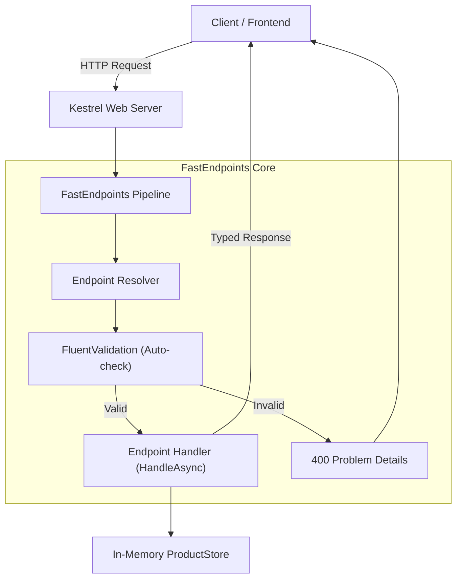
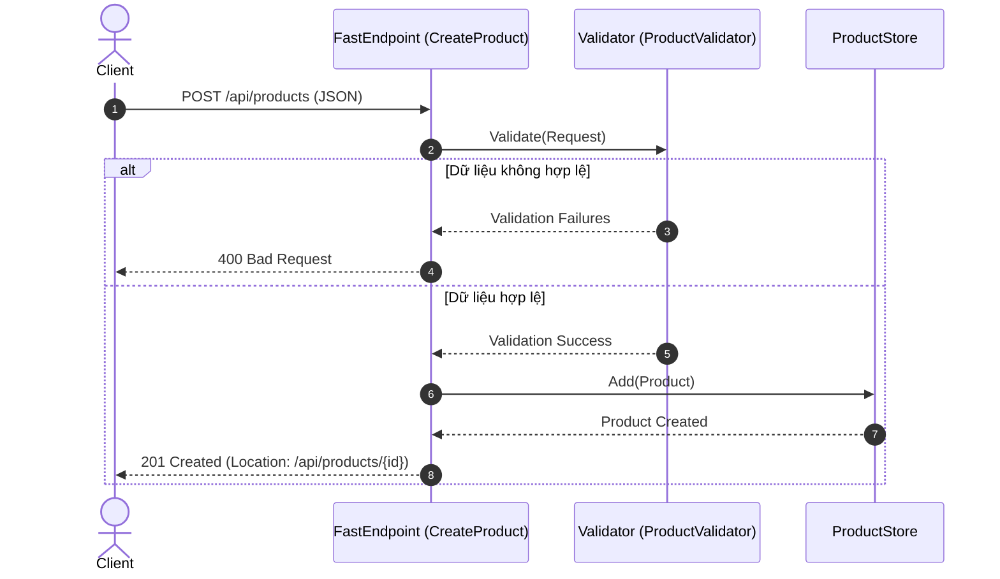

# 01 — FastEndpoints: API quản lý sản phẩm với .NET 10

## 1. Mục tiêu bài thực hành

Một cửa hàng cần API để thêm sản phẩm, tìm sản phẩm, điều chỉnh giá/số lượng tồn và xóa sản phẩm. Bài này triển khai luồng đó bằng **FastEndpoints**.

Sau khi chạy và đọc code, bạn cần trả lời được:

- URL và HTTP method được khai báo ở đâu?
- JSON mà client gửi biến thành đối tượng C# như thế nào?
- Ai gọi `HandleAsync`, và `req` cùng `ct` đến từ đâu?
- Vì sao request không hợp lệ nhận 400 trước khi ghi vào kho dữ liệu?
- Vì sao sản phẩm vừa tạo vẫn tồn tại ở request tiếp theo?

## 2. FastEndpoints giải quyết vấn đề gì?

Trong API có nhiều nghiệp vụ, một controller có thể chứa nhiều action với các DTO và quy tắc khác nhau. FastEndpoints cho phép tổ chức **mỗi thao tác thành một endpoint riêng**, ghép request, validation và xử lý theo tính năng.

Ví dụ: muốn sửa quy tắc thêm sản phẩm, bắt đầu ở tính năng Create; muốn sửa cách tìm kiếm, xem List. Bạn không cần thêm MediatR chỉ để chuyển request đến handler trong bài này.

ASP.NET Core vẫn đảm nhiệm web host, HTTP và dependency injection. FastEndpoints bổ sung cách khai báo endpoint và pipeline xử lý. Đây là lựa chọn tổ chức API; không phải điều kiện bắt buộc để viết API tốt, và bài này không đưa ra kết luận benchmark.


## Sơ đồ Kiến trúc & Luồng dữ liệu (Architecture & Data Flow)

### 1. Sơ đồ Kiến trúc Tổng quan (Architecture Overview)


### 2. Mô hình Luồng dữ liệu Chi tiết (Data Flow & Sequence)


### 3. Các Use Cases Cụ thể trong Thực tế (Concrete Use Cases)
- **Microservices & High-Throughput APIs**: Thay thế MVC Controller truyền thống để giảm overhead và tăng RPS (requests/sec).
- **Vertical Slice Architecture**: Đóng gói Request, DTO, Validator và Handler trong một thư mục tính năng, dễ đọc và bảo trì.
- **REST APIs quy mô lớn**: Tránh tình trạng Controller phình to (God Controller) khi có hàng trăm endpoint.


## 3. Yêu cầu và chạy nhanh

- Cài **.NET SDK 10**, kiểm tra bằng `dotnet --list-sdks`.
- Dùng terminal, Visual Studio hoặc VS Code tùy thích.
- Có mạng ở lần restore đầu để tải NuGet.
- Không cần SQL Server, Redis hoặc Docker. Dữ liệu nằm trong bộ nhớ của tiến trình.

Các lệnh bên dưới chạy từ thư mục `01-FastEndpoints`:

```powershell
cd D:\GitHub\dotnet-example\01-FastEndpoints
dotnet restore
dotnet run --project ProductCatalog.Api --launch-profile http
```

Giữ terminal này mở. Khi thấy thông báo đang lắng nghe cổng 5101, mở:

- Swagger UI: <http://localhost:5101/swagger>
- Danh sách sản phẩm: <http://localhost:5101/api/products>

Trong Swagger, chọn endpoint → **Try it out** → nhập dữ liệu → **Execute**. Quan sát đồng thời response body, status code và response headers.

Profile `http` đặt môi trường Development. Swagger chỉ bật trong môi trường này. Dừng API bằng `Ctrl+C`; chạy lại sẽ khởi tạo lại dữ liệu mẫu và mất những thay đổi trước đó.

### Cấu trúc và thứ tự đọc code

```text
01-FastEndpoints/
├── ProductCatalog.slnx
├── README.md
├── ProductCatalog.Api/
│   ├── Program.cs
│   ├── ProductCatalog.Api.csproj
│   ├── ProductCatalog.Api.http
│   ├── Properties/launchSettings.json
│   ├── Models/Product.cs
│   ├── Data/ProductStore.cs
│   └── Features/Products/
│       ├── Contracts.cs
│       ├── Validators.cs
│       ├── CreateProductEndpoint.cs
│       ├── GetProductEndpoint.cs
│       ├── ListProductsEndpoint.cs
│       ├── UpdateProductEndpoint.cs
│       └── DeleteProductEndpoint.cs
└── ProductCatalog.Tests/
    └── ProductEndpointsTests.cs
```

Đọc `Program.cs` để thấy đăng ký dịch vụ và pipeline → `Contracts.cs` để biết dữ liệu vào/ra → `Validators.cs` để biết quy tắc → `CreateProductEndpoint.cs` để hiểu một thao tác hoàn chỉnh → `ProductStore.cs` để thấy dữ liệu được lưu thế nào → các endpoint còn lại và tests.

File `ProductCatalog.Api.http` dùng trong HTTP client của IDE (Visual Studio, Rider hoặc VS Code có REST Client). Các request mẫu giúp quan sát status/header trực tiếp; với sản phẩm tự tạo, dùng ID được trả về trong các request tiếp theo.

## 4. Hợp đồng API

| Method | Đường dẫn | Ý nghĩa | Thành công |
| --- | --- | --- | --- |
| GET | `/api/products` | Xem danh sách | 200 |
| GET | `/api/products?search=keyboard` | Tìm theo tên | 200 |
| GET | `/api/products/{id}` | Xem một sản phẩm | 200 |
| POST | `/api/products` | Tạo sản phẩm | 201 + header Location |
| PUT | `/api/products/{id}` | Cập nhật thông tin sản phẩm | 200 |
| DELETE | `/api/products/{id}` | Xóa sản phẩm | 204, không có body |

Body cho POST và PUT:

```json
{
  "name": "Mechanical Keyboard",
  "price": 1250000,
  "stock": 10
}
```

`price` là số tiền theo cùng một đơn vị quy ước trong demo, không có chuyển đổi ngoại tệ. `stock` là số nguyên. ID do server cấp khi tạo; khi cập nhật/xóa, lấy ID từ đường dẫn.

Tên bắt buộc, tối đa 100 ký tự; giá phải lớn hơn 0; tồn kho không âm; ID phải lớn hơn 0. GET danh sách trả một mảng JSON. Khi khởi động mới, store có hai sản phẩm mẫu: Mechanical Keyboard và Wireless Mouse.

PUT gửi đầy đủ các trường chỉnh sửa; bài này không triển khai PATCH. Trường số bị bỏ qua trong JSON có thể nhận giá trị mặc định C#, nên không dùng PUT như cập nhật một phần.

## 5. Thử một vòng nghiệp vụ bằng PowerShell

Mở **terminal thứ hai**, giữ API chạy ở terminal đầu. Dùng ID server trả về để các lệnh không phụ thuộc số thứ tự của dữ liệu mẫu:

```powershell
$baseUrl = 'http://localhost:5101'

# 1. Xem dữ liệu hiện có
Invoke-RestMethod "$baseUrl/api/products"

# 2. Tạo sản phẩm
$createBody = @{
    name = 'Mechanical Keyboard'
    price = 1250000
    stock = 10
} | ConvertTo-Json

$product = Invoke-RestMethod "$baseUrl/api/products" `
    -Method Post -ContentType 'application/json' -Body $createBody
$product
$productId = $product.id

# 3. Đọc lại chính sản phẩm vừa tạo
Invoke-RestMethod "$baseUrl/api/products/$productId"

# 4. Tìm theo tên
Invoke-RestMethod "$baseUrl/api/products?search=Mechanical"

# 5. Thay đổi giá và tồn kho
$updateBody = @{
    name = 'Mechanical Keyboard'
    price = 1190000
    stock = 8
} | ConvertTo-Json

Invoke-RestMethod "$baseUrl/api/products/$productId" `
    -Method Put -ContentType 'application/json' -Body $updateBody

# 6. Xóa; 204 không trả JSON
Invoke-RestMethod "$baseUrl/api/products/$productId" -Method Delete

# 7. Đọc lại sẽ nhận 404; PowerShell báo lỗi HTTP là đúng mong đợi
Invoke-RestMethod "$baseUrl/api/products/$productId"
```

`Invoke-RestMethod` thuận tiện để đọc JSON nhưng không hiện đầy đủ headers/status. Dùng Swagger hoặc file `.http` đi kèm khi muốn kiểm tra header `Location` của POST. Endpoint GET ở địa chỉ đó phải đọc được sản phẩm vừa tạo.

## 6. Cố tình gửi sai để hiểu validation

Trong Swagger, gửi POST với body:

```json
{
  "name": "",
  "price": -1,
  "stock": -5
}
```

Kết quả mong đợi là **400 Bad Request**, với thông tin lỗi theo trường. Sản phẩm này không được ghi vào store. Sau đó sửa từng trường và gửi lại để quan sát các lỗi biến mất.

Phân biệt hai tình huống:

- Request sai định dạng hoặc vi phạm quy tắc đầu vào → **400**.
- ID hợp lệ về kiểu/giá trị nhưng không có sản phẩm tương ứng → **404**.

Không biến mọi tình huống thành 200 kèm một trường `success=false`; status code giúp client hiểu kết quả HTTP.

## 7. Lần theo một request POST

```text
Client gửi POST /api/products với JSON
    ↓
ASP.NET Core nhận HTTP request và chọn endpoint
    ↓
FastEndpoints bind JSON vào request DTO
    ↓
Validator kiểm tra dữ liệu
    ├─ Không hợp lệ → response 400, không chạy nghiệp vụ tạo
    └─ Hợp lệ
         ↓
    FastEndpoints gọi HandleAsync(req, ct)
         ↓
    Endpoint gọi store để tạo sản phẩm
         ↓
    Endpoint gửi response 201 và Location
         ↓
    Client nhận JSON của sản phẩm mới
```

**Ai gọi `HandleAsync`?** Pipeline FastEndpoints gọi override trong endpoint khi HTTP request phù hợp đi tới. Bạn viết thân hàm; client gọi URL, không gọi trực tiếp phương thức C#.

**`req` từ đâu?** Framework đọc dữ liệu HTTP, tạo DTO và gán các giá trị đã bind. Ví dụ JSON `"name": "Mechanical Keyboard"` trở thành thuộc tính `Name` của request. Khi đọc theo ID, ID đến từ route; với tìm kiếm, giá trị đến từ query string.

**`ct` từ đâu?** Framework truyền cancellation token liên quan tới request. Khi có thao tác I/O như truy vấn database, nên truyền token này tiếp xuống API bất đồng bộ. Store ở bài này chỉ xử lý trong RAM; `async` ở endpoint chủ yếu phục vụ việc gửi HTTP response.

**`Configure()` làm gì?** Khai báo method, route và chính sách truy cập cho endpoint khi framework cấu hình ứng dụng. Phần nghiệp vụ theo từng request nằm trong `HandleAsync`, không đặt trong `Configure()`.

## 8. Request, response và entity khác nhau thế nào?

- **Request DTO**: những gì client được phép gửi để thực hiện thao tác.
- **Entity/model trong store**: sản phẩm mà ứng dụng đang lưu giữ.
- **Response DTO**: những gì API công khai cho client sau khi xử lý, bao gồm ID do server tạo.

Tách các vai trò giúp tránh việc sau này thêm trường nội bộ vào model rồi vô tình cho client ghi vào trường đó. Demo dùng mapping trực tiếp để nhìn rõ dữ liệu đi đâu; chưa cần thêm một thư viện mapping.

## 9. Dependency injection và vòng đời dữ liệu

Trong startup, ứng dụng đăng ký store với DI. Endpoint nhận store qua constructor; ASP.NET Core/FastEndpoints phối hợp khởi tạo endpoint và cấp dependency đã đăng ký.

Store dùng **singleton**: các request trong cùng một instance ứng dụng dùng chung một kho. Nếu mỗi request tạo một store rỗng riêng thì GET sau POST không tìm thấy sản phẩm vừa tạo.

Chia sẻ bộ nhớ cũng có nghĩa là nhiều request có thể thao tác đồng thời. Vì vậy store cần đồng bộ thao tác ghi/cấp ID và tránh trả đối tượng mutable để bên ngoài thay đổi dữ liệu không qua store.

Singleton không làm dữ liệu bền vững. Hai tiến trình API có hai kho riêng; khởi động lại sẽ mất thay đổi. Khi học thư viện database sau này, ta sẽ thay phần lưu trữ bằng dữ liệu bền vững và chọn lifetime phù hợp cho dependency đó.

## 10. Vì sao dùng validation riêng?

Validator mô tả điều kiện để một request được chấp nhận. Handler có thể tập trung vào thao tác tạo/cập nhật thay vì lặp lại các câu `if` cho từng trường.

FastEndpoints tích hợp FluentValidation; cú pháp `RuleFor(x => x.Name)` chỉ ra thuộc tính cần kiểm tra. Lambda này là biểu thức chọn thuộc tính, không phải thao tác lưu sản phẩm. Phần học chuyên sâu FluentValidation sẽ là bài riêng.

Validation đầu vào và kiểm tra nghiệp vụ khác nhau: tên rỗng là lỗi đầu vào; sản phẩm không tồn tại cần tra store rồi trả 404. Không nên coi mọi lỗi trong hệ thống đều là lỗi validator.

## 11. Build và kiểm thử

Từ thư mục bài học:

```powershell
dotnet build -c Release
dotnet test -c Release
```

Integration tests khởi động ứng dụng qua `WebApplicationFactory` và gửi HTTP vào test server trong tiến trình. Bạn không cần chạy server cổng 5101 trước khi chạy test.

Điểm cần kiểm tra gồm: tạo/đọc/cập nhật/xóa thật qua pipeline, Location sau POST, dữ liệu không hợp lệ, ID không tồn tại, tìm kiếm và tài liệu OpenAPI. Các test nhằm kiểm tra hành vi API, không chỉ gọi store trực tiếp.

## 12. Bài tập tiếp theo

1. Đặt breakpoint ở validator và `HandleAsync` của Create. Gửi một request đúng rồi một request sai để thấy nhánh nào được chạy.
2. Thêm `Category` vào sản phẩm: tự xác định những request/response và test cần sửa.
3. Bổ sung bộ lọc chỉ lấy sản phẩm còn hàng qua query string.
4. Thêm phân trang và kiểm tra page/pageSize không hợp lệ.
5. Dừng rồi chạy lại API để xác nhận sự khác nhau giữa lưu RAM và lưu database.

## 13. Giới hạn và lỗi thường gặp

- **Đây là demo học thư viện**: endpoint cho phép anonymous; chưa có xác thực/phân quyền.
- Không có persistence, transaction database, pagination hoặc kiểm soát phiên bản cập nhật. PUT ghi đè dữ liệu theo request đến sau.
- Không triển khai public như một hệ thống quản lý kho thực tế khi chưa bổ sung các yêu cầu trên.
- Không tìm thấy SDK phù hợp: kiểm tra `dotnet --list-sdks`, cài SDK 10 thay vì chỉ runtime.
- Restore lỗi: kiểm tra kết nối NuGet/proxy; không sửa target xuống .NET 8 để né lỗi.
- Cổng 5101 bận: dùng `dotnet run --project ProductCatalog.Api --launch-profile http -- --urls http://localhost:5102`, sau đó đổi URL trong lệnh thử và file `.http`.
- Swagger 404: kiểm tra đang chạy profile `http` với môi trường Development.
- GET `/` không phải trang chủ của demo; dùng `/swagger` hoặc `/api/products`.
- Dữ liệu biến mất sau khi restart: đó là đặc tính có chủ ý của in-memory store.

## 14. Tài liệu tham khảo chính thức

- [FastEndpoints — bắt đầu và các kiểu endpoint](https://fast-endpoints.com/docs/get-started)
- [Model binding](https://fast-endpoints.com/docs/model-binding)
- [Validation](https://fast-endpoints.com/docs/validation)
- [Dependency injection](https://fast-endpoints.com/docs/dependency-injection)
- [OpenAPI/Swagger](https://fast-endpoints.com/docs/swagger-support)
- [Integration testing](https://fast-endpoints.com/docs/integration-unit-testing)

Ưu tiên đọc code của bài này rồi mở tài liệu tương ứng khi cần đào sâu một tính năng.
