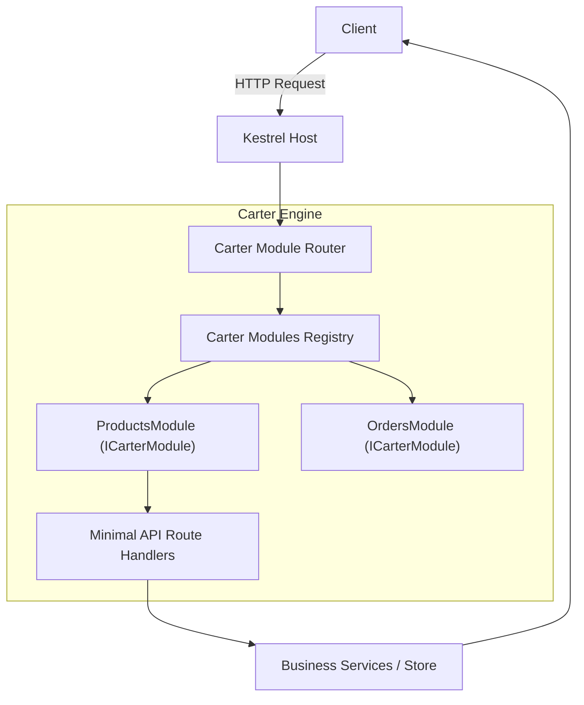
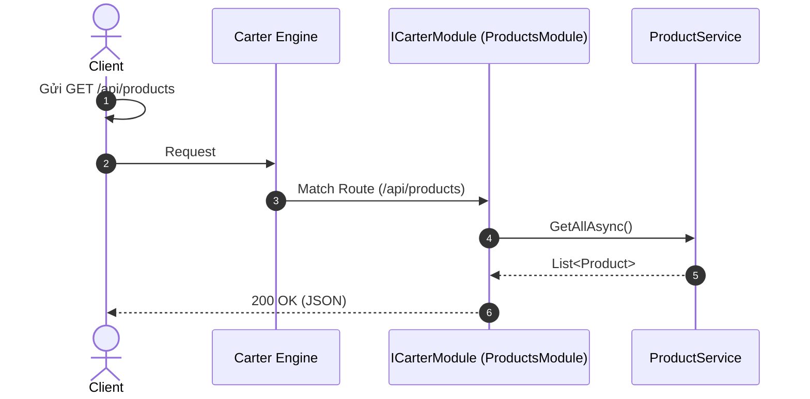

# 02-Carter: Task Board API

## 1. Mục tiêu bài thực hành
Xây dựng một API quản lý công việc (To-Do) sử dụng thư viện **Carter** kết hợp với ASP.NET Core Minimal APIs. Dự án nhằm minh họa cách tổ chức mã nguồn theo mô đun (module-based) và tự động đăng ký endpoint thay vì định nghĩa tất cả trong `Program.cs`.

## 2. Carter giải quyết vấn đề gì?
Khi số lượng endpoint trong Minimal APIs lớn dần, file `Program.cs` sẽ trở nên quá tải. Carter giải quyết vấn đề này bằng cách:
- Cung cấp module-based routing cho Minimal APIs, giúp tổ chức endpoint theo từng feature (tính năng).
- Tự động quét và đăng ký các module (kế thừa `ICarterModule`) thông qua `app.MapCarter()`.
- Tự động đăng ký các validator của FluentValidation vào Dependency Injection.


## Sơ đồ Kiến trúc & Luồng dữ liệu (Architecture & Data Flow)

### 1. Sơ đồ Kiến trúc Tổng quan (Architecture Overview)


### 2. Mô hình Luồng dữ liệu Chi tiết (Data Flow & Sequence)


### 3. Các Use Cases Cụ thể trong Thực tế (Concrete Use Cases)
- **Tổ chức Minimal APIs theo Module**: Phân chia hàng chục Minimal API routes vào các class riêng biệt thay vì dồn hết vào `Program.cs`.
- **Plugin Architecture**: Tự động scan assembly và đăng ký các route module mà không cần gọi hàm thủ công.
- **Microservices gọn nhẹ**: Ưu tiên tốc độ khởi động và footprint bộ nhớ thấp.


## 3. Yêu cầu và chạy nhanh
- .NET 10 SDK
- Chạy dự án:
  ```bash
  cd TaskBoard.Api
  dotnet run
  ```
- Swagger UI có sẵn tại: `http://localhost:5102/swagger`

## 4. Hợp đồng API
| Method | Path | Description | Success |
|--------|------|-------------|--------|
| GET | /api/tasks | Lấy danh sách task | 200 |
| GET | /api/tasks?completed=true | Lọc task đã hoàn thành | 200 |
| GET | /api/tasks/{id} | Lấy thông tin 1 task | 200 |
| POST | /api/tasks | Tạo task mới | 201 + Location |
| PUT | /api/tasks/{id} | Cập nhật task | 200 |
| DELETE | /api/tasks/{id} | Xóa task | 204 |
| PATCH | /api/tasks/{id}/complete | Đánh dấu hoàn thành | 200 |

## 5. Thử nghiệp vụ bằng PowerShell
```powershell
# Tạo task mới
Invoke-RestMethod -Uri "http://localhost:5102/api/tasks" -Method Post -ContentType "application/json" -Body '{"title":"Learn Carter","description":"Read docs"}'

# Lấy danh sách task
Invoke-RestMethod -Uri "http://localhost:5102/api/tasks"

# Đánh dấu hoàn thành
Invoke-RestMethod -Uri "http://localhost:5102/api/tasks/1/complete" -Method Patch
```

## 6. Validation
Dự án sử dụng **FluentValidation**. Carter tự động scan và thêm các validator (như `CreateTaskRequestValidator`) vào Container (DI). Các lỗi validation (vd: để trống title) sẽ trả về 400 Bad Request.

## 7. Lần theo request
1. HTTP Request đến `/api/tasks`.
2. Router gọi hàm xử lý tương ứng trong `TaskModule.cs`.
3. Hàm xử lý nhận tham số từ Request Body/Query và DI (như `TaskStore`, `IValidator`).
4. Nếu validate thành công, gọi `TaskStore` để xử lý logic và trả về `Results.*`.

## 8. Dependency injection
- `Carter`: Đăng ký bằng `builder.Services.AddCarter()` và `app.MapCarter()`.
- `TaskStore`: Đăng ký dưới dạng Singleton để lưu trạng thái in-memory.

## 9. Build và kiểm thử
Kiểm thử tích hợp (Integration Tests) sử dụng `xUnit` và `WebApplicationFactory`:
```bash
dotnet test
```

## 10. Bài tập tiếp theo
- Phân tách logic validate ra filter thay vì gọi trực tiếp `validator.Validate()`.
- Thêm module quản lý User/Project riêng rẽ để thấy rõ tác dụng tổ chức code.

## 11. Giới hạn
- Dữ liệu lưu in-memory sẽ mất khi restart ứng dụng.
- Dùng trong môi trường thật cần kết nối Database (EF Core, Dapper...).

## 12. Tài liệu tham khảo
- Carter GitHub: [https://github.com/CarterCommunity/Carter](https://github.com/CarterCommunity/Carter)
