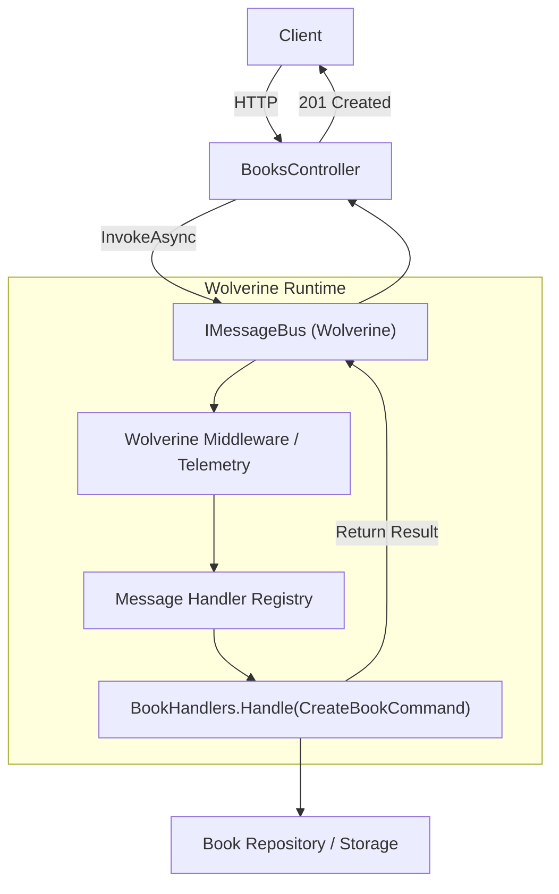
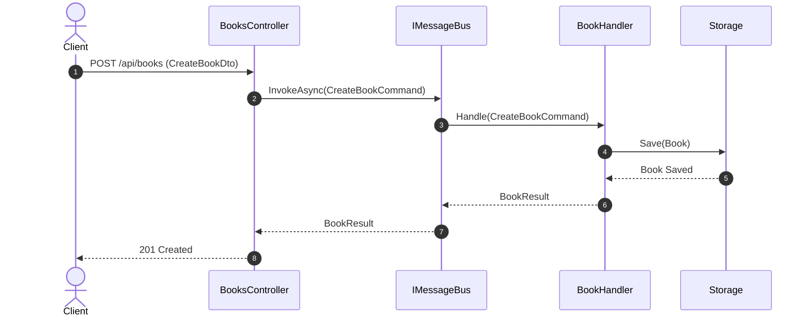

# 03 - Wolverine

## 1. Mục tiêu bài thực hành
Bài thực hành này giúp bạn làm quen với **Wolverine**, một thư viện mediator và message bus mạnh mẽ, hiệu suất cao cho .NET. Wolverine giúp tách biệt luồng xử lý bằng kiến trúc Command Query Responsibility Segregation (CQRS) thông qua convention-based handlers (tự động phát hiện dựa trên quy ước đặt tên thay vì interfaces).

## 2. Wolverine giải quyết vấn đề gì?
- **Mediator & Message Bus in-process**: Gửi nhận Command/Query trong nội bộ ứng dụng mà không cần thiết lập hàng đợi thông điệp bên ngoài.
- **Convention-based Handlers**: Không cần implement các interface như `IRequestHandler<T, TResult>`. Chỉ cần định nghĩa class `Handler` với phương thức `Handle`. Wolverine sẽ tự động tìm thấy.
- **Hiệu suất cao**: Giảm chi phí phân bổ bộ nhớ, tối ưu cho việc xử lý tin nhắn tốc độ cao.
- **HTTP endpoint generation**: Tích hợp chặt chẽ với Minimal APIs thông qua thư viện `Wolverine.Http` (bài này sử dụng `IMessageBus` để gọi trực tiếp từ endpoints truyền thống cho cơ bản).


## Sơ đồ Kiến trúc & Luồng dữ liệu (Architecture & Data Flow)

### 1. Sơ đồ Kiến trúc Tổng quan (Architecture Overview)


### 2. Mô hình Luồng dữ liệu Chi tiết (Data Flow & Sequence)


### 3. Các Use Cases Cụ thể trong Thực tế (Concrete Use Cases)
- **CQRS In-Process**: Tách biệt luồng Command và Query mà không cần phụ thuộc vào broker bên ngoài.
- **Hybrid In-Memory & External Messaging**: Viết code một lần, có thể chuyển sang broker (RabbitMQ/Kafka) thông qua cấu hình.
- **Transactional Outbox**: Tự động lưu message vào outbox cùng transaction với database.


## 3. Yêu cầu và chạy nhanh
- .NET 10 SDK
- Chạy ứng dụng tại thư mục `BookStore.Api`:
```bash
dotnet run
```
- API sẽ chạy ở port **5103** (`http://localhost:5103`). Swagger UI có sẵn ở `/swagger` trong môi trường Development.

## 4. Hợp đồng API
| Method | Path | Mô tả | Trạng thái thành công |
|--------|------|-------------|--------|
| GET | `/api/books` | Lấy danh sách sách (có thể lọc qua `?author=`) | 200 OK |
| GET | `/api/books/{id}` | Lấy chi tiết sách theo ID | 200 OK |
| POST | `/api/books` | Thêm sách mới | 201 Created |
| PUT | `/api/books/{id}` | Cập nhật sách | 200 OK |
| DELETE | `/api/books/{id}` | Xóa sách | 204 No Content |

## 5. Thử bằng PowerShell
```powershell
# Get all books
Invoke-RestMethod -Uri "http://localhost:5103/api/books" -Method Get

# Create a new book
$book = @{
    Title = "C# in Depth"
    Author = "Jon Skeet"
    Price = 45.99
    PublishedYear = 2019
}
Invoke-RestMethod -Uri "http://localhost:5103/api/books" -Method Post -Body ($book | ConvertTo-Json) -ContentType "application/json"
```

## 6. Lần theo request
Quy trình: `Client` -> `BooksEndpoints` (nhận request) -> Gọi `IMessageBus.InvokeAsync<IResult>(Command)` -> Wolverine map command tới class Handler tương ứng (VD: `CreateBookHandler.Handle`) -> tương tác `BookStore` (thêm sách) -> Trả về kết quả.

## 7. So sánh ngắn với MediatR
- **MediatR**: Dựa trên interface (`IRequest`, `IRequestHandler`).
- **Wolverine**: Dựa trên quy ước (`Command`, `Handler.Handle`). Tự động tiêm các dependencies bằng cách truyền chúng vào hàm `Handle` (như tham số thứ hai `BookStore`), không cần thông qua constructor. Mã ngắn gọn và sạch sẽ hơn.

## 8. Build và kiểm thử
Chạy các unit test / integration test:
```bash
dotnet test
```

## 9. Bài tập tiếp theo
- Dùng `Wolverine.Http` để tự động generate HTTP endpoints từ Handlers.
- Kết nối RabbitMQ cho việc truyền tin bất đồng bộ.
- Thêm FluentValidation tích hợp Wolverine.

## 10. Giới hạn
Bài ví dụ sử dụng C# thuần (`IMessageBus`) với Minimal APIs thông thường. Mặc định `Wolverine.Http` có thể tối ưu việc đăng ký routing ngắn hơn nữa, nhưng chúng ta dùng cách này để dễ hiểu luồng xử lý in-process bus. Dữ liệu lưu trong bộ nhớ và mất đi khi restart app.

## 11. Tài liệu
- Wolverine Documentation: [https://wolverine.netlify.app/](https://wolverine.netlify.app/)
