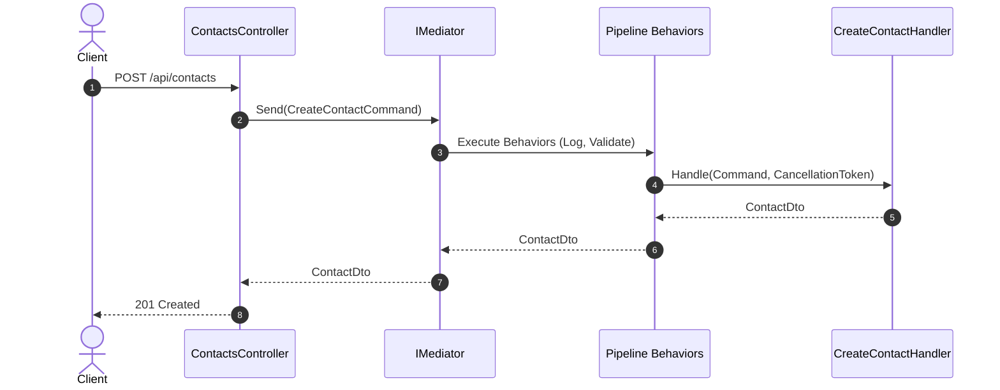

# 04-MediatR

## 1. Mục tiêu bài thực hành

Bài thực hành này giúp bạn làm quen với **MediatR**, thư viện CQRS (Command Query Responsibility Segregation) và in-process mediator phổ biến nhất trong hệ sinh thái .NET. Chúng ta sẽ xây dựng một API quản lý danh bạ (Contact Manager) sử dụng Minimal APIs và MediatR để xử lý các nghiệp vụ.

## 2. MediatR giải quyết vấn đề gì?

MediatR cung cấp mô hình **in-process mediator**, giúp:
- Tách biệt (loose coupling) giữa lớp HTTP (Endpoints/Controllers) và business logic.
- Áp dụng CQRS: phân chia rõ ràng giữa lệnh (Commands - thay đổi trạng thái) và truy vấn (Queries - lấy dữ liệu).
- Code dễ bảo trì, dễ test, tuân thủ nguyên tắc Single Responsibility.


## Sơ đồ Kiến trúc & Luồng dữ liệu (Architecture & Data Flow)

### 1. Sơ đồ Kiến trúc Tổng quan (Architecture Overview)
```mermaid
flowchart TD
    Client["Client"] -->|HTTP Request| Controller["ContactsController"]
    Controller -->|Send(Command/Query)| Mediator["IMediator"]
    subgraph MediatR Pipeline
        Mediator --> P1["LoggingBehavior"]
        P1 --> P2["ValidationBehavior"]
        P2 --> Handler["IRequestHandler (CreateContactHandler)"]
    end
    Handler --> Repo["Contact Repository"]
    Handler -->|Response| Mediator
    Mediator --> Controller
    Controller --> Client
```

### 2. Mô hình Luồng dữ liệu Chi tiết (Data Flow & Sequence)


### 3. Các Use Cases Cụ thể trong Thực tế (Concrete Use Cases)
- **Clean Architecture & Onion Architecture**: Tạo ranh giới rõ ràng giữa Controller và Application logic.
- **Cross-cutting Concerns**: Xử lý logging, validation, caching, authorization đồng nhất trên toàn bộ hệ thống qua Pipeline Behaviors.
- **In-Process Pub/Sub**: Phát thông báo nội bộ (`INotification`) khi có sự kiện nghiệp vụ xảy ra.


## 3. Pipeline Behaviors

Đây là tính năng mạnh mẽ nhất của MediatR. Pipeline Behaviors cho phép bạn xử lý các cross-cutting concerns (logging, validation, caching, transaction) một cách tập trung mà không làm rác logic chính của Handler. Trong dự án này, chúng ta sử dụng 2 behaviors:
1. **LoggingBehavior**: Ghi log lại thời gian thực thi của mọi Request.
2. **ValidationBehavior**: Sử dụng `FluentValidation` để tự động kiểm tra tính hợp lệ của Request trước khi Handler được gọi.

## 4. Yêu cầu và chạy nhanh

- .NET 10 SDK
- Cổng mặc định: `5104`

Chạy dự án:
```powershell
dotnet run --project ContactManager.Api
```

## 5. Hợp đồng API

| Method | Path | Description | Success |
|--------|------|-------------|--------|
| GET | `/api/contacts` | List all contacts | 200 |
| GET | `/api/contacts?search=xxx` | Search by name/email | 200 |
| GET | `/api/contacts/{id}` | Get one contact | 200 |
| POST | `/api/contacts` | Create contact | 201 + Location |
| PUT | `/api/contacts/{id}` | Update contact | 200 |
| DELETE | `/api/contacts/{id}` | Delete contact | 204 |

## 6. Thử bằng PowerShell

```powershell
# Tạo một liên hệ mới
Invoke-RestMethod -Uri "http://localhost:5104/api/contacts" -Method Post -ContentType "application/json" -Body '{"firstName":"Elon","lastName":"Musk","email":"elon@spacex.com"}'

# Lấy danh sách
Invoke-RestMethod -Uri "http://localhost:5104/api/contacts" -Method Get

# Tìm kiếm
Invoke-RestMethod -Uri "http://localhost:5104/api/contacts?search=elon" -Method Get
```

## 7. Lần theo request

Khi một request đến hệ thống, luồng thực thi sẽ như sau:
`Client` → `Endpoint (MapPost)` → `IMediator.Send` → `LoggingBehavior` (Bắt đầu đếm giờ) → `ValidationBehavior` (Kiểm tra FluentValidation) → `CreateContactHandler` (Thực thi) → `ContactStore` (Lưu dữ liệu). Nếu có lỗi, ngoại lệ sẽ bật lên và được Middleware xử lý để trả về HTTP 400.

## 8. So sánh với Wolverine

Cả hai đều giải quyết vấn đề in-process messaging. Tuy nhiên:
- **MediatR**: Tiêu chuẩn de facto của .NET, yêu cầu cấu hình (IRequest, IRequestHandler), chủ yếu cho in-process.
- **Wolverine**: Mới hơn, convention-based (ít interface hơn), hỗ trợ out-of-process (RabbitMQ, Azure Service Bus) dễ dàng hơn.

## 9. Build và kiểm thử

```powershell
dotnet build
dotnet test
```

## 10. Bài tập

Bạn hãy thử tạo một `CachingBehavior` cho các lệnh Query, lưu trữ kết quả trong `IMemoryCache` theo một `CacheKey` để tăng tốc truy vấn thay vì đọc từ Store mỗi lần.

## 11. Giới hạn

- Dự án sử dụng in-memory database (`ConcurrentDictionary`) và không có cơ sở dữ liệu thật (như SQL Server). Dữ liệu sẽ mất khi restart.

## 12. Tài liệu

- https://github.com/jbogard/MediatR
