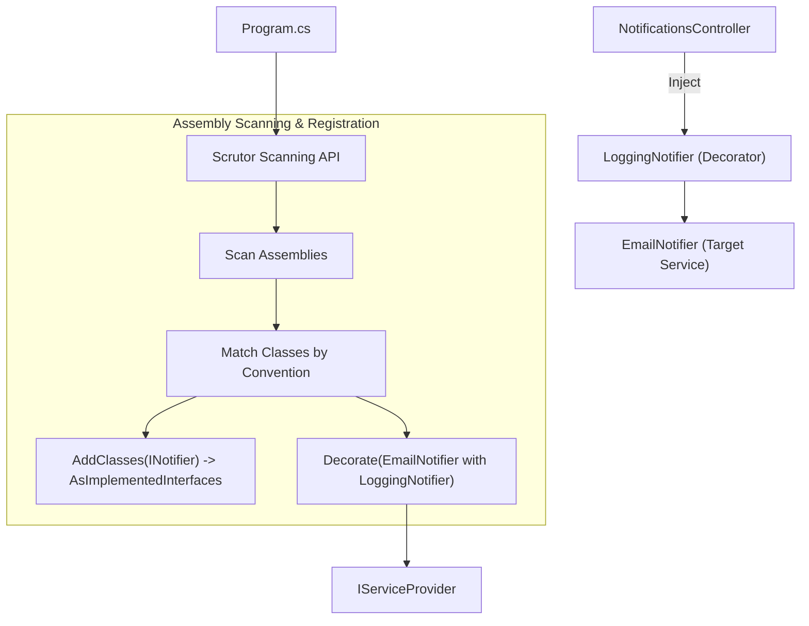
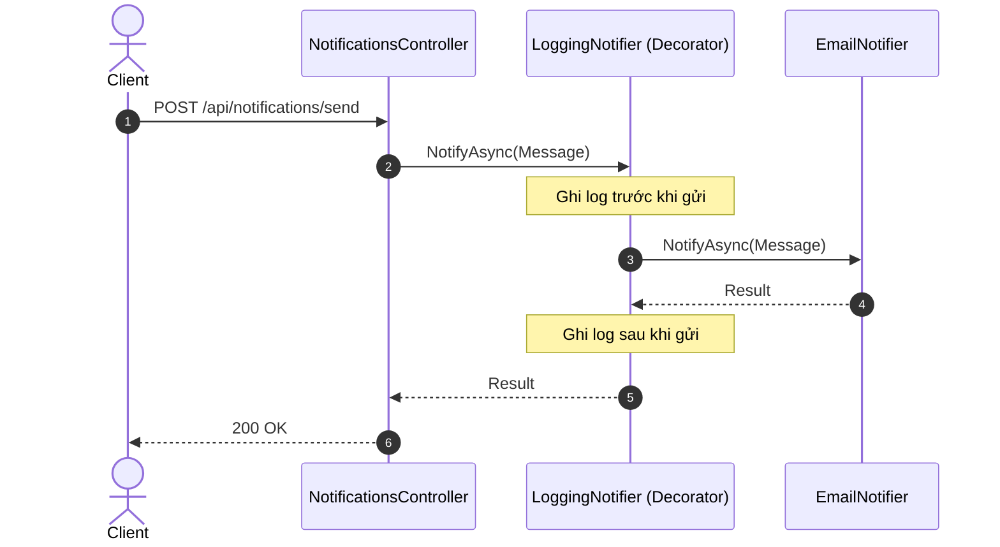

# Thực hành 05: Đăng ký Service tự động và Decorator với Scrutor

## 1. Mục tiêu bài thực hành
Tìm hiểu cách sử dụng thư viện **Scrutor** trong .NET 10 để tự động quét (scan) và đăng ký các services thay vì phải khai báo thủ công từng interface và implementation. Đồng thời, áp dụng **Decorator Pattern** để mở rộng tính năng của các service một cách minh bạch mà không cần sửa đổi mã nguồn gốc.

## 2. Scrutor giải quyết vấn đề gì?
Trong các dự án lớn, việc đăng ký hàng tá hoặc hàng trăm service vào Dependency Injection (DI) container bằng cách gọi `builder.Services.AddScoped<IType, Type>()` trở nên lặp đi lặp lại và dễ thiếu sót.
- **Assembly scanning**: Scrutor cung cấp API `Scan()` cho phép đăng ký hàng loạt các lớp theo những quy tắc nhất định (ví dụ: tất cả lớp triển khai một giao diện cụ thể).
- **Decoration**: Mặc dù .NET DI container mặc định không hỗ trợ tốt việc áp dụng Decorator pattern tự động, Scrutor cung cấp hàm `Decorate()` cho phép bao bọc các dịch vụ hiện có bằng các dịch vụ khác (ví dụ: thêm caching, logging hoặc retry).


## Sơ đồ Kiến trúc & Luồng dữ liệu (Architecture & Data Flow)

### 1. Sơ đồ Kiến trúc Tổng quan (Architecture Overview)


### 2. Mô hình Luồng dữ liệu Chi tiết (Data Flow & Sequence)


### 3. Các Use Cases Cụ thể trong Thực tế (Concrete Use Cases)
- **Auto-Registration theo Quy ước**: Tự động đăng ký hàng trăm service (`I...Service` -> `...Service`) mà không phải viết thủ công từng dòng `AddScoped`.
- **Decorator Pattern trong DI**: Bổ sung tính năng logging, caching, metrics bao bọc service gốc mà không sửa code cũ.
- **Modular Monolith**: Tự động nạp các service từ các module DLL khác nhau khi khởi động ứng dụng.


## 3. Assembly Scanning hoạt động thế nào
Thay vì khai báo từng service:
```csharp
builder.Services.AddTransient<INotificationSender, EmailSender>();
builder.Services.AddTransient<INotificationSender, SmsSender>();
builder.Services.AddTransient<INotificationSender, PushSender>();
```
Với Scrutor, ta chỉ cần quét assembly:
```csharp
builder.Services.Scan(scan => scan
    .FromAssemblyOf<Program>()
    .AddClasses(classes => classes.AssignableTo<INotificationSender>())
        .AsImplementedInterfaces()
        .WithTransientLifetime());
```
Quy tắc trên tự động thêm bất kỳ lớp nào triển khai `INotificationSender` vào DI container.

## 4. Decorator Pattern hoạt động thế nào
Decorator cho phép áp dụng thêm logic trước, sau, hoặc thay thế một lời gọi mà không cần thay đổi lớp triển khai cơ bản. 
```csharp
builder.Services.Decorate<INotificationSender, LoggingNotificationSender>();
builder.Services.Decorate<INotificationSender, RetryNotificationSender>();
```
Lưu ý quan trọng: **Thứ tự Decorate rất quan trọng!** Trình DI container sẽ gọi từ ngoài vào trong theo thứ tự đã đăng ký. Trong ví dụ này, chuỗi gọi sẽ là `RetryNotificationSender` -> `LoggingNotificationSender` -> Service thực (Email, SMS, hoặc Push).

## 5. Yêu cầu và chạy nhanh
Dự án được cấu hình chạy trên port 5105.

Chạy API bằng lệnh sau:
```bash
dotnet run --project NotificationService.Api
```

Mở Swagger: `http://localhost:5105/swagger`

## 6. Hợp đồng API

| Method | Path | Description | Result |
|--------|------|-------------|--------|
| GET | `/api/notifications/channels` | Lấy danh sách channel | 200 OK |
| GET | `/api/notifications/formatters` | Lấy danh sách formatter | 200 OK |
| POST | `/api/notifications/send` | Gửi một thông báo | 200 OK |
| POST | `/api/notifications/broadcast` | Gửi đến tất cả channel | 200 OK |

## 7. Thử bằng PowerShell
```powershell
# Xem các channel
Invoke-RestMethod -Uri http://localhost:5105/api/notifications/channels

# Gửi thông báo
$body = @{ channel="email"; to="user@example.com"; subject="Hello"; body="World" } | ConvertTo-Json
Invoke-RestMethod -Uri http://localhost:5105/api/notifications/send -Method POST -Body $body -ContentType "application/json"
```

## 8. Build và kiểm thử
Chạy lệnh kiểm thử toàn bộ test cases đã được viết cho chức năng Scrutor:
```bash
dotnet build
dotnet test
```

## 9. Bài tập
Tạo thêm một `CachingNotificationSender` để lưu cache kết quả thông báo và đăng ký nó thông qua `builder.Services.Decorate<INotificationSender, CachingNotificationSender>()`.

## 10. Giới hạn
Scrutor dựa vào Reflection khi khởi động ứng dụng để quét các classes, việc này có thể làm chậm quá trình khởi động đối với những ứng dụng vô cùng lớn (hàng chục ngàn file) hoặc trong môi trường Serverless.

## 11. Tài liệu
* [Mã nguồn Scrutor trên GitHub](https://github.com/khellang/Scrutor)
