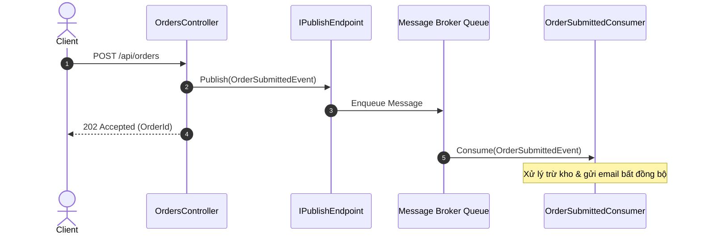

# 06-MassTransit - Order Processor

Dự án này là một ví dụ hoàn chỉnh về cách sử dụng **MassTransit** trong ASP.NET Core 10 để xây dựng kiến trúc phân tán dựa trên message.

## 1. Mục tiêu bài thực hành
- Hiểu được các khái niệm cơ bản của Message Bus thông qua MassTransit.
- Thiết lập một ứng dụng Web API tích hợp MassTransit.
- Khai báo và sử dụng các Publish Endpoint và Consumer (Consumer pattern).
- Thử nghiệm với Transport trong bộ nhớ (In-memory Transport) và hiểu sự khác biệt so với Production Transport.

## 2. MassTransit giải quyết vấn đề gì?
MassTransit là một Message Bus/Distributed Application Framework dành cho .NET. Nó mang lại một abstraction layer ở trên các Message Broker thông dụng (như RabbitMQ, Azure Service Bus, Amazon SQS, ActiveMQ...). Nhờ vậy, nhà phát triển có thể viết mã tập trung vào các message (contract) và consumer mà không bị cột chặt vào một broker cụ thể nào.
Ngoài ra, nó cung cấp sẵn các pattern quan trọng như Retry, Circuit Breaker, Outbox, Saga... giúp xây dựng các hệ thống phân tán chịu lỗi tốt hơn.


## Sơ đồ Kiến trúc & Luồng dữ liệu (Architecture & Data Flow)

### 1. Sơ đồ Kiến trúc Tổng quan (Architecture Overview)
```mermaid
flowchart TD
    Client["Client"] -->|HTTP POST| Controller["OrdersController"]
    Controller -->|Publish/Send| Bus["IBus / IPublishEndpoint"]
    subgraph MassTransit Transport (In-Memory / RabbitMQ)
        Bus --> Queue["order-submitted-queue"]
        Queue --> Consumer1["OrderSubmittedConsumer"]
        Queue --> Consumer2["InventoryCheckConsumer"]
    end
    Consumer1 --> Log["Log & Notification"]
    Consumer2 --> InvStore["Inventory Database"]
```

### 2. Mô hình Luồng dữ liệu Chi tiết (Data Flow & Sequence)


### 3. Các Use Cases Cụ thể trong Thực tế (Concrete Use Cases)
- **Event-Driven Architecture**: Giao tiếp bất đồng bộ giữa các microservices qua RabbitMQ, Azure Service Bus hoặc Amazon SQS.
- **Saga Orchestration & State Machine**: Điều phối các quy trình nghiệp vụ phân tán phức tạp như đặt vé, thanh toán, giao hàng.
- **Retry, Circuit Breaker & Dead Letter Queue**: Tự động thử lại khi gặp lỗi tạm thời và chuyển tin nhắn hỏng sang hàng đợi riêng.


## 3. Consumer pattern hoạt động thế nào
Khi API Publish một message (ví dụ: `OrderSubmitted`), message này được đưa vào Transport. Transport sẽ định tuyến message tới các hàng đợi (queue) tương ứng của các Consumer đăng ký lắng nghe (ví dụ: `OrderSubmittedConsumer`). MassTransit tự động khởi tạo Consumer và gọi hàm `Consume` để xử lý thông điệp một cách bất đồng bộ.

## 4. In-memory transport vs production transport
- **In-Memory Transport**: Rất tốt để phát triển, kiểm thử hoặc trong các hệ thống xử lý nội bộ đơn giản. Nó rất nhanh nhưng **sẽ mất toàn bộ message** nếu ứng dụng bị khởi động lại.
- **Production Transport**: (như RabbitMQ, Azure Service Bus) lưu trữ message vào bộ nhớ bền vững (durable storage). Dù ứng dụng crash hay khởi động lại, các message chưa được xử lý vẫn nằm trên queue chờ đến khi hệ thống sẵn sàng.

## 5. Yêu cầu và chạy nhanh
- .NET 10 SDK
- Cổng mặc định: **5106**

Mở terminal và chạy lệnh:
```bash
dotnet restore
dotnet run --project OrderProcessor.Api
```

## 6. Hợp đồng API

| Method | Path | Description | Success |
|--------|------|-------------|--------|
| POST | `/api/orders` | Tạo đơn hàng, publish `OrderSubmitted` | 202 Accepted |
| GET | `/api/orders` | Danh sách tất cả đơn hàng | 200 OK |
| GET | `/api/orders/{id}` | Lấy chi tiết một đơn hàng | 200 OK |
| POST | `/api/orders/{id}/cancel` | Hủy đơn hàng, publish `OrderCancelled` | 200 OK |

**Payload tạo đơn hàng:**
```json
{
  "customerName": "John Doe",
  "product": "Laptop",
  "quantity": 1,
  "totalPrice": 25000000
}
```

## 7. Thử bằng PowerShell
```powershell
$response = Invoke-RestMethod -Method Post -Uri "http://localhost:5106/api/orders" -ContentType "application/json" -Body '{"customerName": "John Doe", "product": "Laptop", "quantity": 1, "totalPrice": 25000000}'
$orderId = $response.id

# Đợi 1 giây để Consumer xử lý
Start-Sleep -Seconds 1

Invoke-RestMethod -Method Get -Uri "http://localhost:5106/api/orders/$orderId"
```

## 8. Lần theo request
1. **Client** gọi `POST /api/orders`
2. **API** tạo `Order` với trạng thái `Submitted`, gọi `Publish(OrderSubmitted)` và trả về ngay 202 Accepted.
3. MassTransit đưa event vào In-memory Bus.
4. `OrderSubmittedConsumer` nhận được event, đổi trạng thái thành `Processing`, xử lý (delay giả lập), sau đó đổi trạng thái thành `Completed` và publish `OrderProcessed`.
5. `OrderProcessedConsumer` (nếu có logic bổ sung) sẽ nhận và xử lý.
Nếu client gọi `/cancel`, API sẽ publish `OrderCancelled` và `OrderCancelledConsumer` sẽ chuyển trạng thái đơn hàng về `Cancelled`.

## 9. Build và kiểm thử
Chạy kiểm thử toàn bộ bằng:
```bash
dotnet test
```

## 10. Bài tập: thêm OrderShipped event
Bạn có thể tự luyện tập bằng cách:
1. Tạo contract mới `OrderShipped(Guid OrderId, string TrackingNumber)`.
2. Sửa `OrderProcessedConsumer` để sau khi hoàn thành, nó Publish `OrderShipped`.
3. Viết `OrderShippedConsumer` cập nhật trạng thái đơn hàng thành `Shipped`.

## 11. Giới hạn
Trong bài này chúng ta dùng `UsingInMemory`. Nghĩa là nếu bạn submit đơn hàng, event đang trong hàng đợi mà bạn tắt app ngay lập tức thì các event sẽ bị mất hoàn toàn. Để khắc phục, bạn có thể chuyển qua cấu hình `UsingRabbitMq` và khởi chạy một container RabbitMQ.

## 12. Tài liệu
Trang chủ MassTransit: [https://masstransit.io/](https://masstransit.io/)
