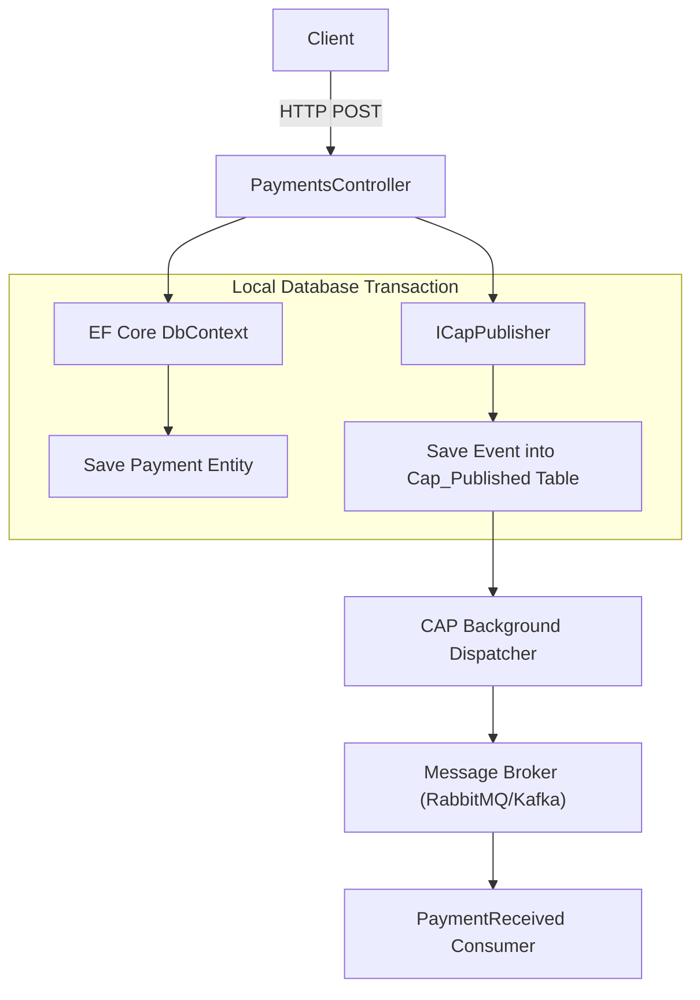
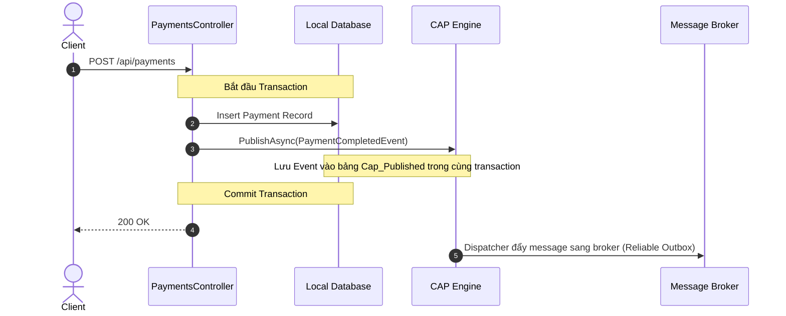

# 07-CAP: DotNetCore.CAP (Outbox Pattern & Event Bus)

## Sơ đồ Kiến trúc & Luồng dữ liệu (Architecture & Data Flow)

### 1. Sơ đồ Kiến trúc Tổng quan (Architecture Overview)


### 2. Mô hình Luồng dữ liệu Chi tiết (Data Flow & Sequence)


### 3. Các Use Cases Cụ thể trong Thực tế (Concrete Use Cases)
- **Transactional Outbox Pattern**: Đảm bảo dữ liệu nghiệp vụ và sự kiện gửi đi luôn nhất quán tuyệt đối (không bị lỗi lưu DB thành công nhưng mất event).
- **Idempotent Consumer (Inbox Pattern)**: Lọc trùng lặp tự động ở đầu nhận, đảm bảo mỗi message chỉ được xử lý một lần.
- **Hệ thống Tài chính & Thanh toán**: Yêu cầu tính toàn vẹn cao giữa nhiều dịch vụ phân tán.


## Mục tiêu bài thực hành
Tìm hiểu cách sử dụng thư viện **DotNetCore.CAP** để đảm bảo tính nhất quán (consistency) khi lưu dữ liệu và phát sự kiện (publish event) thông qua mẫu thiết kế **Transactional Outbox**. Demo cách cấu hình Publisher và Subscriber đơn giản.

## CAP giải quyết vấn đề gì?
Trong các hệ thống phân tán và microservices, khi chúng ta lưu một record vào database và gửi một event lên message broker (như RabbitMQ/Kafka), một trong hai thao tác có thể thất bại (ví dụ: database commit thành công nhưng RabbitMQ bị sập). 
CAP giải quyết vấn đề bằng **Transactional Outbox pattern**:
- Lưu dữ liệu và sự kiện (message) trong cùng một transaction của Database.
- Đảm bảo event chắc chắn được gửi đi ngay cả khi broker chập chờn.

## Outbox Pattern là gì?
Thay vì gửi event trực tiếp cho broker, hệ thống ghi message vào một bảng tạm (Outbox table) trong cùng giao dịch cơ sở dữ liệu. Sau đó, một background process hoặc một luồng song song sẽ đọc bảng này và gửi cho broker. Khi gửi thành công, trạng thái message trong Outbox table được cập nhật.

## In-memory vs Production
- **Demo In-Memory**: Bài lab này sử dụng `UseInMemoryStorage` và `UseInMemoryMessageQueue` để dễ chạy mà không cần setup Database và Message Broker thật.
- **Production**: Khi triển khai, cần đổi sang `UseSqlServer()`/`UsePostgreSql()` và `UseRabbitMQ()`/`UseKafka()`.

## Publisher/Subscriber pattern trong CAP
- **Publisher**: Sử dụng `ICapPublisher` tiêm vào DI để publish sự kiện với một tên chủ đề (topic name).
- **Subscriber**: Triển khai interface `ICapSubscribe` và dùng attribute `[CapSubscribe("topic.name")]` để nhận sự kiện.

## Yêu cầu và cách chạy nhanh
- .NET 10 SDK
- Cổng ứng dụng: **5107**

```bash
dotnet restore
dotnet run --project PaymentService.Api
```

Mở Swagger: `http://localhost:5107/swagger`

## Hợp đồng API
| Method | Path | Mô tả |
|--------|------|-------------|
| POST | `/api/payments` | Tạo mới Payment (trạng thái Pending, sau đó CAP tự động publish event rồi Subscriber đổi sang Completed) |
| GET | `/api/payments` | Lấy danh sách Payment |
| GET | `/api/payments/{id}` | Lấy chi tiết Payment |
| POST | `/api/payments/{id}/refund` | Hoàn tiền Payment |

## Thử bằng PowerShell
```powershell
$payment = Invoke-RestMethod -Uri "http://localhost:5107/api/payments" -Method Post -Body '{"orderId": "O-123", "amount": 1000, "currency": "VND"}' -ContentType "application/json"
Start-Sleep -Seconds 2
Invoke-RestMethod -Uri "http://localhost:5107/api/payments/$($payment.id)" -Method Get
```

## Build và kiểm thử
```bash
dotnet build
dotnet test
```

## Bài tập
- Thêm endpoint `POST /api/payments/{id}/expire` để mô phỏng một thanh toán bị quá hạn.
- Định nghĩa `PaymentExpiredEvent` và xử lý trong Subscriber để cập nhật trạng thái "Expired".

## Giới hạn bài lab
Vì sử dụng `InMemoryStorage`, khi khởi động lại ứng dụng, tất cả Payment và Outbox message sẽ bị mất. Trong thực tế, dữ liệu này sẽ được persist xuống DB để xử lý các event lỗi/chưa gửi.

## Tài liệu tham khảo
- [Trang chủ DotNetCore.CAP](https://cap.dotnetcore.xyz/)
