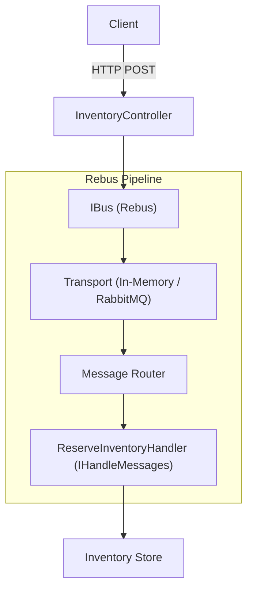
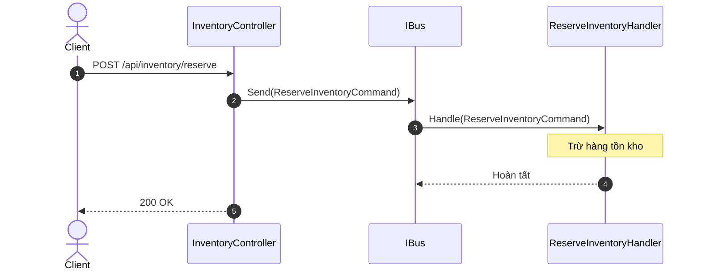

# 08 - Rebus (Lightweight Service Bus)

## 1. Mục tiêu bài thực hành
Tìm hiểu và triển khai Rebus trong .NET 10. Dự án mô phỏng một `InventoryService` (Dịch vụ quản lý kho) sử dụng Rebus để xử lý bất đồng bộ các thao tác thêm bớt hàng hóa (AddStock, RemoveStock) thay vì cập nhật trực tiếp trong HTTP request.

## 2. Rebus giải quyết vấn đề gì?
Rebus là một "lightweight service bus" cho .NET. Nó giúp:
- **Tách biệt xử lý (Decoupling):** API nhận request và trả về nhanh chóng (202 Accepted), việc xử lý nghiệp vụ nặng được đưa vào background (Handler).
- **Transport Abstraction:** Code nghiệp vụ không phụ thuộc vào công nghệ hàng đợi. Bạn có thể dùng InMemory khi phát triển và đổi sang RabbitMQ, Azure Service Bus ở môi trường thật chỉ với 1 dòng cấu hình.
- **Reliability:** Hỗ trợ retry, dead-letter queue, v.v.


## Sơ đồ Kiến trúc & Luồng dữ liệu (Architecture & Data Flow)

### 1. Sơ đồ Kiến trúc Tổng quan (Architecture Overview)


### 2. Mô hình Luồng dữ liệu Chi tiết (Data Flow & Sequence)


### 3. Các Use Cases Cụ thể trong Thực tế (Concrete Use Cases)
- **Service Bus Siêu Nhẹ**: Lựa chọn gọn gàng, ít cấu hình hơn MassTransit/NServiceBus cho các dự án vừa và nhỏ.
- **Quản lý Saga**: Hỗ trợ State Machine Saga để điều phối các tiến trình nghiệp vụ nhiều bước.
- **Định tuyến tin nhắn linh hoạt**: Cấu hình routing 1-1 (Command) hoặc 1-N (Event) thông qua cấu hình C# trực quan.


## 3. Send vs Publish
- **Send (Command):** Gửi một thông điệp (command) đến một đích đến cụ thể (queue). Ở đây ta dùng `AddStockCommand` và `RemoveStockCommand`. Chỉ có 1 handler xử lý nó.
- **Publish (Event):** Phát một sự kiện (event) ra ngoài, các service/handler nào quan tâm (subscribe) đều có thể xử lý. Ở đây ta dùng `StockUpdatedEvent`.

## 4. Handler Pattern
Rebus sử dụng interface `IHandleMessages<T>` để định nghĩa các handler xử lý logic khi có message/event `T` tới.

## 5. Transport Configuration
Dự án sử dụng `InMemNetwork` làm transport. Điều này có nghĩa mọi message đều lưu trên RAM. Thích hợp cho việc test hoặc ứng dụng monolithic nhỏ.

## 6. Yêu cầu và chạy nhanh
- .NET 10 SDK
- Chạy lệnh: `dotnet run --project InventoryService.Api` (Ứng dụng chạy ở cổng 5108).

## 7. Hợp đồng API
| HTTP | Path | Mô tả |
| --- | --- | --- |
| GET | `/api/inventory` | Lấy danh sách sản phẩm |
| GET | `/api/inventory/{id}` | Lấy chi tiết một sản phẩm |
| POST | `/api/inventory` | Thêm mới sản phẩm |
| POST | `/api/inventory/{id}/add-stock` | Nhập kho (Bất đồng bộ) |
| POST | `/api/inventory/{id}/remove-stock` | Xuất kho (Bất đồng bộ) |

## 8. Thử bằng PowerShell
```powershell
# Xem danh sách
Invoke-RestMethod http://localhost:5108/api/inventory

# Nhập kho (để ý API trả về rất nhanh, HTTP 202 Accepted)
Invoke-WebRequest -Method Post -Uri http://localhost:5108/api/inventory/1/add-stock -Body '{"amount": 50}' -ContentType "application/json"

# Xem lại danh sách, số lượng đã được cộng thêm
Invoke-RestMethod http://localhost:5108/api/inventory/1
```

## 9. Build và kiểm thử
```powershell
dotnet build
dotnet test
```

## 10. Bài tập
- Thêm command `TransferStockCommand` chuyển số lượng từ sản phẩm A sang sản phẩm B.
- Đổi InMemNetwork sang RabbitMQ bằng package `Rebus.RabbitMq`.

## 11. Giới hạn
Trong bài viết này chúng ta dùng InMemory, do đó nếu ứng dụng tắt, các message chưa kịp xử lý sẽ mất.

## 12. Tài liệu
- Rebus GitHub: https://github.com/rebus-org/Rebus
