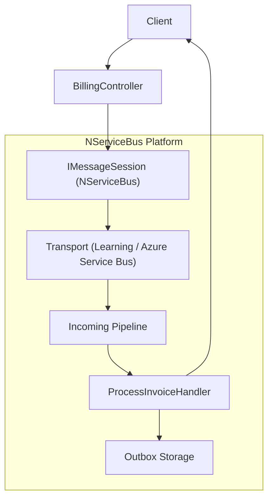
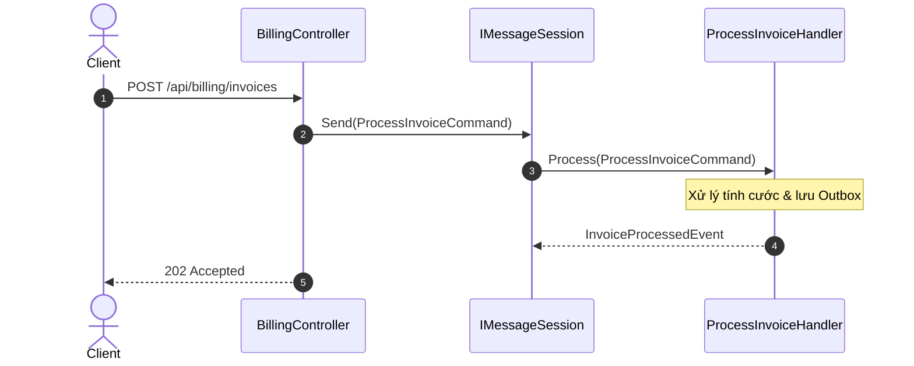

# 09-NServiceBus

Dự án này minh họa cách tích hợp và sử dụng **NServiceBus** - một enterprise service bus (ESB) mạnh mẽ cho .NET. Dự án mô phỏng một hệ thống thanh toán đơn hàng, xử lý các lệnh và sự kiện một cách bất đồng bộ để tăng cường độ tin cậy và khả năng mở rộng.

## 1. Mục Tiêu
- Trình bày cách cấu hình cơ bản của NServiceBus trong ứng dụng .NET 10.
- Giới thiệu khái niệm Commands, Events, và Handlers trong mô hình Message-Driven.
- Cung cấp kiến thức về Learning Transport để dễ dàng phát triển và kiểm thử mà không cần cài đặt hạ tầng thực tế.
- Hướng dẫn thiết lập Routing cho local endpoints.

## 2. Kiến Trúc và Các Thành Phần Cốt Lõi
- **NServiceBus**: Cung cấp bộ khung giao tiếp tin nhắn (messaging) đảm bảo độ tin cậy. NServiceBus xử lý việc gửi, nhận, retry và lưu vết lỗi (error queue) một cách tự động.
- **Learning Transport**: Môi trường transport (trung chuyển) nội bộ dùng trong môi trường phát triển (Dev) hoặc chạy thử (Demo). Nó lưu trữ messages ở dưới dạng file trong thư mục `.learningtransport` (zero-infrastructure), do đó bạn không cần phải cấu hình RabbitMQ, Azure Service Bus hay MSMQ.
- **Commands và Events**:
  - `BillOrderCommand`: Một lệnh (Command) chỉ định một hành động cụ thể cần thực hiện (thanh toán).
  - `OrderBilledEvent`: Một sự kiện (Event) thông báo cho các dịch vụ khác rằng hành động đã hoàn tất.
- **Message Handlers**: Lớp triển khai `IHandleMessages<T>` nơi chứa logic nghiệp vụ, như `BillOrderHandler` dùng để xử lý lệnh `BillOrderCommand`.


## Sơ đồ Kiến trúc & Luồng dữ liệu (Architecture & Data Flow)

### 1. Sơ đồ Kiến trúc Tổng quan (Architecture Overview)


### 2. Mô hình Luồng dữ liệu Chi tiết (Data Flow & Sequence)


### 3. Các Use Cases Cụ thể trong Thực tế (Concrete Use Cases)
- **Hệ thống Doanh nghiệp Phân tán Cấp cao**: Đòi hỏi chuẩn SLA cao, giám sát tập trung (ServicePulse, ServiceInsight).
- **Quy trình Saga Dài hạn**: Quản lý vòng đời dài hạn (Long-running processes) kéo dài nhiều ngày hoặc nhiều tuần.
- **Khả năng tự phục hồi (Self-healing)**: Cơ chế retry thông minh nhiều cấp độ (Immediate Retry, Delayed Retry).


## 3. Tại sao chọn NServiceBus?
- **Saga Capabilities**: Hỗ trợ mạnh mẽ việc quản lý các chuỗi giao dịch dài (Long-running processes) hay phân tán bằng Saga pattern, theo dõi state của các quá trình nghiệp vụ.
- **Độ Tin Cậy Cao**: Cơ chế thử lại (Retry) tích hợp sẵn, từ immediate retry (thử lại ngay lập tức) đến delayed retry (thử lại sau một khoảng thời gian).
- **Audit & Error Handling**: Các tin nhắn lỗi sẽ được chuyển vào hàng đợi `error`, và tin nhắn xử lý thành công được ghi vết tại hàng đợi `audit`.
- **Cộng Đồng và Tài Liệu**: Tài liệu dồi dào, phù hợp cho quy mô từ nhỏ đến hệ thống Enterprise phức tạp.

## 4. Đặc tả API
API cung cấp các endpoints sau:

| Phương thức | Đường dẫn | Mô tả | Mã trạng thái thành công |
|-------------|-----------|-------|--------------------------|
| POST | `/api/billing/bill` | Gửi lệnh thanh toán (BillOrderCommand) | 202 Accepted |
| GET | `/api/billing/invoices` | Lấy danh sách hóa đơn | 200 OK |
| GET | `/api/billing/invoices/{orderId}`| Lấy hóa đơn theo OrderId | 200 OK / 404 Not Found |

**Ví dụ Payload POST `/api/billing/bill`:**
```json
{
  "orderId": "3fa85f64-5717-4562-b3fc-2c963f66afa6",
  "amount": 1500000,
  "customerEmail": "customer@example.com"
}
```

## 5. Hướng Dẫn Chạy Dự Án
Chạy ứng dụng với lệnh:
```bash
cd OrderBilling.Api
dotnet restore
dotnet run
```
Truy cập giao diện Swagger tại: `http://localhost:5109/swagger/index.html`

## 6. Hướng Dẫn Kiểm Thử (Tests)
Dự án có sẵn bộ Unit/Integration Tests viết bằng xUnit và WebApplicationFactory.
Để chạy kiểm thử:
```bash
cd OrderBilling.Tests
dotnet test
```
Các bài kiểm thử cover kịch bản:
- Gửi lệnh thanh toán thành công và kiểm tra hóa đơn (cần một chút thời gian chờ do NServiceBus xử lý ngầm).
- Báo lỗi (400) cho các tham số không hợp lệ.
- Lấy thông tin hóa đơn (404/200).

## 7. Cấu Trúc Mã Nguồn (Tóm Tắt)
- `Program.cs`: Cấu hình NServiceBus và Learning Transport.
- `Messages/`: Nơi định nghĩa các messages (Commands/Events).
- `Handlers/BillOrderHandler.cs`: Nhận và xử lý lệnh thanh toán.
- `Endpoints/BillingEndpoints.cs`: Khai báo Minimal APIs để giao tiếp với Client và ném tin nhắn vào Service Bus thông qua `IMessageSession`.
- `Data/InvoiceStore.cs`: Mock database (sử dụng ConcurrentDictionary).

## 8. Cân Nhắc Về Giấy Phép (Licensing)
**Đặc biệt lưu ý:**
- **NServiceBus** là sản phẩm thương mại của **Particular Software**.
- Đối với mục đích học tập, phát triển, hoặc dùng `LearningTransport`, ứng dụng sẽ chạy mà không đòi hỏi phải có license key ngay, nhưng trong một số trường hợp sẽ in ra cảnh báo hoặc yêu cầu license trong môi trường Production.
- Để sử dụng trong Production với đầy đủ các Transport (RabbitMQ, Azure, ASB, SQS,...) và công cụ giám sát như ServiceControl / ServicePulse, bạn **cần mua giấy phép (Commercial License)**. Hãy kiểm tra [trang web của Particular Software](https://particular.net/licensing) để biết thêm chi tiết hoặc đăng ký giấy phép dùng thử (Trial/Free cho dự án nhỏ).

## 9. Mở Rộng
Bạn có thể mở rộng project này bằng cách:
1. Đổi `LearningTransport` thành `RabbitMQTransport` để thực hành với một broker thực.
2. Thêm một Endpoint (Project) mới tên là `OrderShipping.Api` lắng nghe sự kiện `OrderBilledEvent` để giao hàng.
3. Cài đặt **Saga** để chờ nhiều sự kiện hoàn tất trước khi kết thúc một quy trình.

## 10. Các Vấn Đề Thường Gặp (Troubleshooting)
- Nếu dự án tạo ra thư mục `.learningtransport` chiếm nhiều dung lượng trên máy tính hoặc bị khóa (locked file), bạn có thể an tâm xóa nó đi khi quá trình phát triển (dev) đã dừng hoàn toàn.
- Hãy cẩn trọng về delay trong Unit Test. Nếu NServiceBus phản hồi chậm hơn 2s, bạn có thể phải tinh chỉnh lại thời gian Task.Delay() trong `BillingTests`.

## 11. Các Best Practices
- Giữ Message nhỏ gọn (chỉ chứa data thật sự cần thiết).
- Tránh chia sẻ code logic trong Assembly chứa Message (Nên tách ra một Project `.Contracts` hoặc `.Messages` độc lập).
- Handler chỉ nên gọi Service Layer để xử lý nghiệp vụ chứ không nên chứa một file handler hàng ngàn dòng code.

## 12. Tài Liệu Tham Khảo
- [NServiceBus Documentation](https://docs.particular.net/nservicebus/)
- [Learning Transport](https://docs.particular.net/transports/learning/)
