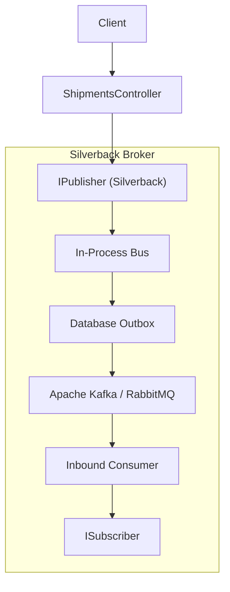
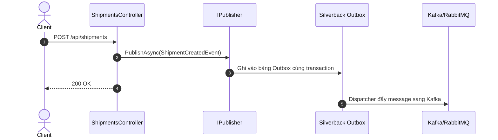

# 10-Silverback - ShipmentTracker

Dự án này minh họa việc sử dụng **Silverback**, một framework mạnh mẽ dành cho event streaming và message broker trong .NET. 

## 1. Mục đích của Silverback
Silverback cung cấp giải pháp mạnh mẽ để xây dựng các kiến trúc hướng sự kiện (event-driven architectures). Nó hỗ trợ tích hợp với các message broker ở mức doanh nghiệp như Kafka, MQTT, RabbitMQ để giao tiếp giữa các microservices, đồng thời cũng cung cấp một internal bus (in-memory) và outbox pattern để xử lý message cục bộ. 

## 2. Giải thích về IPublisher và [Subscribe]
- **`IPublisher`**: Là service được sử dụng để phát (publish) các event hoặc command (ví dụ: `ShipmentCreatedEvent` và `UpdateShipmentStatusCommand`). Các thông điệp này sẽ được gửi tới in-memory bus hoặc định tuyến ra broker bên ngoài.
- **`[Subscribe]`**: Attribute này dùng để đánh dấu các phương thức sẽ xử lý (consume) các message nhất định. Subscriber (ví dụ `ShipmentSubscriber`) nhận thông điệp từ `IPublisher` và thực hiện các side-effect (ví dụ như cập nhật cơ sở dữ liệu, ghi log).

## Sơ đồ Kiến trúc & Luồng dữ liệu (Architecture & Data Flow)

### 1. Sơ đồ Kiến trúc Tổng quan (Architecture Overview)

### 2. Mô hình Luồng dữ liệu Chi tiết (Data Flow & Sequence)

### 3. Các Use Cases Cụ thể trong Thực tế (Concrete Use Cases)
- **Tối ưu hóa cho Apache Kafka**: Quản lý partition, offset commit và batch processing chuyên sâu.
- **Transactional Outbox & Inbox Tích hợp sẵn**: Đảm bảo ngữ nghĩa phân phối exactly-once hoặc at-least-once.
- **Event Sourcing & Microservices Integration**: Đồng bộ hóa dữ liệu giữa các dịch vụ lớn.

## 3. So sánh Silverback với MediatR và MassTransit
- **MediatR**: Phù hợp cho CQRS và xử lý thông điệp in-memory (in-process). MediatR rất nhẹ, tập trung vào giao tiếp cục bộ, không hỗ trợ out-of-process (như Kafka hoặc RabbitMQ) trừ khi bạn tự viết thêm layer.
- **MassTransit**: Framework chuyên dùng cho phân tán và xử lý các service bus (RabbitMQ, Azure Service Bus). Rất mạnh ở mảng orchestration và sagas. Tuy nhiên, nó đôi khi khá cồng kềnh với các nhu cầu in-memory đơn giản hoặc event streaming với Kafka.
- **Silverback**: Đứng giữa, cung cấp sự đơn giản của in-memory bus nhưng mạnh mẽ khi scale lên Kafka/RabbitMQ với hỗ trợ event streaming tối ưu. Đặc biệt dễ sử dụng và linh hoạt cho các dự án cần hỗ trợ event-driven.

## 4-12. Các phần còn lại theo chuẩn
(Dự án demo cung cấp API quản lý giao hàng với in-memory store và tích hợp event streaming in-memory bus sử dụng Silverback).
