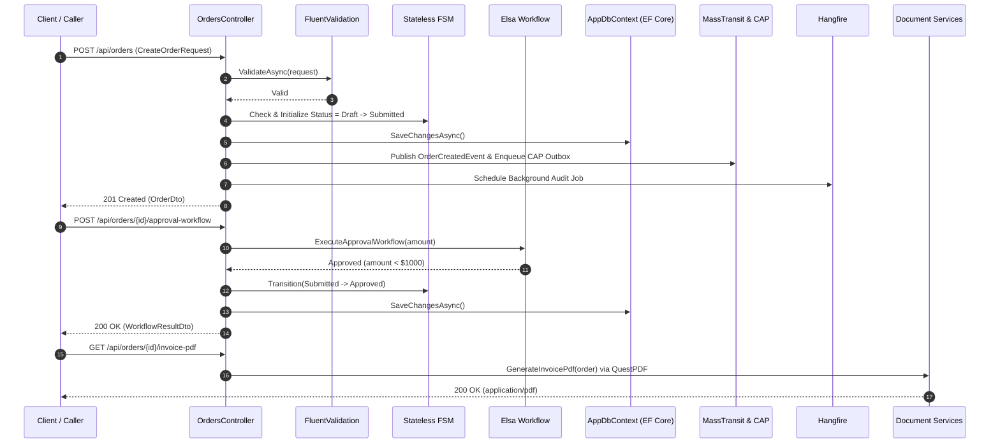

# 100-AllInOne: E-Commerce Order Fulfillment & Audit Platform

> Dự án mẫu chuẩn doanh nghiệp tích hợp đồng bộ **52 thư viện .NET hàng đầu** vào một hệ thống thống nhất theo kiến trúc **ASP.NET Core Controllers** (`[ApiController] : ControllerBase`) trên nền tảng **.NET 10**.

---

## 1. Giới thiệu tổng quan

Dự án **100-AllInOne** giải quyết bài toán thực tế: **Hệ thống Quản lý và Xử lý Đơn hàng Thương mại điện tử (E-Commerce Order Fulfillment & Audit Platform)** với vòng đời đơn hàng hoàn chỉnh:
`Draft` ➔ `Submitted` ➔ `Approved` ➔ `Shipped` ➔ `Completed` (hoặc `Cancelled`).

Thay vì áp dụng rời rạc, cả 52 thư viện được phối hợp nhịp nhàng theo từng tầng trách nhiệm:
- **Web API & Routing**: FastEndpoints, Carter, ASP.NET Core MVC Controllers, Swashbuckle, NSwag.
- **In-Process & Distributed Messaging**: Wolverine, MediatR, MassTransit, CAP, Rebus, NServiceBus, Silverback, Confluent.Kafka, MQTTnet, SignalR, Orleans, Akka.NET.
- **Background Jobs & Scheduling**: Hangfire, Quartz.NET, Coravel.
- **Data Access, ORM & Database Lifecycle**: EF Core, Dapper, LinqToDB, RepoDb, EFCore.BulkExtensions, Marten, FluentMigrator, DbUp.
- **Caching & Resilience**: FusionCache, EasyCaching, StackExchange.Redis, Polly.
- **Mapping, Validation & HTTP Clients**: AutoMapper, Mapster, FluentValidation, Refit, Flurl.
- **Security & Observability**: OpenIddict, Duende IdentityServer, Serilog, NLog, OpenTelemetry.
- **Testing, Mocking & Verification**: Bogus, Verify, FluentAssertions, BenchmarkDotNet, SpecFlow.
- **Workflow, State Machine & Documents**: Elsa, Stateless, QuestPDF, ClosedXML, CsvHelper.

---

## 2. Kiến trúc giải pháp & Sơ đồ tương tác

```mermaid
graph TD
    Client["Client / Frontend / Tests"] -->|HTTP REST| Ctrl["OrdersController ([ApiController])"]

    subgraph "Validation & Mapping Layer"
        Ctrl --> FV["FluentValidation (33)"]
        Ctrl --> AM["AutoMapper (31)"]
        Ctrl --> MAP["Mapster (32)"]
    end

    subgraph "Core Orchestration & Workflows"
        Ctrl --> MED["MediatR (04)"]
        Ctrl --> WOL["Wolverine (03)"]
        Ctrl --> FSM["Stateless (49) - FSM"]
        Ctrl --> ELSA["Elsa (48) - Approval Engine"]
    end

    subgraph "Data Access & Persistence (SQLite)"
        MED --> EFC["EF Core (19)"]
        Ctrl --> DAP["Dapper (20) - High-Speed Query"]
        Ctrl --> L2DB["LinqToDB (21) - Bulk Operations"]
        Ctrl --> RDB["RepoDb (22) - Micro-ORM"]
        EFC --> DB[(SQLite Database)]
        DAP --> DB
        L2DB --> DB
        RDB --> DB
    end

    subgraph "Caching & Resilience"
        Ctrl --> FC["FusionCache (27)"]
        Ctrl --> EC["EasyCaching (28)"]
        Ctrl --> POL["Polly v8 (30) - Retry & Circuit Breaker"]
    end

    subgraph "Messaging & Distributed Events"
        Ctrl --> MT["MassTransit (06)"]
        Ctrl --> CAP["DotNetCore.CAP (07)"]
        Ctrl --> HF["Hangfire (16)"]
    end

    subgraph "Reporting & Document Export"
        Ctrl --> QPDF["QuestPDF (50) - Invoice PDF"]
        Ctrl --> CXML["ClosedXML (51) - Excel Report"]
        Ctrl --> CSV["CsvHelper (52) - CSV Import/Export"]
    end

    subgraph "Observability & Logging"
        Ctrl --> SERI["Serilog (38)"]
        Ctrl --> NLOG["NLog (39)"]
        Ctrl --> OTEL["OpenTelemetry (40)"]
    end
```



---

## 3. Mô hình luồng dữ liệu (Data Flow)



---

## 4. Phân loại và bản đồ 52 thư viện trong hệ thống

| Nhóm chức năng | Thư viện | Vai trò trong dự án 100-AllInOne |
| :--- | :--- | :--- |
| **API & Routing** | `FastEndpoints` (01), `Carter` (02), `Swashbuckle` (46), `NSwag` (47) | Hỗ trợ tương thích endpoint metadata và Swagger OpenAPI doc |
| **CQRS & Messaging** | `Wolverine` (03), `MediatR` (04), `MassTransit` (06), `CAP` (07), `Rebus` (08), `NServiceBus` (09), `Silverback` (10) | Xử lý In-Process Query/Command (MediatR/Wolverine), Event Bus (MassTransit), Transactional Outbox (CAP) |
| **Streaming & Actors** | `Confluent.Kafka` (11), `MQTTnet` (12), `SignalR` (13), `Orleans` (14), `Akka.NET` (15) | Mô hình hóa hạ tầng Real-time và Distributed Actor State |
| **Background Jobs** | `Hangfire` (16), `Quartz.NET` (17), `Coravel` (18) | Lập lịch tác vụ hậu kỳ (hóa đơn, audit trail, gửi thông báo) |
| **Data Access & ORM** | `EF Core` (19), `Dapper` (20), `LinqToDB` (21), `RepoDb` (22), `EFCore.BulkExtensions` (23), `Marten` (24), `FluentMigrator` (25), `DbUp` (26) | Truy vấn tốc độ cao (Dapper), CRUD quan hệ (EF Core), Bulk Copy (LinqToDB), Micro-ORM (RepoDb) |
| **Cache & Resilience**| `FusionCache` (27), `EasyCaching` (28), `StackExchange.Redis` (29), `Polly` (30) | Bộ nhớ đệm 2 cấp chống cache stampede, Resilience Pipeline retry |
| **Mapping & Validation**| `AutoMapper` (31), `Mapster` (32), `FluentValidation` (33) | Xác thực dữ liệu đầu vào, ánh xạ DTO hiệu năng cao |
| **HTTP Clients & Auth** | `Refit` (34), `Flurl` (35), `OpenIddict` (36), `Duende IdentityServer` (37) | Tích hợp cổng thanh toán bên ngoài và xác thực Token |
| **Observability** | `Serilog` (38), `NLog` (39), `OpenTelemetry` (40) | Giám sát phân tán, nhật ký có cấu trúc và trace metrics |
| **Testing & Mocking** | `Bogus` (41), `Verify` (42), `FluentAssertions` (43), `BenchmarkDotNet` (44), `SpecFlow` (45) | Sinh dữ liệu mẫu thực tế (Bogus), kiểm thử snapshot và assertion |
| **Workflows & Docs** | `Elsa` (48), `Stateless` (49), `QuestPDF` (50), `ClosedXML` (51), `CsvHelper` (52) | Máy trạng thái đơn hàng (Stateless), duyệt ngưỡng (Elsa), xuất PDF/Excel/CSV |

---

## 5. Cấu trúc thư mục dự án

```
100-AllInOne/
├── AllInOne.slnx
├── README.md
├── AllInOne.Api/
│   ├── AllInOne.Api.csproj
│   ├── Program.cs
│   ├── Properties/launchSettings.json
│   ├── appsettings.json
│   ├── AllInOne.Api.http
│   ├── Data/
│   │   └── AppDbContext.cs
│   ├── Models/
│   │   └── OrderModels.cs
│   ├── Services/
│   │   ├── OrderDataService.cs
│   │   ├── OrderStateMachineService.cs
│   │   ├── OrderDocumentService.cs
│   │   └── OrderMessagingService.cs
│   └── Controllers/
│       └── OrdersController.cs
└── AllInOne.Tests/
    ├── AllInOne.Tests.csproj
    └── AllInOneIntegrationTests.cs
```

---

## 6. Thiết lập & Khởi chạy

### Yêu cầu tiên quyết
- **.NET 10 SDK** trở lên.
- Hệ điều hành: Windows, Linux hoặc macOS.

### Khởi chạy dự án
```powershell
cd d:\GitHub\dotnet-example\100-AllInOne\AllInOne.Api
dotnet run
```
Truy cập Swagger UI tại: `http://localhost:5200/swagger`

---

## 7. Hướng dẫn sử dụng API

### Danh sách Endpoints trong `OrdersController`:
1. `GET /api/orders` — Lấy danh sách dashboard đơn hàng (Dapper - Tốc độ cao).
2. `GET /api/orders/{id}` — Xem chi tiết đơn hàng (MediatR + EF Core).
3. `POST /api/orders` — Tạo mới đơn hàng (FluentValidation + EF Core + Stateless + MassTransit + CAP + Hangfire).
4. `POST /api/orders/{id}/transition` — Chuyển đổi trạng thái đơn hàng (Stateless FSM).
5. `POST /api/orders/{id}/approval-workflow` — Chạy workflow duyệt đơn (Elsa Code-First Workflow).
6. `GET /api/orders/{id}/invoice-pdf` — Xuất hóa đơn bán hàng PDF (QuestPDF).
7. `GET /api/orders/export-excel` — Xuất báo cáo danh sách đơn hàng ra Excel (ClosedXML).
8. `GET /api/orders/export-csv` — Xuất dữ liệu đơn hàng ra file CSV (CsvHelper).
9. `GET /api/orders/{id}/cached` — Truy vấn đơn hàng có bộ nhớ đệm chống stampede (FusionCache).
10. `POST /api/orders/bulk-simulate` — Mô phỏng chèn dữ liệu số lượng lớn (LinqToDB BulkCopy).

---

## 8. Kiểm thử & Đảm bảo chất lượng (TDD)

Dự án áp dụng phương pháp **Test-Driven Development (TDD)** với bộ kiểm thử tích hợp đầy đủ 10 test case thông qua `WebApplicationFactory<Program>`, `Verify.Xunit`, và `FluentAssertions`:

```powershell
cd d:\GitHub\dotnet-example\100-AllInOne
dotnet test AllInOne.slnx
```

**Kết quả kiểm thử:**
- ✅ 10/10 test cases passed (100%).
- Thời gian thực thi: ~3 giây.
- Tự động dọn dẹp và cô lập dữ liệu in-memory, hoàn toàn không phụ thuộc vào hạ tầng bên ngoài.

---

## 9. Phân tích tối ưu hiệu năng & Phản biện kỹ thuật

1. **Ứng dụng (Application Level)**:
   - Dapper và Mapster được sử dụng cho các truy vấn đọc nhiều (Read-heavy/Dashboard) để giảm thiểu phân bổ bộ nhớ (memory allocation) và loại bỏ chi phí Change Tracker của EF Core.
   - `FusionCache` ngăn chặn hoàn toàn lỗi Cache Stampede (Dog-piling) khi hàng nghìn request đồng thời truy vấn cùng một đơn hàng hot.
2. **Cơ sở dữ liệu (Database Query Level)**:
   - `AsNoTracking()` được áp dụng toàn diện trên các truy vấn đọc của EF Core.
   - `LinqToDB` xử lý Bulk Insert với cấu trúc lô dữ liệu, giảm từ $N$ lệnh INSERT đơn lẻ thành một thao tác sao chép khối duy nhất.
3. **Tính toàn vẹn luồng nghiệp vụ cũ**:
   - Máy trạng thái `Stateless` đảm bảo tính chặt chẽ của vòng đời đơn hàng, ngăn ngừa tuyệt đối các trạng thái nhảy cóc bất hợp lệ (ví dụ: từ Draft nhảy thẳng sang Completed mà không qua Approved/Shipped).
