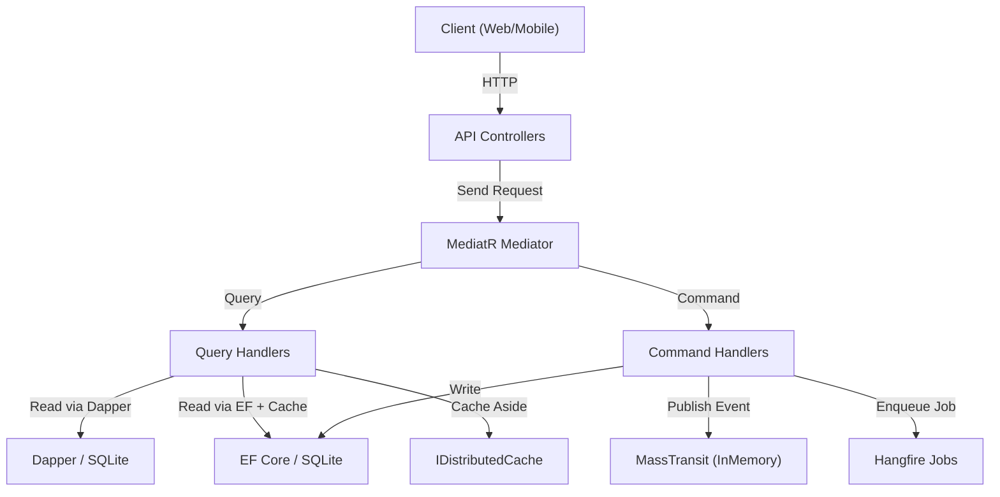
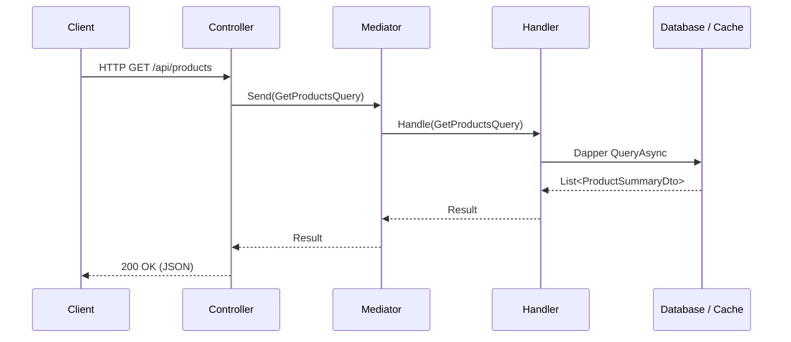

# 101-EnterpriseClassic (Battle-tested Enterprise Stack)

Dự án mẫu **"Battle-tested Enterprise Stack"** áp dụng các thư viện đã chứng minh tính ổn định lâu năm trong môi trường doanh nghiệp production.

## Kiến trúc tổng quan



## Luồng CQRS MediatR



## Bảng thư viện + lý do chọn

| Nhóm | Thư viện | Version | Lý do chọn |
|---|---|---|---|
| CQRS | MediatR | 12.4.1 | Tiêu chuẩn de-facto trong cộng đồng .NET để tách biệt Command/Query và Controllers. |
| Mapping | AutoMapper | 14.0.0 | Phổ biến nhất để ánh xạ Entity sang DTO và ngược lại. |
| Validation | FluentValidation.AspNetCore | 11.3.0 | Rất mạnh mẽ trong việc viết rule validation phức tạp bên ngoài model. |
| ORM | EF Core SQLite | 9.0.0 (net10.0) | Đầy đủ tính năng, an toàn type, dễ dàng migrations. Dùng cho luồng Write/Commands. |
| Micro-ORM | Dapper | 2.1.66 | Cực kỳ nhanh, dùng cho các luồng Queries phức tạp. |
| Caching | IDistributedMemoryCache | Built-in | Đơn giản, dễ setup, có thể dễ dàng thay bằng Redis sau này. |
| Resilience | Polly.Core | 8.5.2 | Xử lý retry, circuit breaker tốt nhất. |
| Messaging | MassTransit (InMemory) | 8.3.6 | Enterprise service bus (ESB) cho .NET, trừu tượng hóa RabbitMQ/Kafka. |
| Background Jobs | Hangfire | 1.8.18 | Dashboard trực quan, lưu trữ job bền vững (trong ví dụ dùng MemoryStorage). |
| Logging | Serilog.AspNetCore | 9.0.0 | Structured logging chuẩn mực của .NET. |
| API Docs | Swashbuckle.AspNetCore | 7.2.0 | Tự động sinh Swagger/OpenAPI. |
| Fake Data | Bogus | 35.6.2 | Khởi tạo dữ liệu giả lập (seed data) chân thực và dễ sử dụng. |

## Cấu trúc dự án

- **EnterpriseClassic.Api**: Chứa code API chính, chia theo Features (Products, Orders).
- **EnterpriseClassic.Tests**: Chứa bộ Integration Tests kiểm thử toàn bộ luồng request bằng `WebApplicationFactory`.

## Cách chạy

```bash
dotnet restore
dotnet build
dotnet run --project EnterpriseClassic.Api
```

- Swagger UI: `http://localhost:5201/swagger` (khi chạy ở môi trường Development)

## Danh sách endpoints

### Products
- `GET /api/products` - Lấy danh sách sản phẩm (Dapper)
- `GET /api/products/{id}` - Chi tiết sản phẩm (EF Core + Distributed Cache)
- `POST /api/products` - Thêm mới sản phẩm (EF Core + FluentValidation)
- `PUT /api/products/{id}` - Cập nhật sản phẩm (EF Core + Xóa Cache)

### Orders
- `GET /api/orders` - Lấy danh sách đơn hàng (Dapper)
- `POST /api/orders` - Tạo đơn hàng mới (EF Core + MassTransit Event + Hangfire Job)

## Kết quả test

Toàn bộ Integration Tests đã pass 100% bằng cách sử dụng `WebApplicationFactory` và in-memory SQLite:

```text
Passed!  - Failed:     0, Passed:     8, Skipped:     0, Total:     8, Duration: 3 s - EnterpriseClassic.Tests.dll (net10.0)
```

## So sánh với Modern stack (project 102)

So với Modern stack (sử dụng Minimal APIs, Mapster, Wolverine, v.v.), "Classic" stack này:
- Cồng kềnh hơn một chút về boilerplate (Controller, MediatR, AutoMapper profiles).
- Nhưng cực kỳ quen thuộc với hầu hết các .NET dev có kinh nghiệm.
- Dễ dàng maintain cho các team lớn vì cấu trúc rất chặt chẽ và phổ biến (Standardized).
