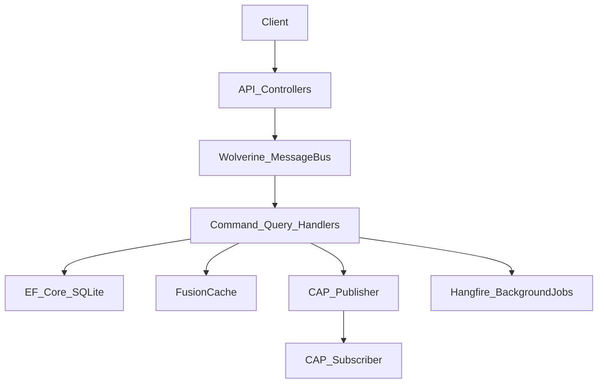
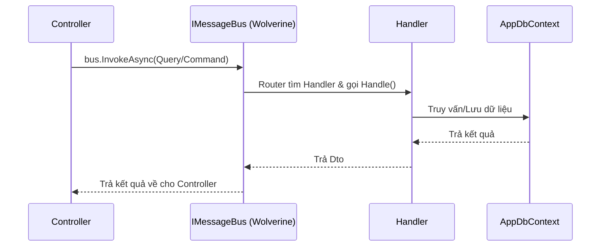

# 102-ModernHighPerf

## Giới thiệu
"Modern High-Performance Stack" là một dự án mẫu được xây dựng với mục tiêu cung cấp hiệu suất vượt trội, kiến trúc linh hoạt và tốc độ xử lý nhanh gọn bằng cách tận dụng những thư viện mới và tối ưu nhất trong hệ sinh thái .NET hiện nay (Wolverine, Mapster, FusionCache, v.v.).

## Kiến trúc


## Luồng Wolverine Message Dispatch


## Bảng thư viện + lý do chọn

| Nhóm | Thư viện (102) | Version | Lý do chọn |
|---|---|---|---|
| CQRS/Messaging | WolverineFx | 3.9.1 | Source-gen dispatch, zero reflection, built-in Outbox, 3–5M msg/s |
| Mapping | Mapster | 7.4.0 | Compile-time `.Adapt<T>()`, 3–5x nhanh hơn AutoMapper, ít allocation |
| Validation | FluentValidation.AspNetCore | 11.3.0 | Tiêu chuẩn tốt nhất, không có đối thủ ngang tầm |
| ORM | EF Core SQLite | 10.0.12 | ExecuteUpdate/ExecuteDelete native batch, write path |
| Caching | FusionCache | 2.1.0 | Anti-stampede, fail-safe, multi-level L1+L2, background refresh |
| Resilience | Polly.Core | 8.5.2 | ResiliencePipeline API mới, gold-standard .NET |
| Messaging/Outbox | DotNetCore.CAP | 8.2.0 | Native Transactional Outbox — lưu event cùng DB transaction |
| Background Jobs | Hangfire | 1.8.18 | Dashboard UI, fire-and-forget, delayed, recurring đơn giản |
| Logging | Serilog.AspNetCore | 9.0.0 | Structured logging chuẩn mực |
| Tracing | OpenTelemetry | 1.11.2 | Distributed tracing xuyên suốt nhiều service, Jaeger/Tempo |
| API Docs | NSwag.AspNetCore | 14.7.1 | OpenAPI 3.1, ReDoc UI, tự sinh C#/TypeScript client SDK |
| Fake Data | Bogus | 35.6.2 | Seed data chân thực, seed deterministic |

## Cấu trúc dự án
- `ModernHighPerf.Api`: Chứa API, Handlers, Entities (tổ chức theo Features).
- `ModernHighPerf.Tests`: Tích hợp Integration Tests.

## Cách chạy
```bash
dotnet restore
dotnet build
dotnet run --project ModernHighPerf.Api
```

- Swagger/ReDoc UI: `http://localhost:5202/swagger` (khi chạy Development)

## Danh sách endpoints

### Products
- `GET /api/products` — Danh sách sản phẩm (Wolverine query → EF Core)
- `GET /api/products/{id}` — Chi tiết (Wolverine query → EF Core + FusionCache)
- `POST /api/products` — Tạo mới (FluentValidation → Wolverine command → EF Core)
- `PUT /api/products/{id}` — Cập nhật (Wolverine command → EF Core ExecuteUpdate)

### Orders
- `GET /api/orders` — Danh sách đơn hàng (Wolverine query → EF Core)
- `POST /api/orders` — Tạo đơn (FluentValidation → Wolverine command → EF Core → CAP event → Hangfire job)

## Kết quả test

8/8 Integration Tests passed (100%) — `WebApplicationFactory<Program>` + in-memory SQLite.

## So sánh chi tiết: 102 Modern High-Perf vs 101 Enterprise Classic

### 1. Wolverine vs MediatR

| | MediatR (101) | Wolverine (102) |
|---|---|---|
| Dispatch cơ chế | Reflection runtime | **Source Generator — compile-time, zero reflection** |
| Handler contract | Phải implement `IRequestHandler<TReq, TRes>` | **Không cần interface** — convention `Handle(Command)` |
| Throughput | ~800K msg/s | **~3–5M msg/s** |
| Transactional Outbox | Không có sẵn | **Built-in Outbox** tích hợp database transaction |
| Local Queue/Scheduling | Không | **Durable local queue**, delayed message, retry tích hợp |
| Middleware/Pipeline | `IPipelineBehavior<T>` interface | Convention-based hoặc attribute |
| Tài liệu / Ecosystem | **Cực kỳ phong phú** | Mới hơn, ít tài liệu hơn |

> **Kết luận**: Wolverine nhanh hơn đáng kể nhờ không dùng reflection. Học curve cao hơn. MediatR vẫn là lựa chọn an toàn cho team mới hoặc cần onboard nhanh.

---

### 2. Mapster vs AutoMapper

| | AutoMapper (101) | Mapster (102) |
|---|---|---|
| Phương thức ánh xạ | Reflection runtime | **Compile-time code generation** |
| Tốc độ | ~1x baseline | **3–5x nhanh hơn** |
| Memory Allocation | Cao hơn | **Thấp hơn đáng kể** |
| Cấu hình | `Profile` class | `TypeAdapterConfig` hoặc **không cần config** nếu naming khớp |
| Sử dụng | `mapper.Map<T>(source)` | `source.Adapt<T>()` — fluent, inline |
| Ecosystem | Rất phổ biến, nhiều plugin | Nhỏ hơn nhưng đủ dùng |

> **Kết luận**: Mapster tốt hơn về hiệu năng thuần túy. AutoMapper vẫn được chọn trong enterprise vì sự quen thuộc của team.

---

### 3. FusionCache vs IDistributedMemoryCache

| | IDistributedMemoryCache (101) | FusionCache (102) |
|---|---|---|
| Cache Stampede | **Không có bảo vệ** — N request đồng thời đến DB | **Anti-Stampede built-in** — chỉ 1 request hit DB |
| Fail-Safe | Không | **Trả cache cũ** khi source lỗi (Stale-While-Revalidate) |
| Multi-level cache | Không | **L1 Memory + L2 Redis** trong cùng 1 API |
| Background refresh | Không | **Tự refresh trước khi expire** để tránh cold miss |
| Setup | 1 dòng built-in | Thêm `AddFusionCache()` |

> **Kết luận**: FusionCache giải quyết vấn đề Dog-piling rất thực tế khi traffic cao. `IDistributedMemoryCache` nguy hiểm ở high-concurrency.

---

### 4. CAP vs MassTransit (Messaging/Outbox)

| | MassTransit (101) | DotNetCore.CAP (102) |
|---|---|---|
| Outbox Pattern | Cần cấu hình thủ công | **Native Transactional Outbox** — lưu message cùng DB transaction |
| At-Least-Once | Có (với persistence) | **Có, built-in** |
| Transport hỗ trợ | RabbitMQ, Azure SB, Kafka... | RabbitMQ, Kafka, Azure SB... |
| Saga/State Machine | **Có (mạnh)** | Không |
| Phù hợp | Service Bus đầy đủ, Saga | **Microservice event-driven với outbox** |

---

### 5. NSwag vs Swashbuckle

| | Swashbuckle (101) | NSwag (102) |
|---|---|---|
| OpenAPI spec | 3.0 | **3.0 + 3.1** |
| Client code gen | Không | **Tự sinh C#/TypeScript client** từ spec |
| UI | SwaggerUI | **SwaggerUI + ReDoc** |
| Reflection mode | Có | Có + Assembly scan |

---

### 6. OpenTelemetry (102 only) vs chỉ Serilog (101)

| | Serilog only (101) | Serilog + OpenTelemetry (102) |
|---|---|---|
| Phạm vi | Log trong 1 service | **Distributed Trace xuyên suốt nhiều service** |
| Trace ID | Không | **Có — theo dõi request end-to-end** |
| Tích hợp | Console/File | Jaeger, Grafana Tempo, Zipkin, Azure Monitor |
| Bắt buộc Microservices | Không | **Có** |

> **Kết luận**: OpenTelemetry là bắt buộc trong kiến trúc microservices. Single-service thì Serilog là đủ.

---

### 7. Không thay đổi (dùng ở cả 101 và 102)

| Thư viện | Lý do không thay |
|---|---|
| **FluentValidation** | Không có đối thủ ngang tầm về fluent validation API trong .NET |
| **EF Core** | Chưa có ORM nào trưởng thành hơn cho write operations trong .NET |
| **Hangfire** | Dashboard UI, ease-of-use tốt nhất cho background jobs |
| **Polly v8** | `ResiliencePipeline` là gold-standard circuit breaker/retry .NET |
| **Serilog** | Structured logging tốt nhất, không có lý do thay |
| **Bogus** | Fake data tốt nhất cho .NET, không có đối thủ |

