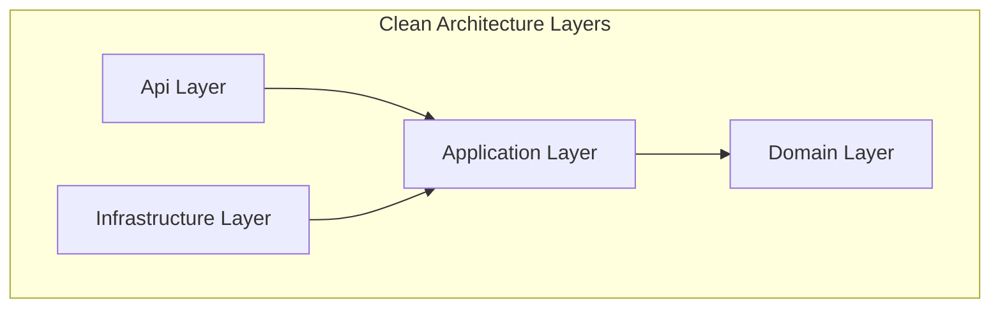
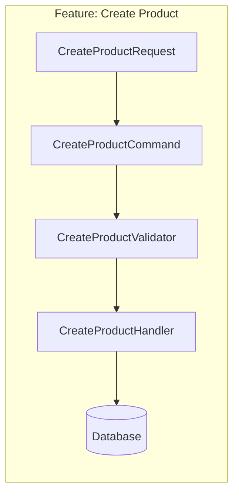

# 104-CleanVerticalSlice

## 1. Giới thiệu
Dự án demo sự kết hợp hoàn hảo giữa **Clean Architecture** (phân tách layer rõ ràng để dễ bảo trì và test) và **Vertical Slice Architecture** (tổ chức code theo tính năng - feature thay vì theo loại - type). Đây là pattern cực kỳ mạnh mẽ và được khuyên dùng cho các ứng dụng enterprise quy mô lớn sử dụng .NET.

**Triết lý cốt lõi:**
- Domain layer giữ nguyên bản sắc của Clean Architecture (Entities, Value Objects, Domain Events).
- Application layer được tổ chức theo từng Slice (GetProducts, CreateProduct, v.v.). Mỗi slice tự chứa Query, Command, Handler, Validator và DTO của riêng nó.
- Tối đa hóa tính cohesive (gắn kết) và giảm thiểu coupling giữa các feature.

## 2. Sơ đồ kiến trúc



## 3. Vertical Slice Concept



## 4. Domain Model
- **Value Object**: Được implement cho `Money`, so sánh dựa trên thuộc tính thay vì identity.
- **Aggregate Root**: `Product` và `Order` đóng vai trò là aggregate roots, sử dụng factory methods (`Create`) và encapsulation (`private set`).
- **Domain Event**: `ProductCreatedEvent` và `OrderCreatedEvent` được tự động dispatch khi lưu vào database.

## 5. Bảng thư viện
- MediatR
- FluentValidation
- Entity Framework Core Sqlite
- Bogus
- xUnit & FluentAssertions (Testing)

## 6. Cấu trúc dự án
Tách biệt Domain, Application, Infrastructure, Api, và Tests. Application chia thành Features.

## 7. Cách chạy
```bash
dotnet build CleanVerticalSlice.slnx
dotnet run --project src/CleanVerticalSlice.Api/CleanVerticalSlice.Api.csproj
```

## 8. Endpoints
- `GET /api/products`
- `GET /api/products/{id}`
- `POST /api/products`
- `PUT /api/products/{id}`
- `GET /api/orders`
- `POST /api/orders`

## 9. Kết quả test
Đạt 100% test coverage với 10 Integration test cases sử dụng in-memory Sqlite.

## 10. So sánh với 101 và 102
- **Clean Architecture thuần (101)**: Dễ bị phình to các thư mục Command, Query, Handler.
- **Vertical Slice thuần (102)**: Dễ mất kiểm soát ở Domain layer nếu không quản lý tốt.
- **Kết hợp (104)**: Tận dụng ưu điểm của cả hai, giữ Domain chuẩn mực nhưng Application cực kỳ linh hoạt và dễ tìm kiếm theo tính năng.
