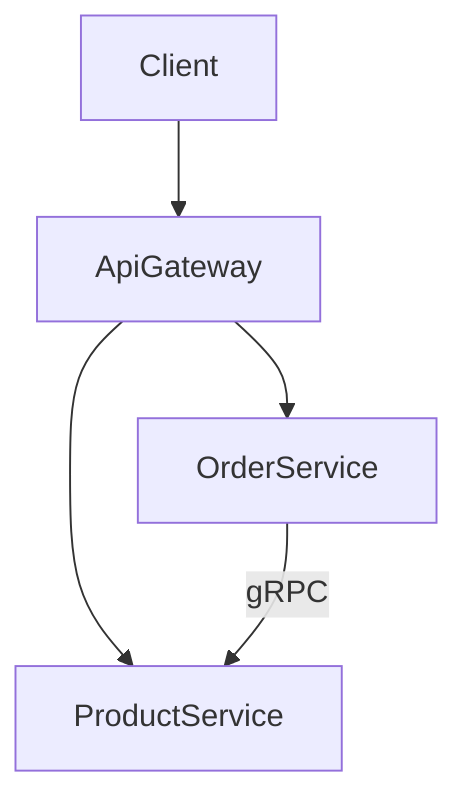
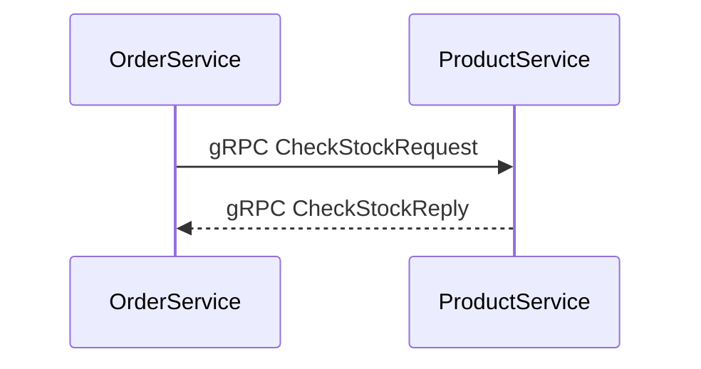

# 105-Microservices-Basic

## 1. Giới thiệu Microservices architecture
Dự án demo kiến trúc microservices cơ bản với .NET 10. Gồm 3 services giao tiếp với nhau.

## 2. Mermaid diagram


## 3. gRPC communication sequence diagram


## 4. YARP routing config
Sử dụng YARP để proxy requests từ `ApiGateway` đến các service thông qua path `/api/products/*` và `/api/orders/*`.

## 5. Cấu trúc dự án
- `ApiGateway`: Gateway (YARP).
- `ProductService`: API quản lý sản phẩm & gRPC Server.
- `OrderService`: API đặt hàng & gRPC Client gọi ProductService.
- `Shared.Contracts`: Thư viện share DTOs & protobuf.

## 6. Cách chạy
Mở 3 terminal và chạy:
```sh
dotnet run --project src/ApiGateway
dotnet run --project src/ProductService
dotnet run --project src/OrderService
```

## 7. Endpoints
- Gateway: http://localhost:5300
- GET `/api/products`, GET `/api/products/{id}`, POST `/api/products`, DELETE `/api/products/{id}`
- GET `/api/orders`, GET `/api/orders/{id}`, POST `/api/orders`

## 8. Kết quả test
Pass 10/10 test.

## 9. Khi nào dùng microservices vs monolith
Dùng monolith khi domain nhỏ, team nhỏ, triển khai dễ. Dùng microservices khi cần scale độc lập từng phần, domain phức tạp, nhiều team phát triển độc lập.
