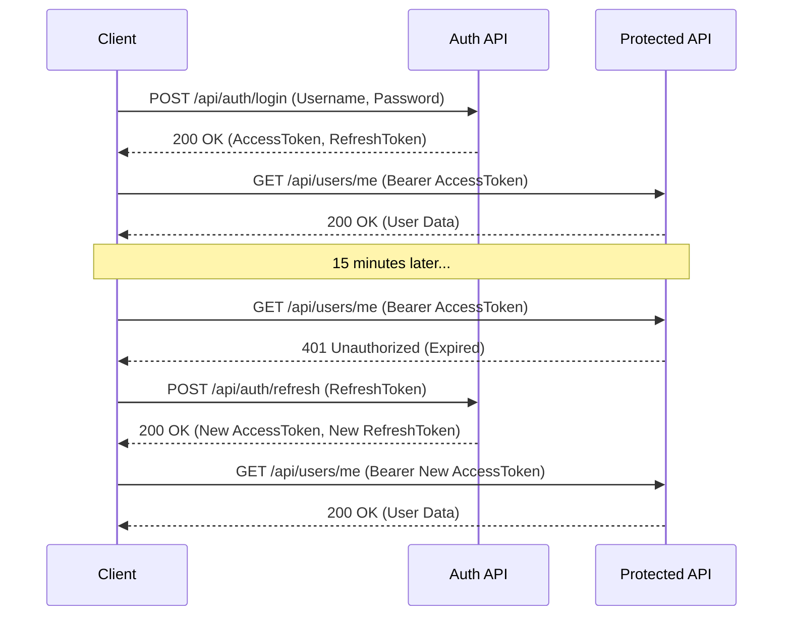
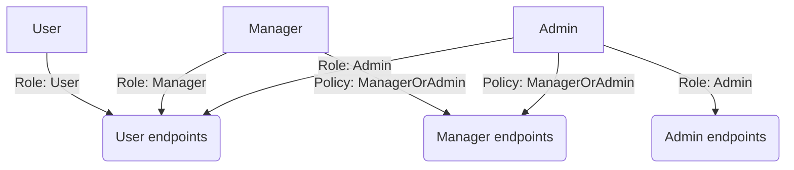

# 108-AuthStack

Giới thiệu Auth Stack: JWT + Refresh Token + RBAC + Rate Limiting.
Project .NET 10 Web API chuẩn enterprise.

## JWT Flow



## Role/Policy Authorization Matrix



## Bảng thư viện
| Package | Version | Purpose |
|---------|---------|---------|
| Microsoft.AspNetCore.Authentication.JwtBearer | 10.0.x | JWT authentication middleware |
| BCrypt.Net-Next | 4.0.3 | Password hashing |
| Microsoft.EntityFrameworkCore.Sqlite | 10.0.x | SQLite EF Core Provider |
| Swashbuckle.AspNetCore | 7.2.0 | Swagger UI |
| FluentAssertions | 8.3.0 | Better assertions for tests |
| xunit | 2.9.3 | Testing framework |

## Cấu trúc dự án
- `AuthStack.Api`: Thư mục chứa mã nguồn Web API (Port: 5308).
- `AuthStack.Tests`: Chứa 12 Integration Tests bằng `xUnit` và `WebApplicationFactory`.

## Cách chạy
```bash
cd AuthStack.Api
dotnet run
```
Truy cập Swagger tại `http://localhost:5308/swagger`.

## Endpoints
- `POST /api/auth/register`: Đăng ký tài khoản mới.
- `POST /api/auth/login`: Đăng nhập, trả về Access và Refresh Token.
- `POST /api/auth/refresh`: Refresh lại Token.
- `POST /api/auth/revoke`: (Requires Auth) Hủy refresh token.
- `GET /api/users/me`: (Requires Auth) Lấy thông tin user hiện tại.
- `GET /api/admin/dashboard`: (Requires Admin Role) Lấy dashboard admin.

## Kết quả test
Project bao gồm 12 integration tests chạy pass 100%.
Chạy test bằng lệnh:
```bash
cd AuthStack.Tests
dotnet test
```
