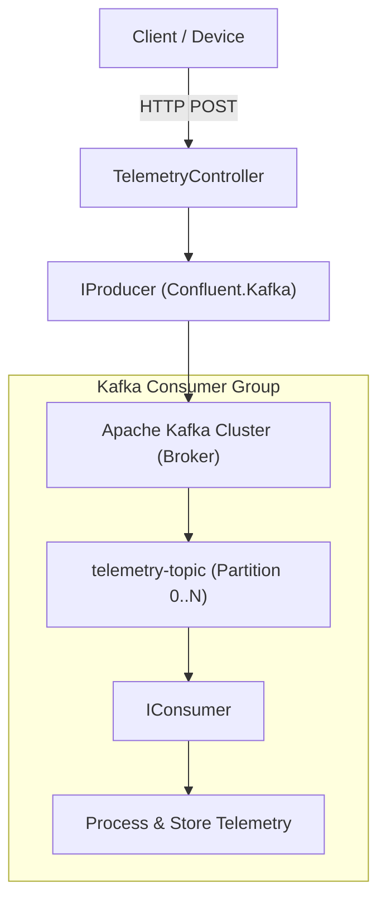
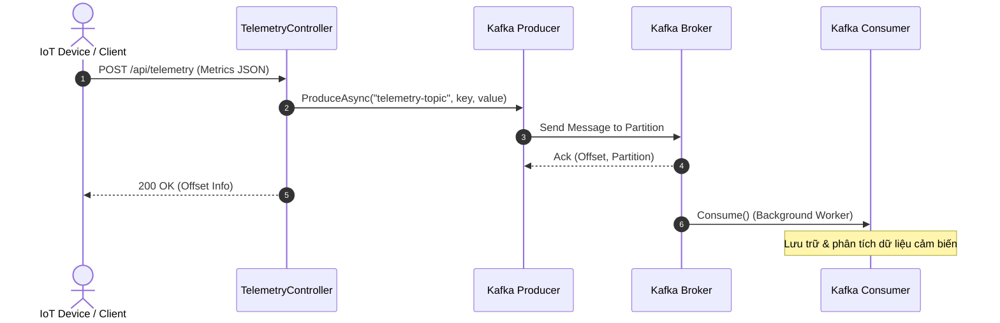

# 11 - ConfluentKafka: Xử lý Luồng Dữ Liệu IoT

Dự án này minh họa cách sử dụng `Confluent.Kafka` - thư viện client chính thức cho Apache Kafka trên nền tảng .NET 10. Dự án được thiết kế để nhận dữ liệu từ các thiết bị IoT, gửi vào Kafka, và có một Background Service đóng vai trò là Consumer để lưu trữ dữ liệu.

## 1. Mục đích
Confluent.Kafka giúp các ứng dụng .NET tương tác với hệ thống Kafka - một nền tảng phân phối streaming phân tán với khả năng mở rộng cao, thông lượng lớn và độ trễ thấp. Kafka phù hợp cho hệ thống theo dõi hành vi, thu thập log, xử lý stream, và tích hợp các microservices.

## 2. Các khái niệm cốt lõi (Key Concepts)
- **Topics**: Luồng dữ liệu (stream) của các messages thuộc cùng một loại.
- **Partitions**: Topic có thể được chia thành nhiều phần, cho phép đọc/ghi song song.
- **Offsets**: Số thứ tự định danh cho mỗi thông điệp (message) trong một partition.
- **Consumer Groups**: Các consumer làm việc cùng nhau để tiêu thụ các topic. Mỗi partition chỉ được đọc bởi một consumer trong cùng một group.
- **Producer Delivery Guarantees**: Các cơ chế bảo đảm thông điệp được gửi thành công (ack=0, ack=1, ack=all).


## Sơ đồ Kiến trúc & Luồng dữ liệu (Architecture & Data Flow)

### 1. Sơ đồ Kiến trúc Tổng quan (Architecture Overview)


### 2. Mô hình Luồng dữ liệu Chi tiết (Data Flow & Sequence)


### 3. Các Use Cases Cụ thể trong Thực tế (Concrete Use Cases)
- **Truyền dẫn Dữ liệu Thời gian Thực (Real-time Ingestion)**: Thu thập hàng triệu bản ghi telemetry, log hoặc sự kiện clickstream mỗi giây.
- **Event Sourcing**: Lưu trữ chuỗi sự kiện không thể thay đổi làm nguồn dữ liệu chân lý.
- **Giao tiếp Bất đồng bộ giữa Microservices**: Phân tán tải thông qua Kafka Consumer Groups.


## 3. Cấu trúc Project
- **KafkaTelemetry.Api**: Web API thu thập dữ liệu IoT và publish lên Kafka (Producer). Background Service sẽ consume dữ liệu từ Kafka và lưu vào memory.
- **KafkaTelemetry.Tests**: Chứa các Unit / Integration Tests sử dụng `WebApplicationFactory`, mock Producer và Consumer để chạy mà không cần Kafka broker.
- **docker-compose.yml**: Chạy Kafka broker cục bộ sử dụng KRaft mode.

## 4. Hướng dẫn chạy dự án

### Môi trường Cục bộ với Docker (Môi trường chuẩn)
1. Mở terminal tại thư mục gốc của dự án.
2. Chạy lệnh: `docker compose up -d` (Kafka sẽ chạy trên port 9092).
3. Chạy ứng dụng API: `dotnet run --project KafkaTelemetry.Api`
4. Mở Swagger tại: `http://localhost:5111/swagger`
5. Test API `POST /api/telemetry` để đẩy dữ liệu vào Kafka và quan sát log của Consumer Service bắt được và lưu message.

### Chạy mà không có Docker (Test / Dev nhẹ)
Dự án được thiết kế với cơ chế bắt lỗi `KafkaException` khi không thể kết nối tới Broker. Bạn vẫn có thể khởi động API thông qua lệnh `dotnet run`. API sẽ chạy và log ra cảnh báo nhưng không gây sập chương trình. Dĩ nhiên, nếu muốn toàn bộ luồng hoạt động thì cần Kafka broker.
Tuy nhiên, `dotnet test` hoàn toàn không phụ thuộc vào Kafka broker nhờ vào Mocking. Chạy test:
`dotnet test`

## 5. Cấu hình
Cấu hình Kafka được đặt trong `appsettings.json`:
```json
"Kafka": {
  "BootstrapServers": "localhost:9092",
  "Topic": "device-telemetry",
  "GroupId": "telemetry-group",
  "EnableConsumer": true
}
```

## 6. Mở rộng cho Môi trường Thực tế (Production Considerations)
- **Partitioning Strategy**: Chọn key cho message (như `DeviceId`) cẩn thận để đảm bảo các dữ liệu của cùng một thiết bị luôn vào cùng một partition, giúp giữ đúng thứ tự.
- **Schema Registry**: Để phát triển API ổn định, dùng Avro hoặc Protobuf thông qua Confluent Schema Registry thay vì JSON thuần túy, điều này giúp check schema khi push.
- **Consumer Offset Commit Strategies**: Cẩn thận với `AutoCommit` - trong các hệ thống đòi hỏi exactly-once hoặc at-least-once, nên tắt `EnableAutoCommit` và gọi hàm commit offset thủ công sau khi lưu dữ liệu thành công.
- **Error Handling và Retries**: Cấu hình Producer retries (`MessageSendMaxRetries`) và dead-letter queues.
