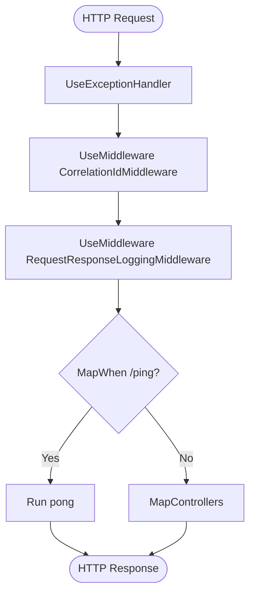

# 110-Middleware-Advanced

## 1. Giới thiệu ASP.NET Core Middleware pipeline
Middleware trong ASP.NET Core là các thành phần phần mềm được lắp ráp vào ứng dụng để xử lý các yêu cầu (requests) và phản hồi (responses). Pipeline này xử lý theo tuần tự: mỗi middleware có thể xử lý request trước hoặc sau khi gọi middleware tiếp theo (bằng cách gọi `next()`), hoặc có thể ngắt (short-circuit) pipeline để trả về response ngay lập tức.

## 2. Middleware pipeline order

## 3. ProblemDetails RFC 9457 giải thích
ProblemDetails (được chuẩn hóa trong RFC 9457) là một định dạng JSON thống nhất để thông báo lỗi cho các HTTP API. Bằng cách sử dụng ProblemDetails, client nhận được định dạng thông báo lỗi dễ phân tích, bao gồm: `type`, `title`, `status`, `detail`, `instance`. .NET 8+ cung cấp sẵn `AddProblemDetails()` để chuẩn hóa tất cả lỗi thành ProblemDetails một cách tự động.

## 4. IExceptionHandler vs ExceptionFilter vs try-catch
- **try-catch**: Bắt lỗi thủ công tại từng dòng code. Khó bảo trì, dễ sót nếu dự án lớn.
- **ExceptionFilter**: Một phần của MVC filter pipeline, chỉ bắt được các lỗi xảy ra bên trong phạm vi controller/action. Không bắt được lỗi từ middleware hoặc routing.
- **IExceptionHandler (.NET 8+)**: Interface được sử dụng cùng `UseExceptionHandler`, nằm ở trên cùng của pipeline. Cho phép xử lý tất cả unhandled exceptions trên toàn bộ pipeline HTTP một cách tập trung, thanh lịch và tích hợp sẵn với ProblemDetails.

## 5. Correlation ID pattern
Correlation ID là một định danh duy nhất (thường là GUID) đính kèm vào HTTP Request Header (`X-Correlation-Id`). Nó được dùng để theo dõi (trace) toàn bộ chu trình xử lý của một yêu cầu xuyên suốt qua nhiều dịch vụ (microservices), middleware và database. Middleware trong dự án sẽ lấy Correlation ID này (hoặc tự tạo nếu thiếu) và đẩy vào LogContext của Serilog để mọi log đều có dấu vết.

## 6. Cấu trúc dự án
Dự án bao gồm:
- **MiddlewareAdvanced.Api**: Ứng dụng Web API chứa custom middlewares, `IExceptionHandler`, controllers.
- **MiddlewareAdvanced.Tests**: Dự án Integration Tests với xUnit và `WebApplicationFactory` chạy kiểm thử trên pipeline thực.

## 7. Cách chạy
- Dùng .NET 10 (`net10.0`)
- Tại thư mục gốc: `dotnet run --project MiddlewareAdvanced.Api`
- Truy cập Swagger: `http://localhost:5310/swagger`

## 8. Endpoints
- `GET /api/products`: Danh sách sản phẩm.
- `POST /api/products`: Tạo mới sản phẩm (Bắn lỗi nếu name rỗng).
- `GET /api/demo/not-found`: Bắn lỗi 404 (Resource not found).
- `GET /api/demo/business-error`: Bắn lỗi 400 (Insufficient inventory).
- `GET /api/demo/server-error`: Bắn lỗi 500 (Unhandled Server Error).
- `GET /api/demo/correlation-id`: Lấy Correlation ID hiện tại.
- `GET /api/demo/slow-endpoint`: Demo log duration.
- `GET /ping`: Demo nhánh MapWhen.

## 9. Kết quả test
Project bao gồm 12 bài test (integration tests) kiểm tra toàn bộ pipeline, exception handling, và correlation id. Tất cả pass 100%.
