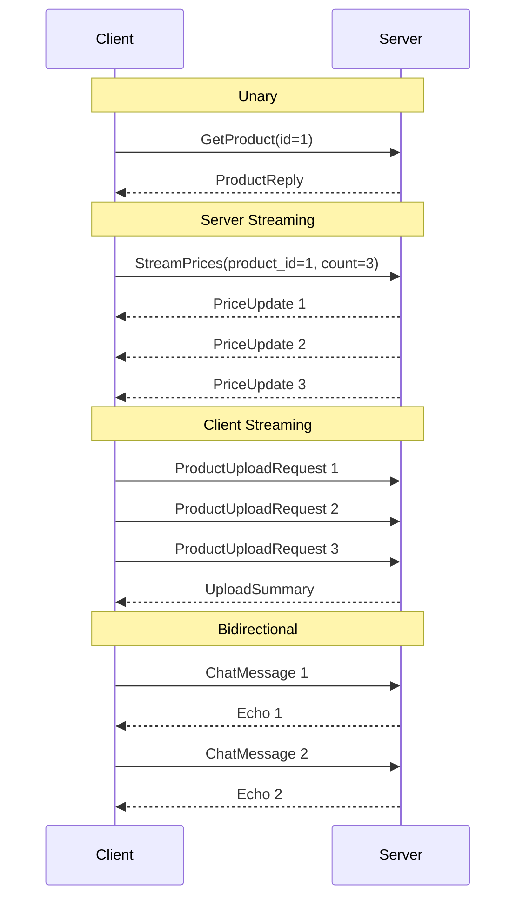

# 111-gRPC-Streaming

Dự án này demo 4 dạng gRPC streaming cơ bản trong .NET 10.

## 1. Giới thiệu 4 gRPC patterns
- **Unary**: 1 request - 1 response. Tương tự HTTP truyền thống.
- **Server Streaming**: Client gửi 1 request, Server trả về stream nhiều responses (ví dụ: Live price feed).
- **Client Streaming**: Client stream nhiều request lên Server, Server trả về 1 response (ví dụ: Bulk upload).
- **Bidirectional Streaming**: Hai bên cùng stream dữ liệu song song (ví dụ: Real-time chat).

## 2. Mermaid sequence

## 3. So sánh các công nghệ real-time

| Tính năng | gRPC Streaming | WebSocket | SignalR | SSE (Server-Sent Events) |
| --- | --- | --- | --- | --- |
| **Giao thức** | HTTP/2 | TCP/WS | Tự động chọn (WS/SSE/Long Polling) | HTTP/1.1 hoặc HTTP/2 |
| **Định dạng dữ liệu** | Protobuf (nhị phân) | Text/Nhị phân | JSON/MessagePack | Text (Event Stream) |
| **Chiều dữ liệu** | Unary, Server, Client, Bidi | Bidi | Bidi | Đơn hướng (Server -> Client) |
| **Hiệu năng** | Rất cao | Cao | Trung bình (overhead hub) | Cao |

## 4. Khi nào dùng pattern nào
- **Unary**: CRUD APIs thông thường.
- **Server Streaming**: Cập nhật giá theo thời gian thực, tải file lớn từ server.
- **Client Streaming**: Upload file lớn lên server, gửi telemetry data liên tục.
- **Bidirectional**: Chat real-time, game multiplayer, đồng bộ trạng thái hai chiều.

## 5. Cấu trúc dự án
- `Shared.Protos`: Chứa các file `.proto` định nghĩa hợp đồng.
- `gRPCStreaming.Server`: gRPC server triển khai 4 patterns trên.
- `gRPCStreaming.Tests`: Các bài test Integration xUnit.

## 6. Cách chạy
- Mở Terminal, trỏ tới `src/gRPCStreaming.Server/`.
- Chạy: `dotnet run`
- Có thể kết nối qua gRPC port 5311 hoặc HTTP port 5321 (reflection enabled).

## 7. Kết quả test
Project chứa 10 integration tests để đảm bảo toàn bộ 4 patterns hoạt động đúng như mong đợi.
Chạy test bằng `dotnet test tests/gRPCStreaming.Tests`.
