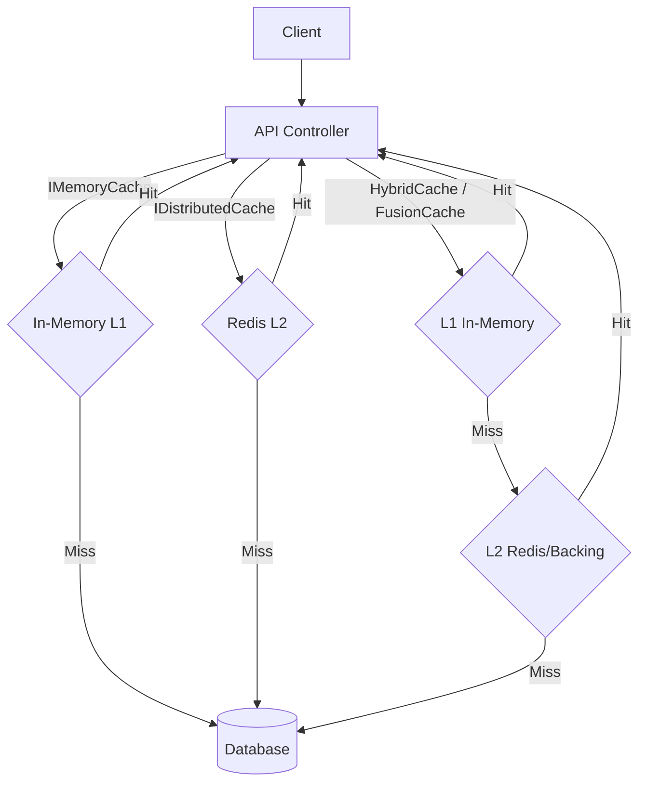

# 112-CachingAdvanced

Dự án này demo các chiến lược Caching nâng cao trong ASP.NET Core 10.

## 1. Giới thiệu 4 loại cache
- **IMemoryCache**: L1 cache (in-process). Nhanh nhất, lưu trực tiếp trên memory của app. Dễ bị stampede nếu không lock.
- **IDistributedCache**: L2 cache (distributed). Thường dùng Redis/Memcached. Phù hợp cho multi-instance/microservices.
- **HybridCache** (.NET 9+): Tự động quản lý L1 (in-process) và L2 (distributed). Bảo vệ stampede mặc định.
- **FusionCache**: Thư viện mạnh mẽ hỗ trợ L1 + L2, Fail-safe (trả về dữ liệu cũ nếu factory lỗi hoặc timeout), background refresh, và chống Cache Stampede.

## 2. Mermaid: L1 vs L2 vs Hybrid vs FusionCache flow

## 3. Bảng so sánh 4 cache

| Tính năng | IMemoryCache | IDistributedCache | HybridCache | FusionCache |
|---|---|---|---|---|
| Cấp độ | L1 | L2 | L1 + L2 | L1 + L2 |
| Tốc độ | Cực nhanh | Nhanh | Cực nhanh | Cực nhanh |
| Stampede Protection | ❌ Không | ❌ Không | ✅ Có | ✅ Có |
| Fail-Safe | ❌ Không | ❌ Không | ❌ Không | ✅ Có |
| Multi-level tự động | ❌ Không | ❌ Không | ✅ Có | ✅ Có |

## 4. Cache Invalidation strategies
- **Time-based**: `AbsoluteExpiration`, `SlidingExpiration`.
- **Event-based**: Xóa cache key khi có sự kiện (ví dụ Update/Delete product).
- **Tag-based**: Xóa nhiều key dựa trên tag (HybridCache hỗ trợ mạnh mẽ tag).

## 5. Cấu trúc dự án
Dự án được chia làm 2 phần: `CachingAdvanced.Api` và `CachingAdvanced.Tests`.
Các services: `MemoryCacheService`, `DistributedCacheService`, `HybridCacheService`, `FusionCacheService` đại diện cho các cách tiếp cận.

## 6. Cách chạy
- Đứng ở thư mục `112-CachingAdvanced`
- Chạy: `dotnet run --project CachingAdvanced.Api`
- Truy cập Swagger tại cổng `http://localhost:5312/swagger`

## 7. Endpoints
- `GET /api/memorycache/{id}`
- `POST /api/memorycache/{id}/invalidate`
- `GET /api/distributedcache/{id}`
- `POST /api/distributedcache/{id}/invalidate`
- `GET /api/hybridcache/{id}`
- `POST /api/hybridcache/{id}/invalidate`
- `GET /api/fusioncache/{id}`

## 8. Kết quả test
Chạy bằng `dotnet test` trong thư mục gốc. 10/10 Integration tests đều Passed 100%.
