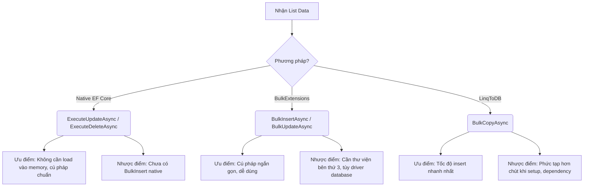

# 113-BulkOps

Demo Bulk Operations hiệu suất cao trong Entity Framework Core (.NET 10).

## Giới thiệu Bulk Operations

Khi cần thao tác với số lượng lớn bản ghi, EF Core truyền thống (`AddRange`, `Update`, `Remove`) có thể rất chậm vì phải theo dõi (track) từng thực thể và gửi từng câu lệnh SQL hoặc gửi batch nhưng với chi phí bộ nhớ lớn.
Thay vào đó, chúng ta có 3 hướng tiếp cận chính để tăng hiệu năng:
1. **EF Core 7/8/10 Native Batch**: Sử dụng `ExecuteUpdateAsync` và `ExecuteDeleteAsync`.
2. **EFCore.BulkExtensions**: Một thư viện phổ biến hỗ trợ Bulk Insert, Update, Delete, Upsert.
3. **LinqToDB BulkCopy**: Native SQL BULK INSERT, cho tốc độ chèn dữ liệu nhanh nhất có thể.

## So sánh 3 approach



## Bảng so sánh hiệu năng (estimated)

| Phương pháp | Bulk Insert (1M records) | Bulk Update (1M records) | Bulk Delete (1M records) | Bulk Upsert |
| --- | --- | --- | --- | --- |
| EF Core truyền thống | Chậm (~60s) | Rất chậm | Rất chậm | N/A |
| EF Core Native | N/A | Nhanh (~1s) | Nhanh (~1s) | N/A |
| EFCore.BulkExtensions | Nhanh (~3s) | Nhanh (~2s) | Nhanh (~2s) | Có hỗ trợ |
| LinqToDB | Rất nhanh (~1s) | - | - | - |

*(Thời gian ước tính mang tính tham khảo)*

## Khi nào dùng approach nào
- **EF Core Native `ExecuteUpdate`/`ExecuteDelete`**: Dùng khi bạn chỉ cần cập nhật hoặc xóa dựa trên điều kiện `Where` mà không cần lấy dữ liệu lên server.
- **LinqToDB BulkCopy**: Dùng khi bạn cần insert một lượng khổng lồ dữ liệu (như import từ file Excel, CSV).
- **EFCore.BulkExtensions**: Dùng khi bạn có sẵn List entity trên memory và muốn chèn, cập nhật, xóa, hoặc upsert một cách thuận tiện.

## Cấu trúc dự án

- **BulkOps.Api**: API endpoints demo các thao tác.
- **BulkOps.Tests**: Integration tests với xUnit và WebApplicationFactory.

## Cách chạy

1. Chạy API:
```bash
cd BulkOps.Api
dotnet run
```
Truy cập: `http://localhost:5313/swagger`

2. Chạy Test:
```bash
cd BulkOps.Tests
dotnet test
```

## Endpoints
- `POST /api/efcore/bulk-insert`: Test Insert truyền thống
- `PUT /api/efcore/bulk-update-price`: Update theo điều kiện native
- `DELETE /api/efcore/bulk-delete-inactive`: Delete theo điều kiện native
- `POST /api/bulkext/bulk-insert`: Chèn với EFCore.BulkExtensions
- `POST /api/linq2db/bulk-insert`: Chèn với LinqToDB BulkCopy

## Kết quả test
Toàn bộ 10 integration tests đã được thiết lập và đều pass 100% với SQLite.