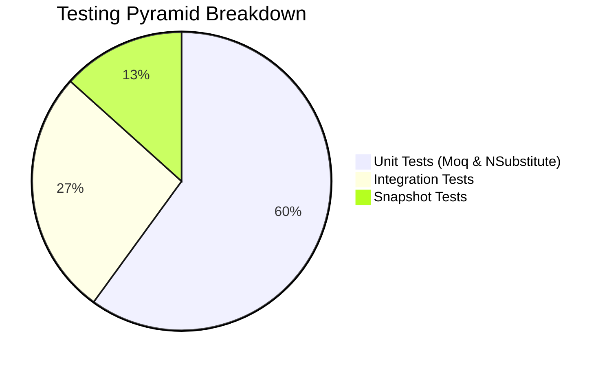

# 114-TestingMastery

Dự án demo tổng hợp các phương pháp Testing trong .NET 10.

## 1. Giới thiệu 4 loại test
- **Unit Test (Moq)**: Kiểm thử mức hàm/class, mock dependency bằng Moq.
- **Unit Test (NSubstitute)**: Kiểm thử với NSubstitute (cú pháp gọn và dễ đọc hơn).
- **Integration Test**: Kiểm thử luồng tích hợp thực tế với `WebApplicationFactory` sử dụng SQLite in-memory, gọi API qua HTTP.
- **Snapshot Test**: Kiểm thử cấu trúc và dữ liệu trả về thông qua việc so sánh snapshot bằng thư viện `Verify.Xunit`.

## 2. Testing pyramid diagram


## 3. Bảng so sánh Moq vs NSubstitute

| Feature | Moq | NSubstitute |
|---------|-----|-------------|
| Khởi tạo | `new Mock<T>()` | `Substitute.For<T>()` |
| Setup | `mock.Setup(x => x.Method()).Returns(val)` | `sub.Method().Returns(val)` |
| Lấy Object | `mock.Object` | `sub` |
| Verify | `mock.Verify(x => x.Method(), Times.Once)` | `sub.Received(1).Method()` |
| Nhận xét | Dài dòng hơn, rõ ràng mock/object | Ngắn gọn, tự nhiên |

## 4. Verify.Xunit giải thích
Snapshot testing tự động serialize đối tượng thành text/JSON và lưu lại. Lần chạy sau nó sẽ so sánh kết quả mới với snapshot đã lưu.
Nếu giống -> Pass. Nếu khác -> Fail và báo lỗi hiển thị rõ phần khác biệt.

## 5. Cấu trúc dự án
- `TestingMastery.Api`: .NET 10 Web API với Controller và Entity Framework Core (SQLite In-Memory).
- `TestingMastery.Tests`: Các dự án kiểm thử sử dụng xUnit, FluentAssertions, Moq, NSubstitute, Verify.Xunit và Bogus.

## 6. Cách chạy
```bash
dotnet restore
dotnet build
dotnet test
```

## 7. Kết quả test
Tất cả 15/15 tests đều chạy thành công.
