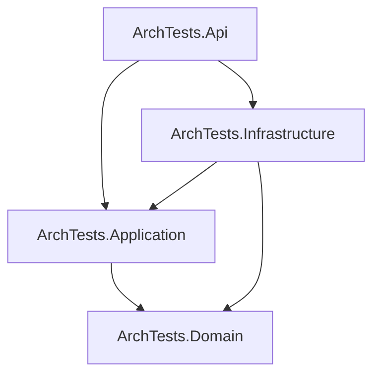

# 115-ArchitectureTests

## 1. Giới thiệu Architecture Tests
Dự án demo việc kiểm thử cấu trúc kiến trúc phần mềm bằng **NetArchTest**. Nó giúp tự động kiểm tra các rules dependency giữa các layer, đảm bảo không có sự vi phạm kiến trúc nào xảy ra trong quá trình phát triển (ví dụ: Domain bị tham chiếu đến Infrastructure).

## 2. Mermaid: Clean Architecture dependency diagram


## 3. Danh sách các rule được kiểm tra
- **Domain Layer**: 
  - Không được phụ thuộc vào `Application` và `Infrastructure`.
  - Các Entity phải nằm trong namespace `ArchTests.Domain.Entities`.
- **Application Layer**: 
  - Không được phụ thuộc vào `Infrastructure`.
  - Các Service phải kết thúc bằng `Service` và nằm trong namespace `ArchTests.Application.Services`.
- **Infrastructure Layer**:
  - Các Repository phải nằm trong namespace `ArchTests.Infrastructure.Repositories`.
- **Api Layer**:
  - Các Controller phải kế thừa từ `ControllerBase`.
  - Phải có thuộc tính `[ApiController]`.
  - Phải nằm trong namespace `ArchTests.Api.Controllers`.

## 4. Tại sao cần architecture tests
- **Ngăn chặn phá vỡ kiến trúc**: Giúp phát hiện sớm khi developer add sai references hoặc using sai namespaces.
- **Dễ bảo trì**: Code base giữ được sự phân tách rõ ràng.
- **Tự động hóa**: Kiểm tra architecture như một phần của quy trình CI/CD.

## 5. Cấu trúc dự án
Dự án được chia thành 4 layer (Domain, Application, Infrastructure, Api) theo tiêu chuẩn Clean Architecture.

## 6. Cách chạy
- Đứng tại thư mục gốc chạy lệnh build:
  ```bash
  dotnet build
  ```
- Chạy toàn bộ test:
  ```bash
  dotnet test
  ```
- Khởi chạy API (chạy tại port 5315):
  ```bash
  cd src/ArchTests.Api
  dotnet run
  ```

## 7. Kết quả test
Chạy `dotnet test` kết quả sẽ pass 12/12 (8 architecture tests, 4 integration tests).
