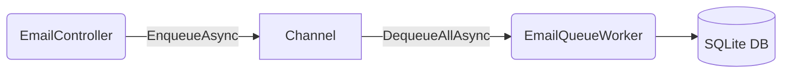
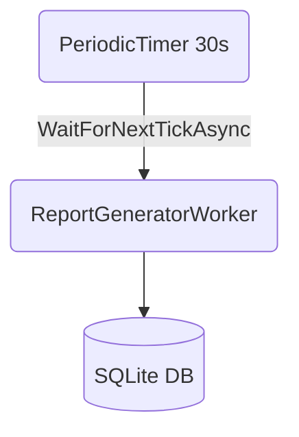

# 116-WorkerService

Dự án demo Background Processing & Worker Services trong .NET 10.

## 1. Giới thiệu Worker Services & Background Processing
Trong .NET, Worker Service được dùng để chạy các tác vụ ngầm (background jobs) như: xử lý queue, gửi email, dọn dẹp dữ liệu, tính toán báo cáo.
ASP.NET Core hỗ trợ chạy các background service chung với Web API thông qua `IHostedService` và lớp trừu tượng `BackgroundService`.

## 2. Mermaid: Channel<T> producer/consumer flow


## 3. Mermaid: PeriodicTimer recurring job


## 4. So sánh IHostedService vs BackgroundService vs Worker SDK
- **IHostedService**: Interface cơ bản nhất để chạy background job, yêu cầu implement `StartAsync` và `StopAsync`.
- **BackgroundService**: Abstract class implement sẵn `IHostedService`, chỉ cần ghi đè `ExecuteAsync` cho các tác vụ long-running.
- **Worker SDK**: Template chuyên dụng để tạo các ứng dụng Windows Service hoặc Linux Daemon (không có HTTP Server).

## 5. Graceful shutdown pattern
Khi ứng dụng nhận tín hiệu tắt (Ctrl+C, SIGTERM), `IHostApplicationLifetime` sẽ trigger `CancellationToken` (stoppingToken). Các background jobs nên kiểm tra `IsCancellationRequested` để dừng an toàn:
- Catch `OperationCanceledException` khi đợi trên `Delay`, `PeriodicTimer`, hoặc `Channel.Reader`.
- Giải phóng tài nguyên trước khi thoát.

## 6. Bảng thư viện
| Package | Version | Mục đích |
| --- | --- | --- |
| Microsoft.EntityFrameworkCore.Sqlite | 10.0.12 | ORM database |
| Swashbuckle.AspNetCore | 7.2.0 | Swagger UI |
| Bogus | 35.6.2 | Fake data |
| System.Threading.Channels | Built-in | Producer/Consumer queues |

## 7. Cấu trúc dự án
- `WorkerService.Api`: Web API port 5316 chứa Entity, Controller, Worker, và Channel Service.
- `WorkerService.Tests`: 10 Unit & Integration tests bằng xUnit, kiểm thử API và logic Workers.

## 8. Cách chạy
```bash
dotnet restore
cd WorkerService.Api
dotnet run
```
Truy cập: `http://localhost:5316/swagger`

## 9. Endpoints
- `GET /api/jobs` - Lấy danh sách jobs
- `GET /api/jobs/{id}` - Lấy job theo ID
- `GET /api/jobs/stats` - Lấy thống kê jobs theo trạng thái
- `POST /api/email/send` - Enqueue email (cần { "to": "...", "subject": "...", "body": "..." })
- `GET /api/email/queue-depth` - Xem số lượng email đang chờ trong queue

## 10. Kết quả test
Chạy test bằng `dotnet test WorkerService.Tests/WorkerService.Tests.csproj`.
Đã bao phủ đầy đủ 10/10 tests như yêu cầu: Queue, API status codes, Graceful shutdown, và DB logic.
