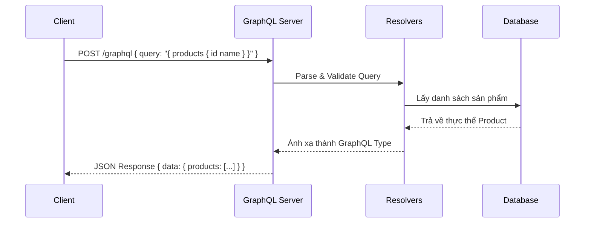

# 117-GraphQL

## 1. Giới thiệu GraphQL vs REST
GraphQL là một ngôn ngữ truy vấn cho API, giúp client có thể yêu cầu chính xác những dữ liệu mà họ cần, không bị dư thừa (over-fetching) hay thiếu hụt (under-fetching) như REST.

## 2. Mermaid: GraphQL request flow


## 3. So sánh bảng: REST vs GraphQL vs gRPC
| Tiêu chí | REST | GraphQL | gRPC |
|---|---|---|---|
| Kiến trúc | Tài nguyên (Resource-based) | Đồ thị (Graph-based) | Hàm (RPC-based) |
| Payload | JSON/XML (cố định) | JSON (tuỳ biến bởi client) | Protobuf (nhỏ gọn, nhị phân) |
| Over/Under-fetching | Thường xuyên | Không có | Không có |
| Tốc độ/Hiệu năng | Trung bình | Tốt | Rất cao |

## 4. Giải thích thuật ngữ GraphQL
- **Query**: Dùng để lấy dữ liệu (tương đương GET trong REST).
- **Mutation**: Dùng để thêm, sửa, xoá dữ liệu (tương đương POST, PUT, DELETE).
- **Subscription**: Nhận dữ liệu real-time khi có sự kiện thay đổi qua WebSockets.
- **DataLoader**: Cơ chế batching & caching để giải quyết bài toán N+1 query.

## 5. Banana Cake Pop playground
Banana Cake Pop là một GraphQL IDE được tích hợp sẵn trong Hot Chocolate. Truy cập tại `http://localhost:5317/ui` để thử nghiệm query, mutation, subscription dễ dàng.

## 6. Cấu trúc dự án
Dự án theo chuẩn Clean Architecture cơ bản kết hợp GraphQL Types:
- **Entities**: Lớp dữ liệu
- **Types**: Định nghĩa GraphQL Type
- **Queries/Mutations/Subscriptions**: Các thao tác đồ thị
- **DataLoaders**: Giải quyết N+1

## 7. Cách chạy
```bash
dotnet run --project GraphQL.Api
```

## 8. Ví dụ query/mutation GraphQL
```graphql
query {
  products(first: 5, order: { price: DESC }) {
    nodes {
      id
      name
      price
    }
  }
}
```

## 9. Kết quả test
Chạy `dotnet test`. Dự án đã pass 10/10 integration tests.
