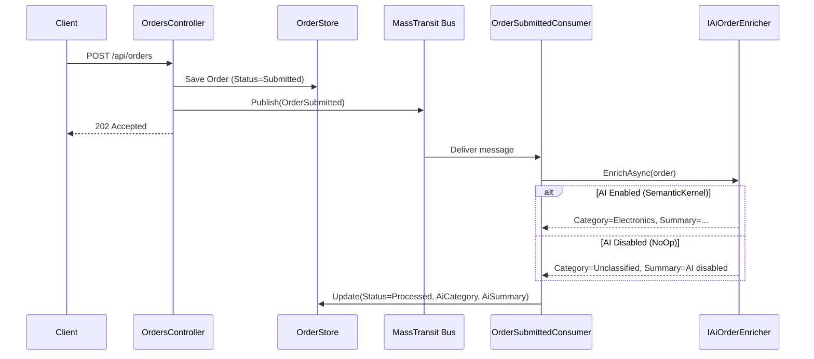

# 118 – AI Agent Messaging: Pluggable AI trong Event-Driven Pipeline

## Pain Point
Khi tích hợp AI vào hệ thống nghiệp vụ, thường gặp vấn đề:
- AI model bị **coupling chặt** vào business logic → đổi model = sửa code khắp nơi
- AI service lỗi/chậm → **workflow chính bị block** hoặc crash
- Không thể **tắt AI** để debug hoặc giảm chi phí → phải deploy lại

**Project này** giải quyết bằng kiến trúc **AI as a pluggable enrichment step** trong MassTransit messaging pipeline, sử dụng **Microsoft Semantic Kernel** làm abstraction layer.

## Tư Tưởng Cốt Lõi

> **AI model là plug-in, KHÔNG phải dependency.** Workflow nghiệp vụ (Order → Message → Consumer → Update) hoạt động độc lập hoàn toàn. AI chỉ là một "enrichment step" có thể bật/tắt/đổi provider bất kỳ lúc nào mà **không ảnh hưởng gì** tới luồng chính.

## Kiến Trúc Tổng Quan



## Cấu Trúc Dự Án

```
118-AI-Agent-Messaging/
├── AiAgentMessaging.Api/
│   ├── Ai/                      # AI abstraction layer (pluggable)
│   │   ├── IAiOrderEnricher.cs  # Core interface
│   │   ├── NoOpOrderEnricher.cs # Fallback khi AI disabled
│   │   ├── SemanticKernelOrderEnricher.cs  # Semantic Kernel impl
│   │   ├── AiServiceRegistration.cs  # DI registration
│   │   ├── AiProviderOptions.cs
│   │   ├── AiEnrichmentResult.cs
│   │   └── OrderEnrichmentRequest.cs
│   ├── Consumers/
│   │   └── OrderSubmittedConsumer.cs   # MassTransit consumer
│   ├── Contracts/
│   │   └── OrderSubmitted.cs          # Message contract
│   ├── Controllers/
│   │   └── OrdersController.cs        # REST API
│   ├── Data/
│   │   └── OrderStore.cs              # In-memory store
│   ├── Models/
│   │   ├── Order.cs                   # Domain model + AI fields
│   │   └── CreateOrderRequest.cs
│   └── Program.cs
├── AiAgentMessaging.Tests/
│   ├── Ai/                     # AI enricher unit tests
│   ├── Consumers/              # Consumer integration tests
│   └── Controllers/            # Controller integration tests
├── AiAgentMessaging.slnx
└── README.md
```

## AI Pluggable Design

### Tháo lắp AI qua `appsettings.json`

```json
{
  "AiProvider": {
    "Enabled": false,       // false → NoOp, workflow vẫn chạy bình thường
    "Provider": "None",     // "OpenAI" | "AzureOpenAI" | "None"
    "ModelId": "gpt-4o-mini",
    "ApiKey": "",
    "Endpoint": ""
  }
}
```

### 3 chế độ hoạt động

| Cấu hình | Behavior | Workflow |
|-----------|----------|----------|
| `Enabled: false` | NoOp enricher → trả default | ✅ Chạy bình thường |
| `Enabled: true, Provider: OpenAI` | Semantic Kernel gọi OpenAI | ✅ + AI enrichment |
| `Enabled: true` nhưng AI lỗi | Catch exception → fallback | ✅ Chạy bình thường |

### Interface chính

```csharp
public interface IAiOrderEnricher
{
    Task<AiEnrichmentResult> EnrichAsync(OrderEnrichmentRequest request, CancellationToken ct);
    bool IsAvailable { get; }
}
```

## Hướng Dẫn Chạy

### Không cần AI (mặc định)
```bash
cd 118-AI-Agent-Messaging
dotnet run --project AiAgentMessaging.Api
# API: http://localhost:5153
# Swagger: http://localhost:5153/swagger
```

### Bật AI với OpenAI
Sửa `appsettings.json`:
```json
{
  "AiProvider": {
    "Enabled": true,
    "Provider": "OpenAI",
    "ModelId": "gpt-4o-mini",
    "ApiKey": "sk-your-key-here"
  }
}
```

### Chạy tests
```bash
dotnet test AiAgentMessaging.slnx
```

## API Endpoints

| Method | Path | Description | Response |
|--------|------|-------------|----------|
| POST | `/api/orders` | Tạo đơn hàng, trigger AI enrichment | 202 Accepted |
| GET | `/api/orders` | Danh sách tất cả đơn hàng | 200 OK |
| GET | `/api/orders/{id}` | Chi tiết đơn hàng (bao gồm AI fields) | 200 OK |

## Điểm Nổi Bật Kỹ Thuật

| Feature | Implementation |
|---------|---------------|
| **AI Abstraction** | `IAiOrderEnricher` interface, DI-based |
| **AI Provider** | Microsoft Semantic Kernel (OpenAI/Azure) |
| **Fallback** | `NoOpOrderEnricher` khi AI disabled/lỗi |
| **Messaging** | MassTransit InMemory transport |
| **Runtime Switch** | `appsettings.json` → không cần redeploy |
| **Testing** | 13 tests (xUnit + WebApplicationFactory) |
| **Port** | 5153 |

## Mở Rộng
- **Thêm Ollama**: Implement custom `IAiOrderEnricher` cho local LLM
- **Multiple AI tasks**: Thêm sentiment analysis, fraud detection consumers
- **Production transport**: Swap `UsingInMemory` → `UsingRabbitMq`
- **Persistent store**: Swap `OrderStore` → EF Core + SQLite
