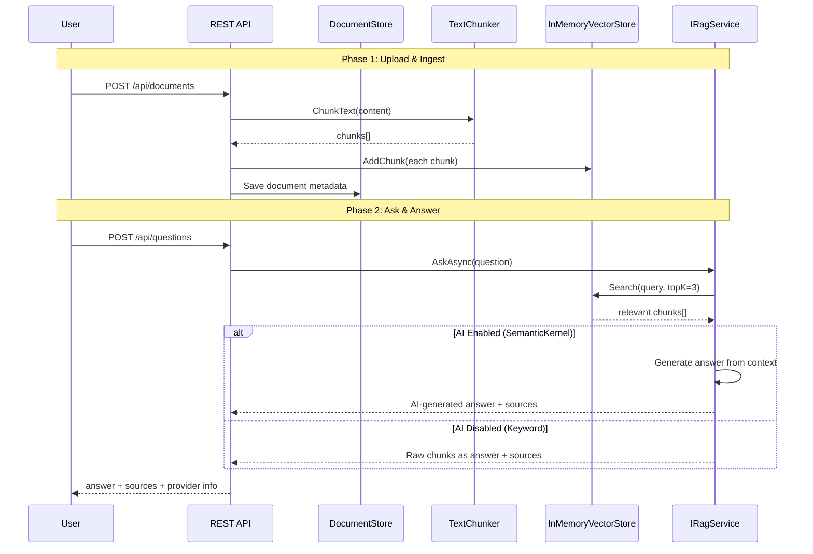

# 119 – RAG Pipeline: Retrieval-Augmented Generation cho .NET

## Pain Point
Khi xây dựng hệ thống Q&A nội bộ (knowledge base, chatbot nghiệp vụ):
- **AI hallucination** — model bịa đặt thông tin không có trong tài liệu
- **Knowledge cutoff** — model không biết dữ liệu nội bộ, quy trình công ty
- **AI coupling** — đổi model = sửa code khắp nơi, tắt AI = sập hệ thống

**Project này** giải quyết bằng kiến trúc **RAG Pipeline** (Upload → Chunk → Vector Search → AI Generate), với AI model **pluggable** — tắt AI thì hệ thống vẫn trả kết quả bằng keyword search.

## Tư Tưởng Cốt Lõi

> **AI model là plug-in, KHÔNG phải dependency.** Pipeline Retrieval (tìm kiếm tài liệu) hoạt động độc lập. AI chỉ là bước "Generation" cuối cùng — có thể bật/tắt/đổi provider mà **không ảnh hưởng** tới việc tìm kiếm và trả kết quả.

## Kiến Trúc



## Cấu Trúc Dự Án

```
119-RAG-Pipeline/
├── RagPipeline.Api/
│   ├── Controllers/
│   │   ├── DocumentsController.cs    # Upload, Get, Delete documents
│   │   └── QuestionsController.cs    # Ask questions (RAG Q&A)
│   ├── Data/
│   │   └── DocumentStore.cs          # In-memory document metadata
│   ├── Models/
│   │   ├── Document.cs
│   │   ├── UploadDocumentRequest.cs
│   │   ├── AskQuestionRequest.cs
│   │   └── AskQuestionResponse.cs
│   ├── Rag/                          # RAG Pipeline core
│   │   ├── IRagService.cs            # Core abstraction (pluggable)
│   │   ├── KeywordRagService.cs      # Fallback: TF-IDF keyword search
│   │   ├── SemanticKernelRagService.cs  # AI-powered RAG
│   │   ├── InMemoryVectorStore.cs    # TF-IDF cosine similarity store
│   │   ├── TextChunker.cs            # Document chunking
│   │   ├── AiProviderOptions.cs
│   │   └── RagServiceRegistration.cs # DI registration
│   └── Program.cs
├── RagPipeline.Tests/
│   ├── Rag/                          # Unit tests
│   │   ├── TextChunkerTests.cs
│   │   ├── InMemoryVectorStoreTests.cs
│   │   └── KeywordRagServiceTests.cs
│   └── Controllers/                  # Integration tests
│       ├── DocumentsControllerTests.cs
│       └── QuestionsControllerTests.cs
├── RagPipeline.slnx
└── README.md
```

## AI Pluggable Design

### Tháo lắp AI qua `appsettings.json`

```json
{
  "AiProvider": {
    "Enabled": false,       // false → KeywordRagService (TF-IDF search)
    "Provider": "None",     // "OpenAI" | "AzureOpenAI" | "None"
    "ModelId": "gpt-4o-mini",
    "ApiKey": "",
    "Endpoint": ""
  }
}
```

### 3 chế độ hoạt động

| Cấu hình | Retrieval | Generation | Workflow |
|-----------|-----------|------------|----------|
| `Enabled: false` | ✅ Keyword TF-IDF | Raw chunks | ✅ Chạy bình thường |
| `Enabled: true, Provider: OpenAI` | ✅ Keyword TF-IDF | AI-generated answer | ✅ + AI answers |
| `Enabled: true` nhưng AI lỗi | ✅ Keyword TF-IDF | Fallback raw chunks | ✅ Chạy bình thường |

## Hướng Dẫn Chạy

### Không cần AI (mặc định)
```bash
cd 119-RAG-Pipeline
dotnet run --project RagPipeline.Api
# API: http://localhost:5154
# Swagger: http://localhost:5154/swagger
```

### Bật AI với OpenAI
Sửa `appsettings.json`:
```json
{
  "AiProvider": {
    "Enabled": true,
    "Provider": "OpenAI",
    "ModelId": "gpt-4o-mini",
    "ApiKey": "sk-your-key-here"
  }
}
```

### Chạy tests
```bash
dotnet test RagPipeline.slnx
```

## API Endpoints

| Method | Path | Description | Response |
|--------|------|-------------|----------|
| POST | `/api/documents` | Upload tài liệu (chunk + vectorize) | 201 Created |
| GET | `/api/documents` | Danh sách tài liệu | 200 OK |
| GET | `/api/documents/{id}` | Chi tiết tài liệu | 200 OK |
| DELETE | `/api/documents/{id}` | Xóa tài liệu + chunks | 204 No Content |
| POST | `/api/questions` | Hỏi đáp dựa trên tài liệu đã upload | 200 OK |

## Điểm Nổi Bật Kỹ Thuật

| Feature | Implementation |
|---------|---------------|
| **Text Chunking** | Paragraph/sentence-based splitting |
| **Vector Search** | TF-IDF cosine similarity (in-memory) |
| **AI Generation** | Semantic Kernel (OpenAI/Azure) |
| **Fallback** | `KeywordRagService` khi AI disabled |
| **AI Abstraction** | `IRagService` interface, DI-based |
| **Testing** | 28 tests (xUnit + WebApplicationFactory) |
| **Port** | 5154 |

## Mở Rộng
- **Real embeddings**: Dùng `text-embedding-ada-002` hoặc local model cho vector hóa thực
- **External vector DB**: Swap `InMemoryVectorStore` → Qdrant / Pinecone / Weaviate
- **File upload**: Hỗ trợ PDF/DOCX parsing
- **Streaming**: Server-Sent Events cho AI answer streaming
- **Conversation memory**: Lưu lịch sử hội thoại cho multi-turn Q&A
