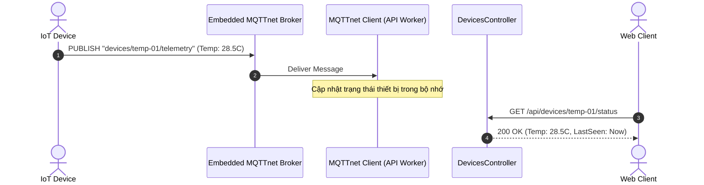
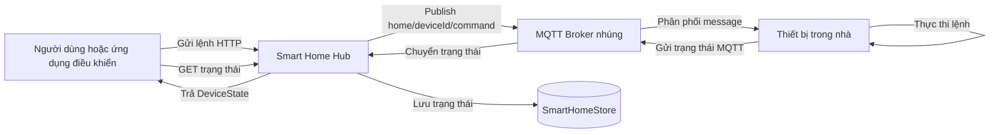
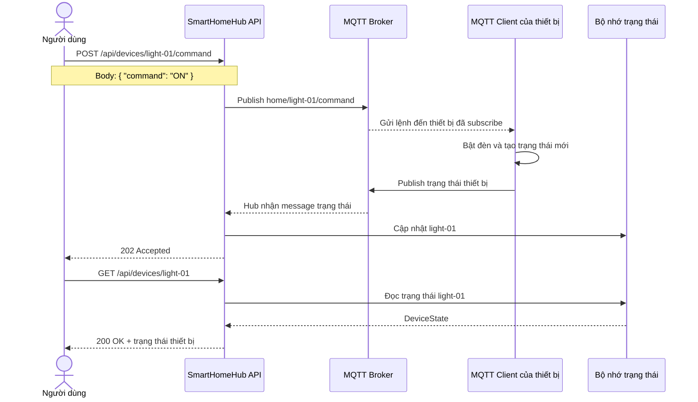
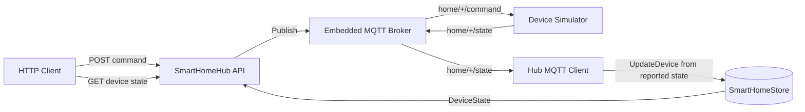

# 12-MQTTnet: Embedded MQTT Broker & Client in .NET 10

## Sơ đồ Kiến trúc & Luồng dữ liệu (Architecture & Data Flow)

### 1. Sơ đồ Kiến trúc Tổng quan (Architecture Overview)
```mermaid
flowchart TD
    Device["IoT Sensor / Edge Device"] -->|MQTT Protocol (1883)| Broker["Embedded MQTTnet Broker"]
    Broker --> Router["Topic Router (devices/+/telemetry)"]
    Router --> ClientSub["MQTTnet Client Subscriber"]
    ClientSub --> MemoryStore["Device State Store"]
    WebClient["Web Client"] -->|HTTP GET| Controller["DevicesController"]
    Controller --> MemoryStore
```

### 2. Mô hình Luồng dữ liệu Chi tiết (Data Flow & Sequence)


### 3. Các Use Cases Cụ thể trong Thực tế (Concrete Use Cases)
- **Hệ thống Nhà Thông minh & IoT**: Kết nối cảm biến, camera, vi điều khiển (ESP32, Raspberry Pi) với băng thông cực thấp.
- **Embedded MQTT Broker**: Tích hợp trực tiếp broker vào ứng dụng .NET mà không cần cài thêm Mosquitto hay HiveMQ.
- **Giám sát Thiết bị Thời gian thực**: Nhận telemetry tức thì qua kết nối TCP nhẹ nhàng.


Dự án này minh họa cách sử dụng thư viện **MQTTnet** để tích hợp cả một MQTT Broker (Máy chủ) nhúng và một MQTT Client (Máy khách) trong cùng một ứng dụng .NET 10 Minimal API. Mô phỏng một Smart Home Hub (Trung tâm Nhà Thông minh), ứng dụng này có khả năng nhận các lệnh qua HTTP API, chuyển tiếp chúng dưới dạng thông điệp MQTT, và xử lý phản hồi/trạng thái qua MQTT.

## 🎯 Mục đích của MQTTnet

MQTT (Message Queuing Telemetry Transport) là giao thức nhắn tin pub/sub nhẹ, tối ưu cho các thiết bị IoT và môi trường mạng không ổn định. 
**MQTTnet** là thư viện mã nguồn mở mạnh mẽ, hiệu suất cao dành cho .NET, hỗ trợ triển khai cả Client và Server (Broker) mà không cần phụ thuộc vào các broker bên ngoài như Mosquitto hay EMQX trong các ứng dụng nhỏ hoặc hệ thống Edge (Biên).

## 🧠 Các khái niệm cơ bản về MQTT

- **Topic (Chủ đề)**: Cấu trúc phân cấp để định tuyến tin nhắn, ví dụ: `home/living-room-light/set`.
- **Wildcards (Ký tự đại diện)**:
  - `+` (Single-level): Khớp một cấp duy nhất (vd: `home/+/set` sẽ khớp `home/light1/set`).
  - `#` (Multi-level): Khớp nhiều cấp ở cuối topic (vd: `home/#` khớp với mọi thứ dưới `home/`).
- **QoS (Quality of Service)**:
  - `QoS 0` (At most once): Gửi nhanh nhất, không đảm bảo nhận được (Lửa và quên).
  - `QoS 1` (At least once): Đảm bảo nhận được ít nhất một lần, có thể trùng lặp.
  - `QoS 2` (Exactly once): Đảm bảo nhận được chính xác một lần, chậm nhất.
- **Retain flag**: Nếu được bật, broker sẽ giữ lại tin nhắn cuối cùng trên topic để gửi ngay cho bất kỳ client nào mới đăng ký.

## 🛠 Cách hoạt động của Broker nhúng

Dự án sử dụng `MqttBrokerHostedService` (một `IHostedService`) để khởi chạy một Broker MQTT chạy ngầm ngay trong tiến trình ứng dụng ở cổng `18883`. Điều này giúp hệ thống tự chủ hoàn toàn mà không cần cài đặt broker ngoài, rất hữu ích cho Edge computing hoặc hệ thống quy mô nhỏ.

## 🔄 Luồng use case thực tế

### Use case: Người dùng bật hoặc điều khiển thiết bị



### Trình tự một lần gửi lệnh



### Phạm vi thực tế của bản demo hiện tại

Demo có ba MQTT client riêng biệt trong cùng process để mô phỏng đầy đủ vòng đời message:

- `MqttClientHostedService` là MQTT client của Hub: publish command và subscribe state.
- `MqttDeviceSimulatorHostedService` là MQTT client đại diện cho thiết bị: subscribe command, mô phỏng thực thi rồi publish state.
- `MqttBrokerHostedService` chỉ làm nhiệm vụ broker, không lưu trạng thái thiết bị.

Vì vậy, luồng chạy thực tế hiện tại là:



Khi tích hợp thiết bị thật, thay `MqttDeviceSimulatorHostedService` bằng MQTT client chạy trên thiết bị. API không ghi command thành state: `GET /api/devices/{deviceId}` chỉ trả `200 OK` sau khi Hub nhận được state do thiết bị báo về; nếu chưa từng nhận state thì trả `404 Not Found`. `SmartHomeStore` hiện chỉ lưu trong bộ nhớ nên dữ liệu mất khi ứng dụng dừng.

## 🚀 Cân nhắc cho môi trường Sản xuất (Production)

Mặc dù Broker nhúng của MQTTnet rất tiện lợi, nhưng đối với các hệ thống quy mô lớn (hàng triệu thiết bị IoT), bạn nên xem xét:
- **Clustering (Cụm)**: Sử dụng các broker chuyên nghiệp như EMQX hoặc HiveMQ để mở rộng và cân bằng tải.
- **Bảo mật (Security)**: Bật TLS/SSL để mã hóa kết nối thay vì TCP thuần.
- **Xác thực (Authentication)**: Xác thực client qua Username/Password hoặc Client Certificates (X.509).
- **Lưu trữ dữ liệu**: Persist (lưu trữ) các tin nhắn retained và sessions vào cơ sở dữ liệu thay vì bộ nhớ trong (In-Memory).

## 🏃 Hướng dẫn chạy dự án

1. **Khôi phục các gói và chạy dự án API:**
   ```bash
   dotnet restore SmartHomeHub.slnx
   dotnet run --project SmartHomeHub.Api
   ```

2. **Gửi lệnh tới một thiết bị:**
   Sử dụng Swagger UI tại `http://localhost:5112/swagger` hoặc dùng lệnh curl:
   ```bash
   curl -X POST http://localhost:5112/api/devices/living-room-light/command \
        -H "Content-Type: application/json" \
        -d '{"deviceType":"Light", "command":"{\"power\":\"ON\",\"brightness\":85}"}'
   ```

3. **Kiểm tra trạng thái thiết bị (đã được lưu qua MQTT):**
   ```bash
   curl http://localhost:5112/api/devices/living-room-light
   ```

4. **Chạy Test (xUnit):**
   ```bash
   dotnet test SmartHomeHub.slnx
   ```
