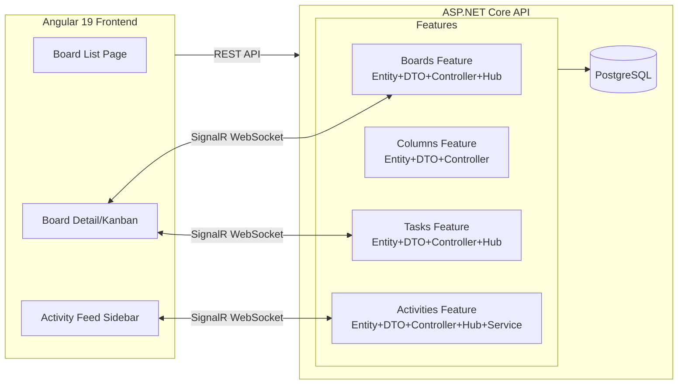

# 120-Realtime-TaskBoard

> **Real-time Collaborative Kanban Board** — SignalR + Angular 19 + Vertical Slice Architecture

## 🎯 Pain Point

| Vấn đề | Giải pháp |
|---------|-----------|
| Board Kanban truyền thống phải refresh để thấy thay đổi | SignalR WebSocket push real-time mọi thay đổi tới tất cả clients |
| Code API tổ chức theo layer (Controllers/, Models/, Services/) khó maintain | Vertical Slice — mỗi feature folder chứa trọn bộ Entity → DTO → Controller → Hub |
| Activity audit log phải poll API liên tục | Activity Feed stream qua SignalR hub, hiển thị ngay lập tức |

## 🏗️ Kiến trúc



## 📁 Cấu trúc Vertical Slice

```
RealtimeTaskBoard.Api/
├── Features/
│   ├── Boards/          # Board CRUD + BoardHub
│   │   ├── BoardEntity.cs
│   │   ├── BoardDto.cs
│   │   ├── BoardController.cs
│   │   ├── BoardHub.cs
│   │   └── BoardConfiguration.cs
│   ├── Columns/         # Column management
│   │   ├── ColumnEntity.cs
│   │   ├── ColumnDto.cs
│   │   ├── ColumnController.cs
│   │   └── ColumnConfiguration.cs
│   ├── Tasks/           # Task CRUD + move + TaskHub
│   │   ├── TaskEntity.cs
│   │   ├── TaskDto.cs
│   │   ├── TaskController.cs
│   │   ├── TaskHub.cs
│   │   └── TaskConfiguration.cs
│   └── Activities/      # Activity Feed + ActivityHub
│       ├── ActivityEntity.cs
│       ├── ActivityDto.cs
│       ├── ActivityController.cs
│       ├── ActivityHub.cs
│       └── ActivityService.cs
├── Infrastructure/Data/AppDbContext.cs
└── Program.cs
```

## 🚀 Chạy nhanh

### Backend (API)
```bash
# Yêu cầu: .NET 10 SDK, PostgreSQL running on localhost:5432
cd 120-Realtime-TaskBoard
dotnet run --project RealtimeTaskBoard.Api
# API: http://localhost:5155
# Swagger: http://localhost:5155/swagger
```

### Frontend (Angular)
```bash
cd RealtimeTaskBoard.Web
npm install
ng serve --proxy-config proxy.conf.json
# UI: http://localhost:4200
```

### Tests
```bash
dotnet test RealtimeTaskBoard.slnx
# 16 integration tests — 100% pass (InMemory DB, không cần PostgreSQL)
```

## 📡 SignalR Hubs

| Hub | Route | Events | Mục đích |
|-----|-------|--------|----------|
| **BoardHub** | `/hubs/board` | BoardUpdated, ColumnAdded, ColumnMoved, ColumnDeleted | Column changes |
| **TaskHub** | `/hubs/task` | TaskCreated, TaskMoved, TaskUpdated, TaskDeleted | Task changes |
| **ActivityHub** | `/hubs/activity` | ActivityLogged | Audit trail stream |

**Group Strategy**: Client gọi `JoinBoard(boardId)` → chỉ nhận events cho board đó.

## 📋 API Endpoints

| Method | Route | Mô tả |
|--------|-------|-------|
| GET | `/api/boards` | Danh sách boards |
| GET | `/api/boards/{id}` | Board detail + columns + tasks |
| POST | `/api/boards` | Tạo board (auto-seed 4 columns) |
| PUT | `/api/boards/{id}` | Cập nhật board |
| DELETE | `/api/boards/{id}` | Xóa board |
| GET | `/api/boards/{boardId}/columns` | Columns của board |
| POST | `/api/boards/{boardId}/columns` | Thêm column |
| PUT | `/api/columns/{id}` | Sửa column |
| PUT | `/api/columns/reorder` | Đổi thứ tự columns |
| DELETE | `/api/columns/{id}` | Xóa column |
| GET | `/api/columns/{columnId}/tasks` | Tasks trong column |
| POST | `/api/columns/{columnId}/tasks` | Tạo task |
| PUT | `/api/tasks/{id}` | Sửa task |
| PUT | `/api/tasks/{id}/move` | Di chuyển task giữa columns |
| DELETE | `/api/tasks/{id}` | Xóa task |
| GET | `/api/boards/{boardId}/activities` | Activity feed |

## ⚡ Điểm nổi bật kỹ thuật

- **Vertical Slice Architecture**: Mỗi feature folder tự chứa — không cần nhảy qua lại giữa folders
- **3 SignalR Hubs**: Tách concern rõ ràng theo feature, mỗi hub phụ trách domain riêng
- **Group-based Broadcast**: Chỉ push events tới clients đang xem cùng board
- **Auto-seed Default Columns**: Mỗi board mới có sẵn Backlog → In Progress → Review → Done
- **Activity Audit Trail**: Mọi thay đổi đều được log + broadcast real-time
- **JSON Column (Labels)**: PostgreSQL `jsonb` cho flexible labels trên tasks
- **Optimistic Position Management**: Tasks tự shift position khi move giữa columns

## 🔌 Tech Stack

| Layer | Công nghệ |
|-------|-----------|
| Runtime | .NET 10 LTS |
| API | ASP.NET Core Controllers |
| Real-time | SignalR (built-in) |
| ORM | EF Core 10 + Npgsql |
| Database | PostgreSQL |
| Frontend | Angular 19 (standalone, signals) |
| Testing | xUnit + WebApplicationFactory + InMemory EF |
| Port | 5155 (API) / 4200 (Angular) |
