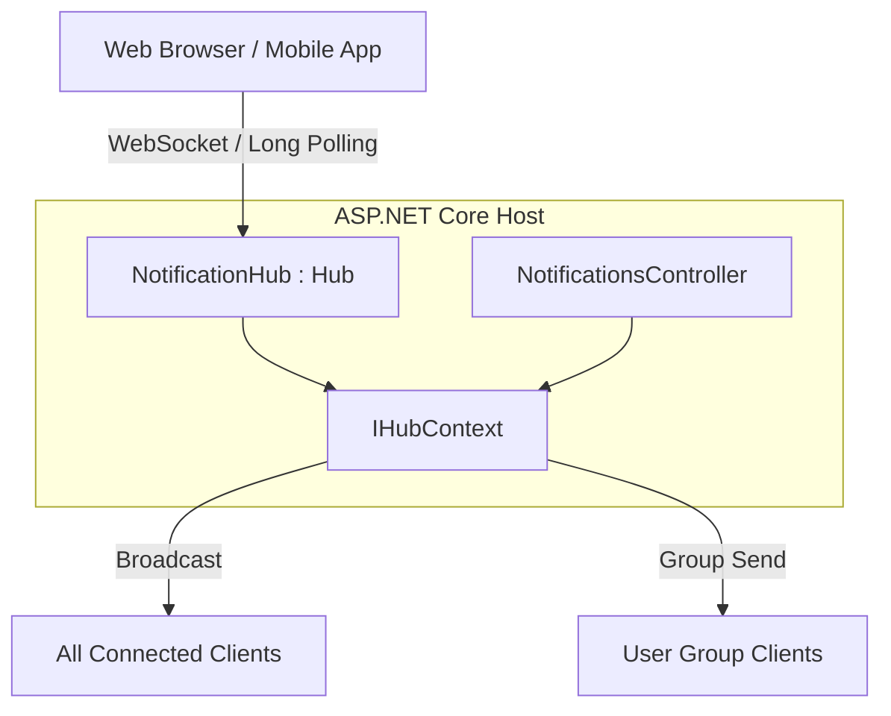
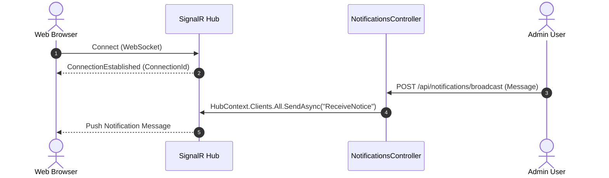

# Project 13: SignalR - Real-time Communication

Dự án này minh họa cách sử dụng **SignalR** trong ASP.NET Core 10 để xây dựng ứng dụng giao tiếp thời gian thực, hai chiều giữa server và client.

## 1. Mục đích của SignalR
SignalR cung cấp API đơn giản hóa quá trình thêm chức năng thời gian thực (real-time) vào ứng dụng web.
- Hỗ trợ **WebSockets** như là phương thức giao tiếp chính.
- Tự động fallback (chuyển đổi) sang **Server-Sent Events (SSE)** hoặc **Long Polling** nếu WebSockets không khả dụng.
- Quản lý tự động các kết nối (reconnect, connection ID).

## 2. Strongly-Typed Hubs vs Dynamically Typed Hubs
- **Dynamically Typed Hub**: Sử dụng `SendAsync("MethodName", data)` dễ dẫn đến lỗi chính tả và thiếu an toàn kiểu dữ liệu.
- **Strongly-Typed Hub (`Hub<T>`)**: Định nghĩa interface (ví dụ `IChatClient`) để quy định các phương thức mà client hỗ trợ, đảm bảo an toàn kiểu dữ liệu và hỗ trợ IntelliSense.

## Sơ đồ Kiến trúc & Luồng dữ liệu (Architecture & Data Flow)

### 1. Sơ đồ Kiến trúc Tổng quan (Architecture Overview)

### 2. Mô hình Luồng dữ liệu Chi tiết (Data Flow & Sequence)

### 3. Các Use Cases Cụ thể trong Thực tế (Concrete Use Cases)
- **Bảng điều khiển (Dashboard) Thời gian thực**: Cập nhật giá chứng khoán, biểu đồ, tỷ số trận đấu tức thì.
- **Ứng dụng Trò chuyện (Chat & Collaboration)**: Giao tiếp 2 chiều tức thời giữa người dùng.
- **Thông báo Đẩy (Push Notifications)**: Báo cho người dùng khi có đơn hàng mới, tin nhắn mới hoặc cảnh báo hệ thống.

## 3. Đẩy dữ liệu từ Server tới Client (Server-to-Client)
Bằng cách tiêm `IHubContext<ChatHub, IChatClient>` vào các controller, minimal API endpoints hoặc background tasks, server có thể chủ động đẩy sự kiện (events, notifications) xuống tất cả hoặc một số client cụ thể (broadcast) mà không cần yêu cầu từ client.

## 4. Cấu trúc Dự án
- `ChatStream.Api`: Server API và SignalR Hubs.
- `ChatStream.Tests`: Integration tests sử dụng xUnit và `WebApplicationFactory`.

## 5. Hub Implementation
- `ChatHub`: Kế thừa `Hub<IChatClient>`, cung cấp các phương thức để client gọi lên server như `JoinRoom`, `LeaveRoom`, `SendMessageToRoom`, `BroadcastMessage`.

## 6. HTTP Endpoints
- `POST /api/notifications/broadcast`: API nhận HTTP POST và broadcast thông báo tới toàn bộ client thông qua `IHubContext`.
- `GET /api/notifications/status`: API kiểm tra trạng thái máy chủ.

## 7. Client Interface
- `IChatClient`: Interface định nghĩa các phương thức `ReceiveMessage`, `UserJoined`, `UserLeft`, `ReceiveNotification` để hub giao tiếp với các connected clients.

## 8. Chạy ứng dụng
- Server sử dụng port `5113`.
- Giao diện Swagger khả dụng tại cấu hình mặc định (dùng OpenAPI middleware).
- Chạy qua lệnh: `dotnet run --project ChatStream.Api`

## 9. Integration Testing
Sử dụng `Microsoft.AspNetCore.SignalR.Client` cùng với `TestServer` của `WebApplicationFactory` để giả lập kết nối SignalR:
- Đảm bảo thiết lập cấu hình handler `HttpMessageHandlerFactory` cho `HubConnectionBuilder`.
- Kiểm tra tính năng broadcast, tạo và quản lý nhóm (room isolation) trong Hub.

## 10. Mở rộng SignalR trong Production
- **Azure SignalR Service**: Dịch vụ PaaS (Platform as a Service) của Azure chuyên dụng cho SignalR, giúp mở rộng (scale) hàng triệu kết nối mà không cần lo lắng về server infrastructure.
- **Redis Backplane**: Sử dụng Redis để đồng bộ hóa tin nhắn giữa nhiều instance (server nodes) SignalR, đảm bảo tin nhắn gửi đến mọi client đang kết nối dù chúng đang kết nối vào máy chủ vật lý/container nào.

## 11. Các Gói Nuget Sử dụng
- `Microsoft.AspNetCore.SignalR.Client` cho Unit Tests.
- `Microsoft.AspNetCore.Mvc.Testing` cho Integration testing.
- `Microsoft.AspNetCore.OpenApi` cho OpenAPI support.

## 12. Cấu hình
- `Program.cs`: `builder.Services.AddSignalR();` và `app.MapHub<ChatHub>("/hubs/chat");`.
