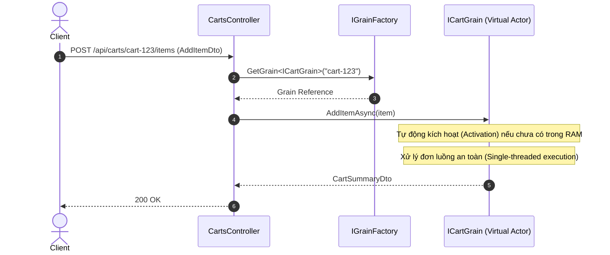

# 14. Microsoft Orleans (Virtual Actors)

## 1. Tên dự án
VirtualActors - Demo Microsoft Orleans Framework

## 2. Mục đích
Dự án này minh họa cách tích hợp và sử dụng **Microsoft Orleans** trong .NET 10. Nó giới thiệu mô hình Virtual Actor để quản lý trạng thái, vòng đời và tính toán đồng thời dễ dàng hơn trong các hệ thống phân tán.


## Sơ đồ Kiến trúc & Luồng dữ liệu (Architecture & Data Flow)

### 1. Sơ đồ Kiến trúc Tổng quan (Architecture Overview)
```mermaid
flowchart TD
    Client["Client / API"] --> Controller["CartsController"]
    Controller --> IGrainFactory["IGrainFactory (Orleans Client)"]
    subgraph Orleans Silo (Cluster)
        IGrainFactory --> GrainRouter["Virtual Actor Router"]
        GrainRouter --> CartGrain["CartGrain (Key: cart-123)"]
        GrainRouter --> CounterGrain["CounterGrain (Key: site-visits)"]
        CartGrain --> State["Grain State (In-Memory / Storage)"]
    end
```

### 2. Mô hình Luồng dữ liệu Chi tiết (Data Flow & Sequence)


### 3. Các Use Cases Cụ thể trong Thực tế (Concrete Use Cases)
- **Virtual Actor Model**: Tự động quản lý vòng đời Actor (tạo, kích hoạt, giải phóng RAM) mà developer không cần can thiệp.
- **Giỏ hàng & Phiên người dùng (Shopping Cart / User Session)**: Mỗi giỏ hàng là một Actor độc lập, xử lý đồng thời cực cao không bị race condition.
- **Game Server & IoT Digital Twins**: Mô hình hóa hàng triệu vật thể ảo (người chơi, thiết bị) trong cluster phân tán.


## 3. Khái niệm cốt lõi (Core Concepts)
- **Virtual Actors (Grains)**: Khác với Traditional Actors (Erlang/Akka), Virtual Actors có vòng đời tự động và sự hiện diện ảo (virtual presence). Orleans đảm bảo mỗi Grain tại một thời điểm chỉ thực thi trên một luồng (single-threaded concurrency guarantees), loại bỏ việc cần sử dụng lock hay mutex cho trạng thái cục bộ.
- **Silo**: Là môi trường thực thi (host) cho các Grains.
- **Cluster**: Tập hợp nhiều Silos giao tiếp với nhau.
- **Grain State Persistence**: Khả năng lưu trạng thái của Grains vào cơ sở dữ liệu một cách trong suốt.

## 4. Khi nào nên sử dụng?
- Thay thế bộ đệm phân tán (distributed cache replacement) khi cần xử lý logic.
- Trò chơi thời gian thực (real-time gaming) và IoT (mỗi thiết bị/người chơi là một per-entity digital twin).
- Quản lý giỏ hàng (shopping carts), trạng thái phiên (session state).

## 5. Các tính năng chính
- Tích hợp Orleans với `UseLocalhostClustering()`.
- Shopping Cart Grain không cần lock/mutex.
- Atomic Counter Grain đếm tự động an toàn đa luồng.
- REST API giao tiếp với Actor/Grains thông qua `IGrainFactory`.

## 6. Yêu cầu hệ thống
- .NET 10 SDK

## 7. Hướng dẫn cài đặt và chạy
```bash
dotnet restore
dotnet run --project VirtualActors.Api/VirtualActors.Api.csproj
```
Dự án chạy tại `http://localhost:5114`.

## 8. Cấu trúc dự án
- `VirtualActors.Api`: Web API chứa Grains, Models và Endpoints.
- `VirtualActors.Tests`: Unit/Integration tests sử dụng `WebApplicationFactory`.

## 9. Hướng dẫn sử dụng
Sử dụng Swagger UI (`/swagger`) hoặc tệp `VirtualActors.Api.http` để thử nghiệm API:
- `POST /api/carts/{cartId}/items`: Thêm item.
- `GET /api/carts/{cartId}`: Xem giỏ hàng.
- `POST /api/counters/{counterId}/increment?val=1`: Tăng biến đếm.

## 10. Cân nhắc khi triển khai (Production Deployment)
- **Clustering**: Tránh dùng localhost clustering. Sử dụng Azure Table, AWS DynamoDB, Kubernetes, hoặc Consul.
- **State Persistence**: Sử dụng SQL, Blob, CosmosDB thay vì in-memory để đảm bảo không mất dữ liệu khi Silo khởi động lại.

## 11. Hướng dẫn kiểm thử
```bash
dotnet test
```
Bao gồm các test đảm bảo chức năng của giỏ hàng và tính an toàn đa luồng của bộ đếm.

## 12. Tài liệu tham khảo
- [Microsoft Orleans Documentation](https://learn.microsoft.com/en-us/dotnet/orleans/)
