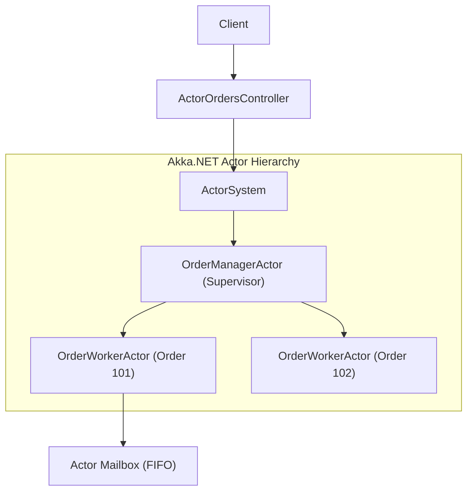
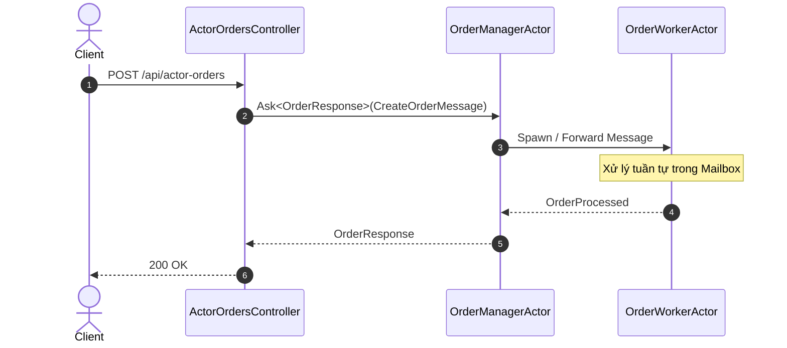

# 15-AkkaNET: Order Workflow với Actor Model

Dự án này là một API mẫu (ASP.NET Core .NET 10) thể hiện cách sử dụng **Akka.NET** và **Akka.Hosting** để xử lý trạng thái đơn hàng (Order State Machine) dựa trên Actor Model.

## 1. Actor Model là gì?
- **Actors**: Đơn vị cơ bản của xử lý tính toán. Mỗi actor có trạng thái riêng, hành vi, và hộp thư (mailbox) để nhận tin nhắn.
- **Mailbox & Message Passing**: Các actor giao tiếp qua việc gửi/nhận tin nhắn bất đồng bộ. Hộp thư đảm bảo từng tin nhắn được xử lý tuần tự, loại bỏ nhu cầu sử dụng lock.
- **Immutability**: Tin nhắn (messages) nên bất biến (immutable) để ngăn trạng thái thay đổi không mong muốn giữa các thread.
- **Zero-lock Concurrency**: Bằng cách chỉ cho phép thay đổi trạng thái qua các tin nhắn tuần tự trong mailbox, bạn không bao giờ phải lo lắng về data races hay thread-locks.

## 2. So sánh Akka.NET và Microsoft Orleans
- **Akka.NET (Traditional Actor Model)**: 
  - Yêu cầu lập trình viên khởi tạo, định tuyến và quản lý vòng đời (lifecycle) của actor một cách thủ công.
  - Cung cấp kiến trúc cây giám sát (Supervision Trees) rõ ràng.
  - Phù hợp cho những hệ thống cần điều khiển chi tiết và độ trễ cục bộ thấp.
- **Microsoft Orleans (Virtual Actor Model)**: 
  - Actors (được gọi là Grains) tự động được kích hoạt (activate) khi có yêu cầu và bị hủy (deactivate) khi không dùng đến.
  - Không cần quản lý vòng đời. Giao tiếp qua RPC thay vì message passing rõ ràng.
  - Phù hợp cho các ứng dụng đám mây phân tán cần mở rộng dễ dàng mà không quan tâm vòng đời.


## Sơ đồ Kiến trúc & Luồng dữ liệu (Architecture & Data Flow)

### 1. Sơ đồ Kiến trúc Tổng quan (Architecture Overview)


### 2. Mô hình Luồng dữ liệu Chi tiết (Data Flow & Sequence)


### 3. Các Use Cases Cụ thể trong Thực tế (Concrete Use Cases)
- **Xử lý Đồng thời Cực hạn (Extreme Concurrency)**: Hàng triệu Actor chạy song song với dung lượng bộ nhớ chỉ vài trăm byte mỗi Actor.
- **Khả năng Tự phục hồi (Supervision Strategies)**: Mô hình "Let it crash" - Actor cha tự động khởi động lại Actor con khi gặp lỗi.
- **Hệ thống Giao dịch Tài chính & Viễn thông**: Xử lý luồng sự kiện tốc độ cao với độ trễ siêu thấp.


## 3. Supervision & Fault Tolerance
- **"Let it crash"**: Triết lý trọng tâm của Akka. Không cố gắng bắt (catch) và xử lý mọi ngoại lệ trong một actor. Hãy để nó sập (crash) và để actor cha (supervisor) quyết định chiến lược phục hồi (Restart, Stop, Resume, Escalate).
- Giúp hệ thống có khả năng tự phục hồi (self-healing) thay vì treo máy hoặc duy trì trạng thái lỗi.

## 4. Production Deployment
Để đưa Akka.NET lên production với khả năng chịu lỗi và phân tán:
- **Akka.Cluster**: Cho phép hệ thống actor mở rộng trên nhiều node vật lý/mạng, loại bỏ điểm gây lỗi duy nhất (Single Point of Failure).
- **Akka.Persistence**: Đảm bảo trạng thái của actor được lưu trữ (bằng Event Sourcing). Khi một node bị sập và actor được phục hồi, nó có thể tái tạo (replay) lại các sự kiện từ SQL Server, EventStore hoặc Redis để khôi phục trạng thái cuối cùng.

## Cách chạy dự án

```bash
cd 15-AkkaNET
dotnet restore
dotnet run --project OrderWorkflowActors.Api
```

- API có thể được gọi thông qua Swagger tại `http://localhost:5115/swagger`.
- Để chạy test tích hợp: `dotnet test`.
