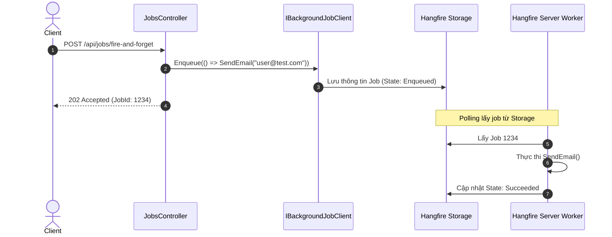

# Demo Hangfire (.NET 10)

Dự án này minh họa cách tích hợp và sử dụng **Hangfire** trong ứng dụng .NET 10 để xử lý các background jobs.

## 1. Giới thiệu
Hangfire là một thư viện mạnh mẽ cho phép xử lý các background jobs trong .NET mà không cần Windows Services hoặc các tiến trình riêng biệt.

## 2. Các thành phần chính
- **Fire-and-forget jobs**: Thực thi một lần và ngay lập tức.
- **Delayed jobs**: Lên lịch thực thi sau một khoảng thời gian nhất định.
- **Recurring jobs**: Lặp lại theo lịch (Cron expressions).
- **Continuation jobs**: Chạy sau khi một job khác hoàn thành.


## Sơ đồ Kiến trúc & Luồng dữ liệu (Architecture & Data Flow)

### 1. Sơ đồ Kiến trúc Tổng quan (Architecture Overview)
```mermaid
flowchart TD
    Client["Client"] --> Controller["JobsController"]
    Controller --> ClientAPI["IBackgroundJobClient"]
    Controller --> RecAPI["IRecurringJobManager"]
    subgraph Hangfire Storage (Memory / SQL / Redis)
        ClientAPI --> JobQueue["Job Queue (Fire-and-Forget / Delayed)"]
        RecAPI --> CronTable["Recurring Cron Schedule"]
    end
    JobQueue --> Server["Hangfire Background Processing Server"]
    CronTable --> Server
    Server --> Worker["Background Worker Pool"]
    Worker --> Execute["Execute Method"]
```

### 2. Mô hình Luồng dữ liệu Chi tiết (Data Flow & Sequence)


### 3. Các Use Cases Cụ thể trong Thực tế (Concrete Use Cases)
- **Fire-and-Forget Jobs**: Gửi email thông báo, tạo file PDF sau khi người dùng bấm xác nhận.
- **Delayed Jobs**: Nhắc nhở giỏ hàng bị bỏ quên sau 24 giờ.
- **Recurring Jobs**: Đồng bộ hóa dữ liệu mỗi đêm vào lúc 02:00 sáng.
- **Dashboard Giám sát Tích hợp**: Theo dõi trực quan trạng thái, lịch sử và thử lại các job thất bại qua Web UI.


## 3. Kiến trúc dự án
- **JobScheduler.Api**: Ứng dụng Web API sử dụng Hangfire với `MemoryStorage` để lưu trữ dữ liệu công việc.
- **JobScheduler.Tests**: Dự án Integration Tests bằng `xUnit` và `WebApplicationFactory`.

## 4. Cách chạy dự án
```bash
cd 16-Hangfire
dotnet restore
dotnet run --project JobScheduler.Api
```

## 5. Endpoints
- `POST /api/jobs/welcome-email`: Tạo một fire-and-forget job.
- `POST /api/jobs/delayed-reminder`: Tạo một delayed job (ví dụ: sau 2 giây).
- `POST /api/jobs/recurring/daily-report`: Tạo một recurring job.
- `GET /api/jobs/history`: Xem lịch sử các jobs đã thực thi.
- `GET /hangfire`: Bảng điều khiển quản lý Hangfire (Dashboard).

## 6. Theo dõi (Monitoring) qua Hangfire Dashboard
Hangfire cung cấp một giao diện web tích hợp sẵn tại `/hangfire`.
- Xem các jobs đang chờ (Enqueued), đang chạy (Processing), thành công (Succeeded), hoặc thất bại (Failed).
- Cho phép trigger thủ công, hoặc retry các job bị lỗi.

## 7. Storage
Dự án này sử dụng `Hangfire.MemoryStorage` (lưu trữ in-memory) phục vụ mục đích demo và testing nhanh. 
**Trong môi trường Production**: Nên sử dụng các lưu trữ bền bỉ như:
- SQL Server (`Hangfire.SqlServer`)
- PostgreSQL (`Hangfire.PostgreSql`)
- Redis (`Hangfire.Redis.StackExchange`)

## 8. Workers & Scaling
Số lượng worker có thể được điều chỉnh:
```csharp
builder.Services.AddHangfireServer(options => { options.WorkerCount = 2; });
```
Hangfire tự động hỗ trợ Scale-out. Khi dùng chung một cơ sở dữ liệu (Storage), các server Hangfire sẽ chia sẻ tải phân tán đồng bộ.

## 9. Cơ chế Retry
Hangfire tự động thử lại (retry) khi xảy ra lỗi. Mặc định là 10. Bạn có thể sử dụng thuộc tính `[AutomaticRetry(Attempts = 5)]`.

## 10. DI (Dependency Injection)
Hangfire tích hợp hoàn toàn với cơ chế DI của .NET. Job methods có thể nhận trực tiếp các services từ `IServiceProvider`.

## 11. Testing
Dự án được test với xUnit & `WebApplicationFactory`. Hangfire xử lý job trong background thread nên trong test cần `Task.Delay` chờ job hoàn thành.

## 12. Tài liệu tham khảo
- [Hangfire Documentation](https://docs.hangfire.io/)
