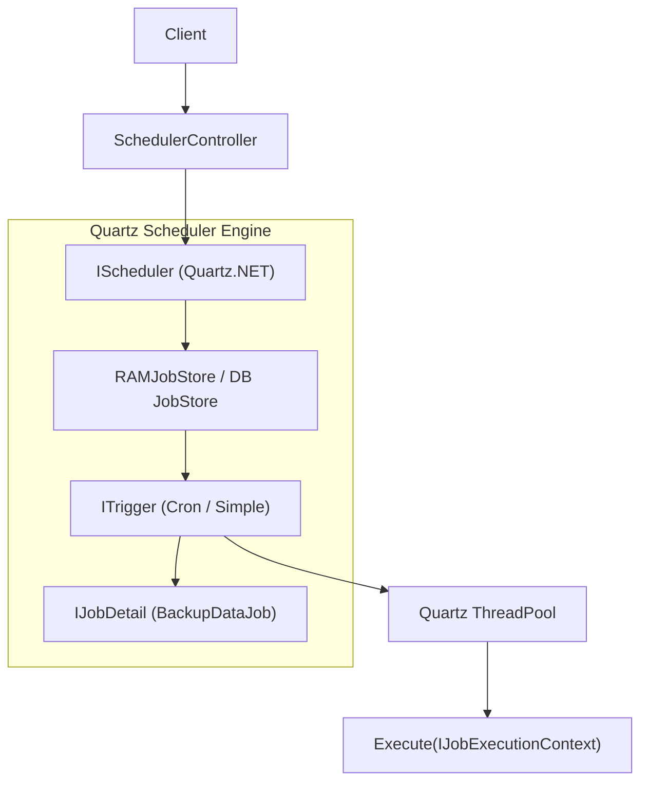
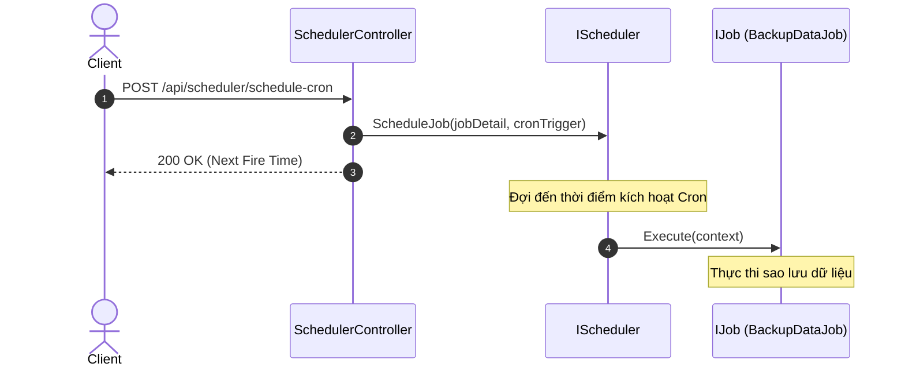

# 17. Quartz.NET trong .NET 10

## 1. Giới thiệu
Dự án demo tích hợp **Quartz.NET** - thư viện lên lịch công việc (job scheduling) phổ biến cho ứng dụng .NET, thông qua package `Quartz.Extensions.Hosting`. 

## 2. Kiến trúc Quartz.NET
- **IScheduler**: Thành phần cốt lõi điều phối việc thực thi các job.
- **IJob**: Interface chứa logic công việc cần thực thi.
- **ITrigger**: Định nghĩa thời điểm/chu kỳ một job sẽ chạy.
- **JobDetail**: Thông tin chi tiết về một job (tên, nhóm, loại).
- **JobDataMap**: Dictionary chứa dữ liệu truyền vào job khi thực thi.


## Sơ đồ Kiến trúc & Luồng dữ liệu (Architecture & Data Flow)

### 1. Sơ đồ Kiến trúc Tổng quan (Architecture Overview)


### 2. Mô hình Luồng dữ liệu Chi tiết (Data Flow & Sequence)


### 3. Các Use Cases Cụ thể trong Thực tế (Concrete Use Cases)
- **Lập lịch Lô Doanh nghiệp (Enterprise Batch Scheduling)**: Hỗ trợ biểu thức Cron phức tạp (ngày lễ, ngày làm việc).
- **Misfire Handling**: Xử lý linh hoạt khi server bị tắt và bật lại (bỏ qua hay chạy bù các job bị lỡ).
- **Chùm máy chủ (Clustered Scheduling)**: Chạy nhiều node mà không sợ trùng lặp job nhờ cơ chế khóa CSDL.


## 3. Các chiến lược lập lịch
- **Simple Schedule**: Thực thi theo chu kỳ cố định (ví dụ: mỗi 2 giây).
- **Cron Schedule**: Lập lịch nâng cao sử dụng biểu thức cron (ví dụ: `0 0 12 * * ?` - chạy lúc 12h trưa mỗi ngày).
- **Calendar Exclusions**: Loại trừ các ngày lễ, ngày cuối tuần khỏi lịch chạy.

## 4. Quartz.NET vs Hangfire
- **Quartz.NET**: Kiến trúc trong bộ nhớ (có thể dùng DB), nhẹ hơn, tập trung vào lập lịch chính xác (precision scheduling) và phức tạp. Không đi kèm UI mặc định.
- **Hangfire**: Luôn cần một persistent storage (SQL, Redis), hỗ trợ theo dõi tiến trình trực quan qua Dashboard tích hợp sẵn. Tốt cho các tác vụ fire-and-forget.

## 5. Chạy Job Cluster trong Production
Để chạy nhiều instance của ứng dụng với Quartz.NET, cần cấu hình `AdoJobStore` với database chung để tránh việc các node chạy cùng một job vào cùng một thời điểm, hoặc chia tải công việc.

## 6. Cấu hình dự án
- Web API Minimal trong .NET 10
- Quartz & Quartz.Extensions.Hosting (v4.1.1)

## 7. Cấu trúc thư mục
- `Jobs/`: Chứa `MetricCollectorJob` và `DatabaseBackupJob`.
- `Data/`: Chứa các singleton store để lưu audit (`MetricAuditStore`, `BackupAuditStore`).
- `Endpoints/`: API để kích hoạt, tạm dừng và tiếp tục job.

## 8. Hướng dẫn chạy
```bash
dotnet restore
dotnet run --project CronScheduler.Api
```

## 9. Các endpoint chính
- `POST /api/scheduler/backup/trigger`: Kích hoạt job backup bằng tay với tham số.
- `POST /api/scheduler/jobs/{jobName}/pause`: Tạm dừng job (ví dụ: `metricCollector`).
- `POST /api/scheduler/jobs/{jobName}/resume`: Tiếp tục job.
- `GET /api/scheduler/metrics`: Lấy danh sách metrics đã lưu.
- `GET /api/scheduler/backups`: Lấy lịch sử backup.

## 10. Chạy Test
```bash
dotnet test
```

## 11. Các công nghệ khác
- Sử dụng xUnit và `WebApplicationFactory` để test tích hợp các API lập lịch.

## 12. Bài học rút ra
Tích hợp Quartz với Minimal API và Dependency Injection của .NET dễ dàng thiết lập và điều khiển các tác vụ nền, đồng thời hỗ trợ tham số linh hoạt với `JobDataMap`.
