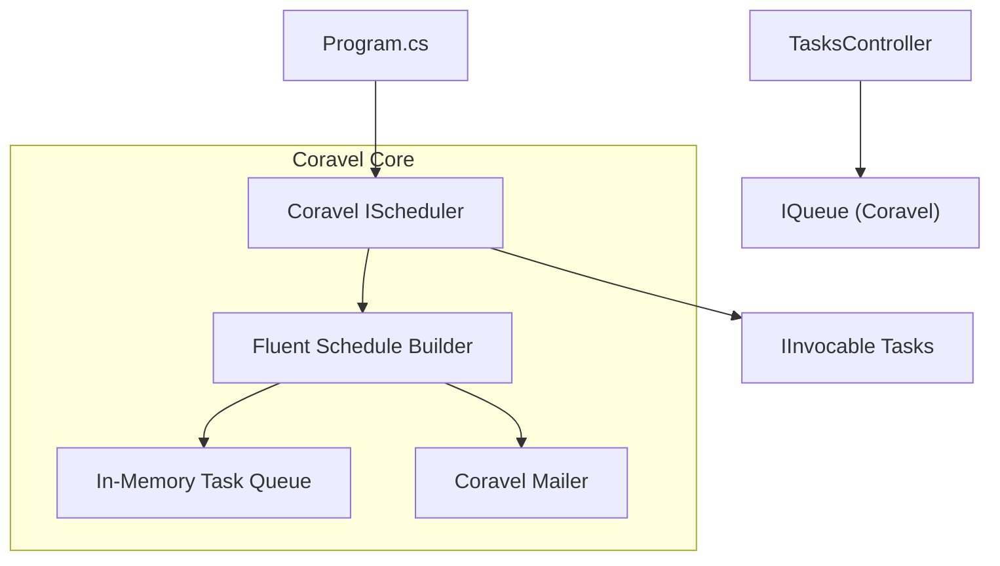
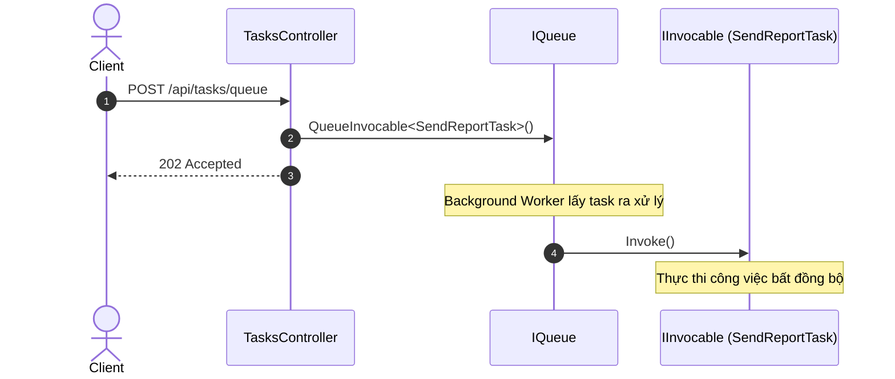

# Coravel trong .NET 10

## 1. Mục đích của Coravel
Coravel là một thư viện gọn nhẹ và dễ sử dụng dành cho các dự án .NET, giúp thực hiện các công việc như lập lịch (scheduling), hàng đợi nền (background queueing), bộ nhớ đệm (caching), gửi email, và phát ra các sự kiện (event broadcasting) mà không cần cấu hình phức tạp. Điểm mạnh lớn nhất của Coravel là nó hoạt động in-memory, do đó không đòi hỏi thiết lập các cơ sở dữ liệu hoặc hệ thống lưu trữ bên ngoài như Redis hoặc SQL Server.

## 2. Tính năng chính
- **Scheduling**: Lập lịch thực hiện công việc định kỳ (giây, phút, giờ, hàng ngày, vv) bằng cú pháp fluent dễ đọc.
- **Queuing**: Hàng đợi FIFO hoạt động in-memory giúp đẩy các công việc nặng về nền (background) một cách mượt mà.
- **Events**: Phát và lắng nghe sự kiện dễ dàng (Pub/Sub in-memory).
- **Caching**: Tích hợp bộ nhớ đệm đơn giản cho ứng dụng.
- **Mailing**: Tính năng gửi email tích hợp.


## Sơ đồ Kiến trúc & Luồng dữ liệu (Architecture & Data Flow)

### 1. Sơ đồ Kiến trúc Tổng quan (Architecture Overview)


### 2. Mô hình Luồng dữ liệu Chi tiết (Data Flow & Sequence)


### 3. Các Use Cases Cụ thể trong Thực tế (Concrete Use Cases)
- **Ứng dụng Monolith Gọn nhẹ**: Thay thế Hangfire/Quartz khi không cần CSDL lưu trữ hay Web Dashboard cồng kềnh.
- **Fluent Task Scheduling**: Khai báo lịch trình bằng cú pháp C# tự nhiên (`scheduler.Schedule<MyJob>().DailyAtHour(13)`).
- **In-Memory Background Queue**: Đưa các tác vụ nặng vào hàng đợi xử lý ngầm trong cùng tiến trình.


## 3. So sánh Coravel, Quartz.NET và Hangfire
| Tiêu chí | Coravel | Hangfire | Quartz.NET |
|----------|---------|----------|------------|
| **Độ phức tạp** | Rất thấp, cấu hình nhanh chóng. | Trung bình, yêu cầu database/Redis. | Cao, linh hoạt nhưng cấu hình khó. |
| **Lưu trữ** | In-memory (mất dữ liệu khi app crash). | Persistent (lưu database, an toàn). | Hỗ trợ cả in-memory và database. |
| **Bảng điều khiển (Dashboard)** | Không có. | Có giao diện dashboard tích hợp. | Không có (cần dùng thư viện bên thứ 3). |
| **Phù hợp nhất cho** | Các tác vụ nền đơn giản, dự án monolith vừa/nhỏ. | Ứng dụng enterprise, cần đảm bảo không mất job. | Lập lịch cực kỳ phức tạp (cron khó). |

## 4. Lưu ý khi dùng môi trường Production
Do Coravel sử dụng hàng đợi in-memory, toàn bộ các job đang ở trong queue sẽ **bị mất** nếu ứng dụng bị crash hoặc khởi động lại (restart). 
Vì thế, Coravel phù hợp nhất cho:
- Các background jobs không quá quan trọng, có thể làm lại sau hoặc được trigger bởi các hành động sau đó.
- Ứng dụng một khối (Monolith) vừa và nhỏ.
Đối với các ứng dụng enterprise yêu cầu độ toàn vẹn của tác vụ nền cao, cân nhắc sử dụng Hangfire hoặc Quartz.NET với Persistent Storage, hay RabbitMQ.

## 5. Hướng dẫn chạy dự án
```bash
# Restore các gói NuGet
dotnet restore

# Build dự án
dotnet build

# Chạy Test (xUnit & WebApplicationFactory)
dotnet test

# Chạy dự án (mặc định tại http://localhost:5118)
dotnet run --project TaskQueueScheduler.Api
```
Mở trình duyệt truy cập `http://localhost:5118/swagger` để tương tác với API qua Swagger UI.
