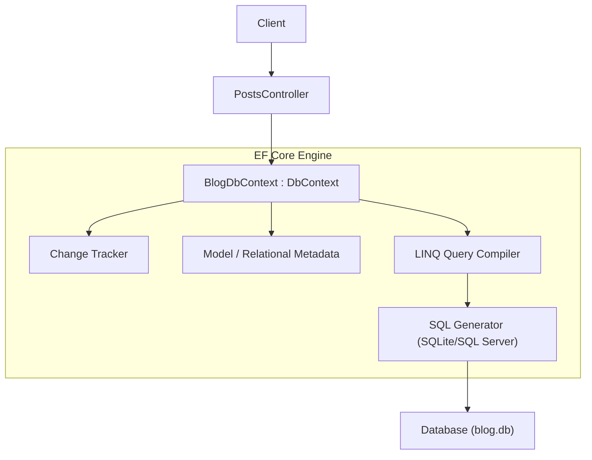
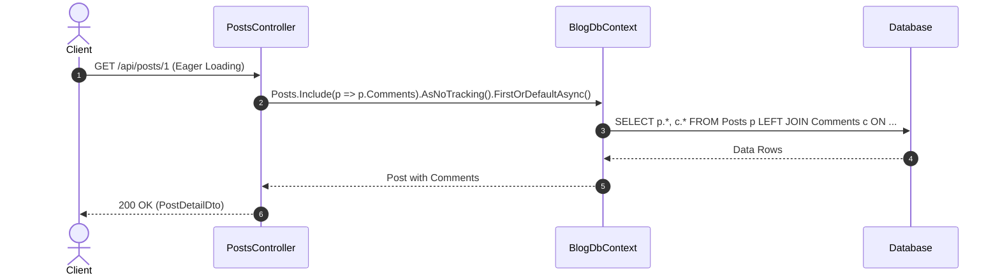

# 19. Entity Framework Core (EF Core) trong .NET 10

## 1. Giới thiệu (Introduction)
Entity Framework Core (EF Core) là trình ánh xạ đối tượng-quan hệ (ORM) chính thức, mạnh mẽ và phổ biến nhất trong hệ sinh thái .NET. Nó cho phép các lập trình viên làm việc với cơ sở dữ liệu sử dụng các đối tượng .NET (entities) thay vì phải viết các câu lệnh SQL trực tiếp. EF Core hỗ trợ nhiều loại cơ sở dữ liệu như SQL Server, PostgreSQL, MySQL, SQLite, v.v. thông qua mô hình Provider.

## 2. Vai trò của thành phần (Component Role)
- **DbContext**: Đại diện cho một phiên làm việc với cơ sở dữ liệu, dùng để truy vấn và lưu các thể hiện của các entity.
- **DbSet**: Đại diện cho một tập hợp các entity trong cơ sở dữ liệu (tương đương với một bảng).
- **Change Tracker**: Thành phần cốt lõi của EF Core, tự động theo dõi các thay đổi của các entity (Added, Modified, Deleted, Unchanged) để tạo ra các lệnh SQL tương ứng khi gọi `SaveChanges()`.
- **Entities & DTOs**: Entity là các class được ánh xạ với CSDL, còn DTO (Data Transfer Object) dùng để truyền dữ liệu qua API.

## Sơ đồ Kiến trúc & Luồng dữ liệu (Architecture & Data Flow)

### 1. Sơ đồ Kiến trúc Tổng quan (Architecture Overview)

### 2. Mô hình Luồng dữ liệu Chi tiết (Data Flow & Sequence)

### 3. Các Use Cases Cụ thể trong Thực tế (Concrete Use Cases)
- **Ứng dụng Nghiệp vụ Doanh nghiệp Toàn diện**: Quản lý các mối quan hệ thực thể phức tạp (1-1, 1-N, N-N).
- **Code-First & Migrations**: Quản lý lịch sử và tiến hóa cấu trúc cơ sở dữ liệu qua các phiên bản phần mềm.
- **Tự động theo dõi thay đổi (Change Tracking)**: Tự động phát hiện các trường bị sửa đổi để tạo lệnh `UPDATE` tối ưu.

## 3. Tại sao cần thiết (Why it's needed)
- Tăng tốc độ phát triển phần mềm bằng cách làm việc với các đối tượng C# thay vì SQL.
- Độc lập với cơ sở dữ liệu: Dễ dàng chuyển đổi giữa các loại DB bằng cách thay đổi provider.
- Tích hợp sẵn tính năng theo dõi thay đổi (Change Tracking), Lazy Loading, Eager Loading.
- Hỗ trợ mạnh mẽ LINQ để viết các truy vấn phức tạp một cách trực quan, type-safe.

## 4. Cách thức hoạt động (How it works)
1. Cấu hình EF Core Provider trong `Program.cs` (`AddDbContext`).
2. Khai báo các Entities và `DbContext`. Cấu hình quan hệ (relations) bằng Fluent API trong `OnModelCreating` hoặc Data Annotations.
3. Inject `DbContext` vào Controller hoặc Service.
4. Sử dụng LINQ trên các `DbSet` để truy vấn (`ToList`, `FirstOrDefault`).
5. Thêm, sửa, xóa các entity và gọi `SaveChanges()` để áp dụng xuống CSDL.

## 5. Đặc điểm và Tính năng (Features & Characteristics)
- **Code-First & Database-First**: Hỗ trợ tạo CSDL từ code hoặc sinh code từ CSDL có sẵn.
- **Migrations**: Quản lý sự thay đổi của schema CSDL theo thời gian.
- **Cascade Delete**: Tự động xóa các bản ghi phụ thuộc khi bản ghi cha bị xóa.
- **Concurrency Control**: Xử lý xung đột dữ liệu khi nhiều người dùng cập nhật cùng một lúc.
- **Interceptors**: Cho phép can thiệp vào quá trình sinh SQL hoặc thực thi command.

## 6. Các Use Cases phổ biến (Common Use Cases)
- Xây dựng hệ thống quản lý dữ liệu nghiệp vụ (CRUD operations).
- Xử lý các nghiệp vụ phức tạp với nhiều bảng dữ liệu quan hệ (1-1, 1-N, N-N).
- Phát triển API nhanh chóng dựa trên mô hình dữ liệu.

## 7. Ví dụ thực tế (Practical Example)
Dự án demo này quản lý Blog, bao gồm các bài viết (`Post`) và bình luận (`Comment`).
Mô hình quan hệ 1-N: 1 Post có thể có nhiều Comments. Khi Post bị xóa, tất cả Comment liên quan cũng tự động bị xóa (Cascade Delete).

## 8. Best Practices
- **Performance**:
  - Dùng `.AsNoTracking()` cho các truy vấn chỉ đọc (read-only) để bỏ qua Change Tracker, tiết kiệm bộ nhớ và tăng tốc.
  - Sử dụng `.Select()` để Projection dữ liệu thành DTO ngay tại tầng DB, giảm lượng cột truy vấn (tránh "Select *").
  - Xử lý N+1 Queries: Tránh gọi truy vấn CSDL trong vòng lặp. Dùng `.Include()` (Eager Loading) để lấy dữ liệu quan hệ trong 1 truy vấn duy nhất.
- **Design**:
  - Tách biệt Models/Entities và DTOs. Không trả về trực tiếp Entity ra ngoài API.
  - Sử dụng Dependency Injection (DI) để quản lý `DbContext` scope theo từng request.

## 9. Khác biệt giữa các môi trường (Environment Differences)
- **Development**: Có thể dùng SQLite hoặc LocalDB, In-Memory. Chạy `Database.EnsureCreated()` để nhanh chóng tạo bảng, hoặc dùng Migrations (`dotnet ef migrations add`).
- **Production**:
  - Sử dụng SQL Server, PostgreSQL, MySQL...
  - Tuyệt đối không dùng `Database.EnsureCreated()`. Luôn dùng Migrations hoặc SQL Scripts thông qua công cụ CI/CD để đảm bảo an toàn schema.
  - Chuỗi kết nối (Connection String) cần được bảo mật trong Key Vault hoặc Environment Variables.

## 10. Các lỗi thường gặp (Common Pitfalls)
- **Lỗi N+1 Query**: Lấy danh sách cha, rồi lặp qua từng phần tử gọi CSDL lấy phần tử con -> Cực kỳ chậm. Giải pháp: Dùng `Include()`.
- **Change Tracker ngốn RAM**: Lấy hàng nghìn records để đọc nhưng không dùng `AsNoTracking()`.
- **Lỗi Cascade Delete không mong muốn**: Do cấu hình nhầm behavior xóa tự động làm mất dữ liệu quan trọng.

## 11. Các công cụ hỗ trợ (Ecosystem & Tools)
- `dotnet-ef`: CLI tool để quản lý Migrations (`dotnet tool install -g dotnet-ef`).
- SSMS, DBeaver, Azure Data Studio: Quản lý và kiểm tra dữ liệu thực tế.
- Entity Framework Profiler: Tool theo dõi các truy vấn SQL do EF sinh ra.

## 12. Tài liệu tham khảo (References)
- [EF Core Documentation](https://learn.microsoft.com/en-us/ef/core/)
- [Performance Tuning EF Core](https://learn.microsoft.com/en-us/ef/core/performance/)
