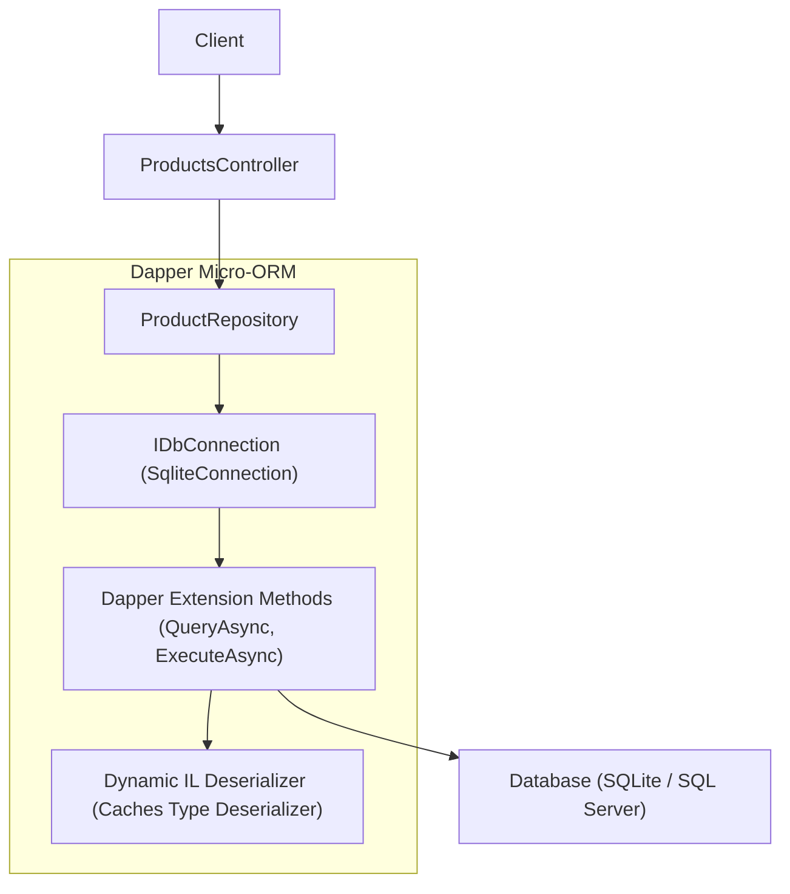
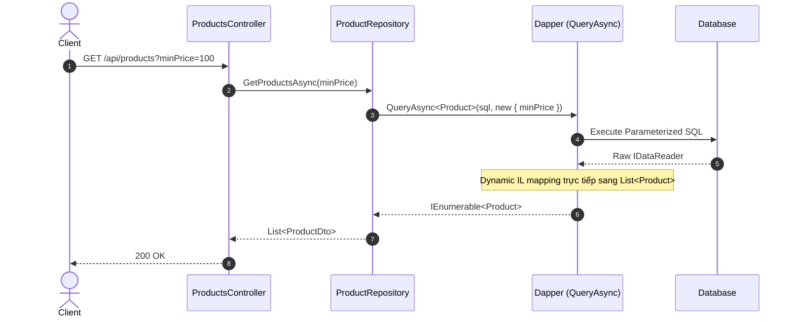

# 20-Dapper: Micro-ORM Siêu Hiệu Năng Cho .NET 10

Dự án mẫu minh họa cách sử dụng **Dapper** — thư viện Micro-ORM nguồn mở nổi tiếng của Stack Overflow, cung cấp các extension method trực tiếp trên `IDbConnection` của ADO.NET với tốc độ thực thi gần tương đương raw ADO.NET DataReader.

---

## 1. Giới thiệu Dapper trong hệ sinh thái .NET

Trong các ứng dụng .NET doanh nghiệp có lưu lượng truy cập cao (high-throughput), Entity Framework Core (EF Core) dù rất mạnh mẽ về Change Tracking và LINQ Provider nhưng có thể mang lại chi phí overhead nhất định về bộ nhớ và CPU.

**Dapper** giải quyết vấn đề này bằng cách:
- **Tập trung vào Raw SQL**: Nhà phát triển viết câu lệnh SQL thuần túy, có toàn quyền kiểm soát Execution Plan và Index của CSDL.
- **Tốc độ thực thi cực đại**: Dapper sử dụng cơ chế Dynamic IL Generation (IL Emit) để map trực tiếp từ `IDataReader` vào POCO object chỉ trong vài microsecond, nhanh gấp nhiều lần Reflection thông thường.
- **Zero Overhead**: Không có Change Tracker, không có DbContext state, không lưu trạng thái ngầm, giúp giải phóng RAM ngay sau khi đọc dữ liệu.

---

## 2. Kiến trúc & Cơ chế hoạt động

```
[ HTTP Request ]
       │
       ▼
[ ProductsController ] (ASP.NET Core Controller)
       │
       ▼
[ IProductRepository ] (ProductRepository)
       │
       ▼
[ Dapper Extension Methods ]
  - connection.QueryAsync<Product, Category, Product>(...) (Multi-Mapping)
  - connection.ExecuteScalarAsync<int>(...) (INSERT + last_insert_rowid)
  - connection.ExecuteAsync(...) (UPDATE, DELETE)
  - connection.BeginTransaction() (Atomic Batch Operation)
       │
       ▼
[ IDbConnection ] (Microsoft.Data.Sqlite / ADO.NET)
       │
       ▼
[ SQLite Database / SQL Server / PostgreSQL ]
```

### Các tính năng cốt lõi được demo:
1. **Parameterized Queries**: Sử dụng `@Param` với anonymous object để triệt tiêu nguy cơ SQL Injection và tận dụng cơ chế Query Plan Caching của RDBMS.
2. **Multi-Mapping (`1:1` relationship)**: Ánh xạ kết quả của câu query `JOIN` giữa `Products` và `Categories` vào cây đối tượng lồng nhau (`Product.Category`) chỉ trong một roundtrip.
3. **Database Transactions**: Quản lý `IDbTransaction` tường minh để thực hiện batch cập nhật chiết khấu giá nhiều sản phẩm đảm bảo tính toàn vẹn dữ liệu (ACID).
4. **Resilient Connection Lifecycle**: Quản lý đóng/mở connection ngắn hạn theo chuẩn ADO.NET Connection Pool.

---


## Sơ đồ Kiến trúc & Luồng dữ liệu (Architecture & Data Flow)

### 1. Sơ đồ Kiến trúc Tổng quan (Architecture Overview)


### 2. Mô hình Luồng dữ liệu Chi tiết (Data Flow & Sequence)


### 3. Các Use Cases Cụ thể trong Thực tế (Concrete Use Cases)
- **Truy vấn Hiệu năng Siêu cao**: Tốc độ mapping gần bằng ADO.NET thuần, nhanh hơn đáng kể so với các ORM đầy đủ.
- **Báo cáo & Truy vấn Phức tạp**: Tự do viết các câu lệnh SQL tối ưu riêng, CTE, Window Functions hoặc Stored Procedures.
- **Mô hình CQRS Read-Side**: Sử dụng EF Core cho việc ghi (Command) và Dapper cho việc đọc dữ liệu (Query).


## 3. Cấu trúc thư mục & Project

```
20-Dapper/
├── ProductCatalog.slnx
├── README.md
├── ProductCatalog.Api/
│   ├── ProductCatalog.Api.csproj
│   ├── Program.cs
│   ├── appsettings.json
│   ├── appsettings.Development.json
│   ├── ProductCatalog.Api.http
│   ├── Properties/
│   │   └── launchSettings.json
│   ├── Data/
│   │   ├── IDbConnectionFactory.cs
│   │   └── DbInitializer.cs
│   ├── Entities/
│   │   ├── Category.cs
│   │   └── Product.cs
│   ├── Models/
│   │   └── ProductDtos.cs
│   ├── Repositories/
│   │   ├── IProductRepository.cs
│   │   └── ProductRepository.cs
│   └── Controllers/
│       └── ProductsController.cs
└── ProductCatalog.Tests/
    ├── ProductCatalog.Tests.csproj
    └── ProductTests.cs
```

---

## 4. Cài đặt & Cấu hình

### Package NuGet:
- `Dapper` (2.1.66)
- `Microsoft.Data.Sqlite` (10.0.12)
- `Swashbuckle.AspNetCore` (10.2.3)
- `Microsoft.AspNetCore.Mvc.Testing` (10.0.0)

### Cấu hình `appsettings.json`:
```json
{
  "ConnectionStrings": {
    "DefaultConnection": "Data Source=products.db"
  }
}
```

---

## 5. Hướng dẫn chạy ứng dụng & API Contract

### Khởi chạy:
```powershell
cd d:\GitHub\dotnet-example\20-Dapper\ProductCatalog.Api
dotnet run
```
Ứng dụng lắng nghe tại: `http://localhost:5120`  
Swagger UI: `http://localhost:5120/swagger`

### API Contract:

| Phương thức | Endpoint | Mô tả |
|---|---|---|
| `GET` | `/api/products` | Lấy danh sách sản phẩm (hỗ trợ `?search=` và `?categoryId=`) |
| `GET` | `/api/products/{id}` | Lấy chi tiết sản phẩm kèm Category thông qua Multi-mapping |
| `POST` | `/api/products` | Thêm mới sản phẩm |
| `PUT` | `/api/products/{id}` | Cập nhật thông tin sản phẩm |
| `DELETE` | `/api/products/{id}` | Xóa sản phẩm theo ID |
| `POST` | `/api/products/batch-discount` | Áp dụng chiết khấu hàng loạt trong 1 Transaction |

---

## 6. Chi tiết triển khai code

### 6.1. Dapper Multi-Mapping (Product + Category)
```csharp
var sql = @"
    SELECT 
        p.Id, p.Name, p.Description, p.Price, p.Stock, p.CategoryId,
        c.Id AS CategoryId, c.Name, c.Description
    FROM Products p
    LEFT JOIN Categories c ON p.CategoryId = c.Id
    WHERE p.Id = @Id;";

var products = await connection.QueryAsync<Product, Category, Product>(
    sql,
    (product, category) =>
    {
        product.Category = category;
        return product;
    },
    param: new { Id = id },
    splitOn: "CategoryId"
);
```

### 6.2. Transaction an toàn trong Dapper
```csharp
using var connection = _factory.CreateConnection();
using var transaction = connection.BeginTransaction();
try
{
    var rate = discountPercentage / 100m;
    var sql = "UPDATE Products SET Price = ROUND(Price * (1.0 - @Rate), 2) WHERE Id = @Id;";

    foreach (var id in productIds)
    {
        await connection.ExecuteAsync(sql, new { Rate = rate, Id = id }, transaction);
    }

    transaction.Commit();
}
catch
{
    transaction.Rollback();
    throw;
}
```

---

## 7. Tối ưu hiệu năng & Best Practices

1. **Tránh String Interpolation trong SQL**: Tuyệt đối không nối chuỗi `WHERE Id = " + id` mà luôn dùng parameterized object `new { Id = id }` để chống SQL Injection và tái sử dụng Plan Cache.
2. **Quản lý Vòng đời Connection**: Không inject `IDbConnection` dưới dạng Scoped hay Singleton. Hãy dùng `IDbConnectionFactory` để tạo connection và giải phóng ngay bằng khối `using var connection = ...`.
3. **Buffered vs Non-Buffered (`buffered: false`)**: Mặc định Dapper tải toàn bộ kết quả vào bộ nhớ (`buffered: true`). Khi truy vấn tập dữ liệu hàng chục nghìn dòng, đặt `buffered: false` để stream qua `IEnumerable` dạng forward-only nhằm tiết kiệm RAM.
4. **SplitOn chính xác**: Trong multi-mapping, `splitOn` chỉ định cột bắt đầu của bảng tiếp theo để Dapper phân tách object chính xác.

---

## 8. Phản biện kỹ thuật & Đánh giá rủi ro

- **Không tự động sinh câu truy vấn**: Mọi câu lệnh SQL do lập trình viên trực tiếp viết. Nếu đổi tên cột trong CSDL, trình biên dịch C# không báo lỗi compile-time. Cần duy trì bộ integration test chặt chẽ.
- **Không có Unit of Work / Change Tracking mặc định**: Nếu cần theo dõi thay đổi phức tạp qua nhiều màn hình, EF Core là lựa chọn thuận tiện hơn; còn Dapper vượt trội ở các nghiệp vụ báo cáo, đọc dữ liệu tần suất cao (CQRS Read Model) hoặc thao tác bulk.
- **Tương thích RDBMS**: Cần chú ý cú pháp lấy ID tự tăng (`last_insert_rowid()` của SQLite, `SCOPE_IDENTITY()` của SQL Server, `RETURNING Id` của PostgreSQL).

---

## 9. Kiểm thử tự động (TDD)

Dự án áp dụng `WebApplicationFactory<Program>` kết hợp SQLite temp database độc lập cho mỗi fixture:
```powershell
dotnet test d:\GitHub\dotnet-example\20-Dapper\ProductCatalog.slnx
```

### Các kịch bản kiểm thử:
- ✅ Lấy danh sách sản phẩm đã map đúng Category name
- ✅ Lọc theo từ khóa tìm kiếm và Category ID
- ✅ Lấy chi tiết sản phẩm 200 OK và 404 Not Found khi ID không tồn tại
- ✅ Tạo mới sản phẩm trả về 201 Created và header `Location`
- ✅ Kiểm tra validation dữ liệu đầu vào (tên trống, giá âm, category không tồn tại)
- ✅ Cập nhật và xóa sản phẩm
- ✅ Kiểm tra Transaction: Áp dụng chiết khấu hàng loạt thành công

---

## 10. Bài tập mở rộng & Thử thách thực tế

1. **Phân trang linh hoạt (Pagination)**: Bổ sung `page` và `pageSize` sử dụng `OFFSET` và `LIMIT` trong SQLite kèm `QueryMultipleAsync` để vừa lấy dữ liệu vừa đếm `COUNT(*)`.
2. **Dapper TypeHandler**: Tạo `SqliteGuidTypeHandler` hoặc `JsonTypeHandler<T>` để map trường JSON trong cột SQLite vào đối tượng C#.
3. **Dapper.Contrib**: Thử nghiệm thư viện mở rộng `Dapper.Contrib` để tự động hóa các thao tác CRUD cơ bản (`Get<T>`, `Insert<T>`, `Update<T>`).

---

## 11. Giới hạn & Lưu ý khi lên Production

- Không nên chia sẻ một instance `IDbConnection` giữa các luồng đồng thời (concurrency violation).
- Cần thiết lập Timeout hợp lý (`commandTimeout`) cho các câu truy vấn phức tạp để tránh treo ứng dụng.
- Đảm bảo các chỉ mục (Indexes) trên CSDL được đánh đúng theo các cột thường xuyên xuất hiện trong mệnh đề `WHERE` và `JOIN`.

---

## 12. Tài liệu tham khảo

- [Dapper GitHub Repository](https://github.com/DapperLib/Dapper)
- [Dapper Official Documentation](https://www.learndapper.com/)
- [Microsoft ADO.NET Best Practices](https://learn.microsoft.com/en-us/dotnet/framework/data/adonet/)
