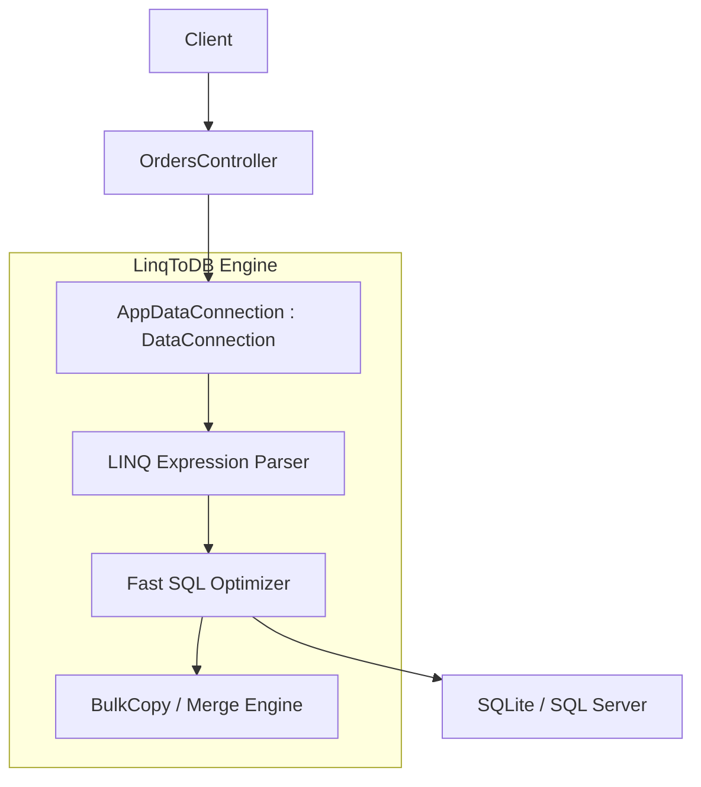
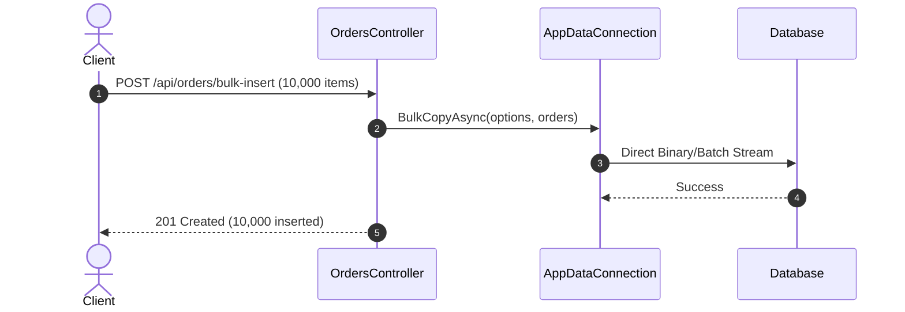

# 21-LinqToDB: LINQ Provider Siêu Tốc & Type-Safe Cho .NET 10

Dự án mẫu minh họa cách sử dụng **linq2db** — một trong những LINQ provider và ORM nhanh nhất trong thế giới .NET, kết hợp hoàn hảo giữa tính an toàn kiểu dữ liệu (Type-Safety) của LINQ và hiệu năng tối đa của câu lệnh SQL.

---

## 1. Giới thiệu LinqToDB trong hệ sinh thái .NET

Entity Framework Core dịch LINQ sang SQL rất tiện dụng nhưng mang theo overhead của Change Tracking, Snapshot State và việc tạo câu query phức tạp đôi khi phát sinh N+1 hoặc subquery không tối ưu. Trong khi đó, Dapper nhanh nhưng hoàn toàn dựa vào raw SQL string, dễ phát sinh lỗi cú pháp thời gian chạy (runtime syntax error) khi đổi tên cột hoặc bảng.

**linq2db** là giải pháp cân bằng lý tưởng:
- **LINQ-to-SQL thuần túy**: Dịch trực tiếp biểu thức C# Expression sang SQL tối ưu, an toàn tại thời điểm biên dịch (compile-time type-safety).
- **Thực thi Set-Based Updates & Deletes**: Cho phép cập nhật hoặc xóa dữ liệu trực tiếp trên CSDL (`UPDATE / DELETE WHERE`) mà không cần nạp thực thể vào bộ nhớ máy chủ.
- **BulkCopy siêu tốc**: Tích hợp cơ chế chèn dữ liệu hàng loạt tốc độ cao tương tự `SqlBulkCopy` cho mọi cơ sở dữ liệu hỗ trợ (SQLite, SQL Server, PostgreSQL, MySQL).
- **Không có Change Tracking Overhead**: Nhẹ và nhanh tương đương micro-ORM.

---

## 2. Kiến trúc & Cơ chế hoạt động

```
[ HTTP Request ]
       │
       ▼
[ OrdersController ] (ASP.NET Core Controller)
       │
       ▼
[ AppDataConnection ] (kế thừa LinqToDB.Data.DataConnection)
  - Orders: ITable<Order>
  - OrderItems: ITable<OrderItem>
       │
       ▼
[ LinqToDB Query Engine ]
  - Type-Safe LINQ Expressions -> Optimized SQL
  - Set-Based Update: .Set(...).UpdateAsync()
  - Set-Based Delete: .Where(...).DeleteAsync()
  - Bulk Operations: db.BulkCopyAsync(...)
  - Identity Insertion: db.InsertWithInt32IdentityAsync(...)
       │
       ▼
[ SQLite Database / SQL Server / PostgreSQL ]
```

---


## Sơ đồ Kiến trúc & Luồng dữ liệu (Architecture & Data Flow)

### 1. Sơ đồ Kiến trúc Tổng quan (Architecture Overview)


### 2. Mô hình Luồng dữ liệu Chi tiết (Data Flow & Sequence)


### 3. Các Use Cases Cụ thể trong Thực tế (Concrete Use Cases)
- **Bulk Operations Tốc độ Cao**: Chèn, cập nhật hàng triệu bản ghi trong vài giây mà không cần thêm thư viện phụ trợ.
- **Truy vấn LINQ không Overhead**: Không có Change Tracker, sinh câu lệnh SQL trong suốt và tối ưu nhất.
- **Hỗ trợ Tính năng Đặc thù của DB**: Sử dụng cú pháp MERGE, Window Functions, Table Hints trực tiếp từ LINQ.


## 3. Cấu trúc thư mục & Project

```
21-LinqToDB/
├── OrderManagement.slnx
├── README.md
├── OrderManagement.Api/
│   ├── OrderManagement.Api.csproj
│   ├── Program.cs
│   ├── appsettings.json
│   ├── appsettings.Development.json
│   ├── OrderManagement.Api.http
│   ├── Properties/
│   │   └── launchSettings.json
│   ├── Data/
│   │   ├── AppDataConnection.cs
│   │   └── DbInitializer.cs
│   ├── Entities/
│   │   ├── Order.cs
│   │   └── OrderItem.cs
│   ├── Models/
│   │   └── OrderDtos.cs
│   └── Controllers/
│       └── OrdersController.cs
└── OrderManagement.Tests/
    ├── OrderManagement.Tests.csproj
    └── OrderTests.cs
```

---

## 4. Cài đặt & Cấu hình

### Package NuGet:
- `linq2db` (5.4.1.9)
- `linq2db.AspNet` (5.4.1.9)
- `linq2db.SQLite` (6.5.0)
- `Microsoft.Data.Sqlite` (10.0.12)
- `Swashbuckle.AspNetCore` (10.2.3)

### Cấu hình `Program.cs`:
```csharp
builder.Services.AddLinqToDBContext<AppDataConnection>((provider, options) =>
    options
        .UseSQLite(connectionString)
        .UseDefaultLogging(provider));
```

---

## 5. Hướng dẫn chạy ứng dụng & API Contract

### Khởi chạy:
```powershell
cd d:\GitHub\dotnet-example\21-LinqToDB\OrderManagement.Api
dotnet run
```
Ứng dụng lắng nghe tại: `http://localhost:5121`  
Swagger UI: `http://localhost:5121/swagger`

### API Contract:

| Phương thức | Endpoint | Mô tả |
|---|---|---|
| `GET` | `/api/orders` | Lấy danh sách đơn hàng (hỗ trợ `?status=` và `?search=`) |
| `GET` | `/api/orders/statistics` | Lấy số liệu thống kê tổng hợp (tính toán hoàn toàn phía DB) |
| `GET` | `/api/orders/{id}` | Lấy chi tiết đơn hàng kèm danh sách sản phẩm |
| `POST` | `/api/orders` | Tạo đơn hàng mới kèm BulkCopy danh sách mặt hàng |
| `PATCH` | `/api/orders/{id}/status` | Cập nhật trạng thái đơn hàng (Set-based UPDATE) |
| `DELETE` | `/api/orders/{id}` | Xóa đơn hàng và mặt hàng liên quan (Set-based DELETE) |

---

## 6. Chi tiết triển khai code

### 6.1. Set-based UPDATE (Cập nhật không cần nạp Entity vào RAM)
```csharp
var rowsAffected = await _db.Orders
    .Where(o => o.Id == id)
    .Set(o => o.Status, dto.Status.Trim())
    .Set(o => o.UpdatedAt, DateTime.UtcNow)
    .UpdateAsync();
```
Câu lệnh trên được linq2db dịch thẳng thành:
```sql
UPDATE Orders SET Status = @status, UpdatedAt = @now WHERE Id = @id;
```

### 6.2. BulkCopy chèn dữ liệu tốc độ cao
```csharp
var orderId = await _db.InsertWithInt32IdentityAsync(order);
var items = dto.Items.Select(i => new OrderItem { OrderId = orderId, ... }).ToList();
await _db.BulkCopyAsync(items);
```

### 6.3. LINQ Projection & Association Counting
```csharp
var orders = await query
    .OrderByDescending(o => o.CreatedAt)
    .Select(o => new OrderSummaryDto(
        o.Id,
        o.CustomerName,
        o.ShippingAddress,
        o.Status,
        o.TotalAmount,
        o.Items.Count(),
        o.CreatedAt,
        o.UpdatedAt
    ))
    .ToListAsync();
```

---

## 7. Tối ưu hiệu năng & Best Practices

1. **Tận dụng Set-based Operations**: Tránh pattern tải thực thể về, sửa thuộc tính trong C#, rồi gọi SaveChanges. Dùng `.Set().UpdateAsync()` và `.DeleteAsync()` để giảm tải I/O và mạng.
2. **Sử dụng BulkCopy**: Khi chèn từ vài chục đến hàng triệu bản ghi, luôn sử dụng `db.BulkCopyAsync()` thay vì vòng lặp `InsertAsync`.
3. **Query Projection (.Select)**: Chỉ chọn các trường cần thiết trả về cho Client, giúp giảm thiểu lưu lượng dữ liệu truyền từ DB sang App.
4. **Tránh Client Evaluation ngầm**: Linq2db được thiết kế nghiêm ngặt: nếu biểu thức LINQ không thể dịch sang SQL, nó sẽ ném ngoại lệ rõ ràng thay vì âm thầm kéo toàn bộ bảng về bộ nhớ để lọc như các ORM khác.

---

## 8. Phản biện kỹ thuật & Đánh giá rủi ro

- **Ảnh hưởng luồng nghiệp vụ**: LinqToDB không duy trì trạng thái thực thể (detached state), do đó mọi logic nghiệp vụ kiểm tra trạng thái cần được tổ chức rõ ràng trong service layer.
- **Hiệu năng DB**: Câu lệnh LINQ được biên dịch trực tiếp sang SQL rất ngắn gọn và bám sát chỉ mục (Index) của CSDL.
- **So sánh LinqToDB vs EF Core vs Dapper**:
  - So với EF Core: LinqToDB nhanh hơn đáng kể trong các câu query phức tạp và các thao tác update/bulk.
  - So với Dapper: LinqToDB mang lại tính an toàn kiểu dữ liệu (compile-time safety) và khả năng tái sử dụng LINQ expression mà không phải nối chuỗi SQL.

---

## 9. Kiểm thử tự động (TDD)

Kiểm thử tích hợp độc lập thông qua `WebApplicationFactory<Program>`:
```powershell
dotnet test d:\GitHub\dotnet-example\21-LinqToDB\OrderManagement.slnx
```

### Kết quả kiểm thử:
- ✅ Lấy danh sách đơn hàng đã ánh xạ đúng số lượng item
- ✅ Lọc theo trạng thái và tìm kiếm theo từ khóa
- ✅ Tính toán số liệu thống kê aggregate (Tổng doanh thu, Tổng đơn hàng, Doanh số theo trạng thái)
- ✅ Tạo đơn hàng mới kết hợp `InsertWithInt32Identity` và `BulkCopy`
- ✅ Cập nhật trạng thái trực tiếp trên DB (Set-based UPDATE)
- ✅ Xóa đơn hàng và chi tiết (Set-based DELETE)
- ✅ Kiểm tra tính hợp lệ dữ liệu đầu vào (Validation 400 Bad Request)

---

## 10. Bài tập mở rộng & Thử thách thực tế

1. **CTEs (Common Table Expressions) với LinqToDB**: Sử dụng phương thức `.AsCte()` để viết các câu truy vấn đệ quy (ví dụ: cây phân cấp danh mục hoặc tổ chức).
2. **Window Functions**: Áp dụng các hàm cửa sổ như `Sql.Ext.RowNumber().Over().PartitionBy(...)` trong LINQ để xếp hạng đơn hàng theo khách hàng.
3. **Merge API**: Tận dụng `db.Orders.Merge()` của LinqToDB để thực hiện thao tác Upsert (Insert/Update) chuẩn SQL trong một lượt gọi.

---

## 11. Giới hạn & Lưu ý khi lên Production

- Đảm bảo connection pool được cấu hình đúng trong chuỗi kết nối.
- Sử dụng `CancellationToken` trong tất cả các phương thức async (`ToListAsync(cancellationToken)`, `UpdateAsync(cancellationToken)`).
- Khi sử dụng `BulkCopy`, lưu ý kích thước batch size phù hợp với tài nguyên bộ nhớ của máy chủ.

---

## 12. Tài liệu tham khảo

- [linq2db GitHub Repository](https://github.com/linq2db/linq2db)
- [linq2db Official Documentation](https://linq2db.github.io/)
- [linq2db Extensions & Examples](https://github.com/linq2db/linq2db/tree/master/Examples)
