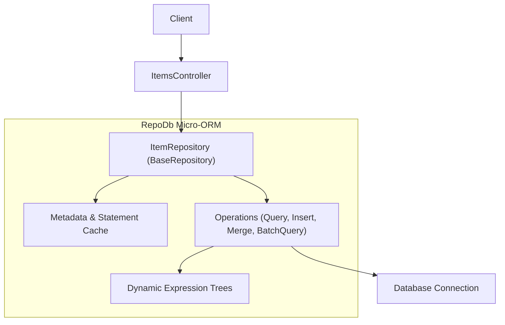
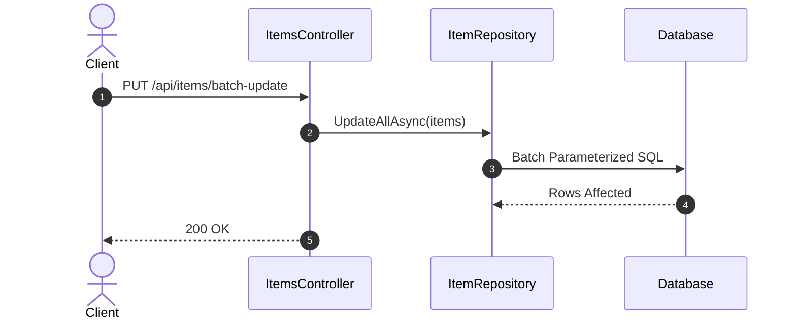

# 22-RepoDb: Hybrid-ORM Hiệu Năng Cao Cho .NET 10

Dự án mẫu minh họa cách sử dụng **RepoDb** — thư viện Hybrid-ORM mã nguồn mở mạnh mẽ dành cho .NET, dung hòa giữa sự tiện lợi của Full-ORM và tốc độ đỉnh cao của Micro-ORM.

---

## 1. Giới thiệu RepoDb trong hệ sinh thái .NET

Khi phát triển ứng dụng .NET lớn, các lập trình viên thường đứng trước sự đánh đổi:
- **Full ORM (EF Core)**: Rất giàu tính năng nhưng overhead lớn khi thao tác hàng loạt hoặc thực thi các câu lệnh chèn/sửa dữ liệu đơn giản.
- **Micro ORM (Dapper)**: Siêu nhanh nhưng phải viết raw SQL thủ công cho từng câu CRUD cơ bản, dễ gây trùng lặp code và sai sót chuỗi SQL.

**RepoDb** ra đời với mô hình **Hybrid-ORM**:
- **Fluent CRUD**: Cung cấp sẵn các phương thức `Query`, `Insert`, `Update`, `Delete`, `Merge` trực tiếp trên `IDbConnection` mà không cần viết một dòng SQL nào.
- **Batch Operations Native**: Hỗ trợ `InsertAll`, `UpdateAll`, `DeleteAll`, `MergeAll` xử lý đồng thời hàng nghìn thực thể cực nhanh.
- **Merge/Upsert Native**: Hỗ trợ thao tác chèn hoặc cập nhật (Upsert) dựa trên trường định danh (Qualifier Fields) mà không cần kiểm tra tồn tại thủ công.
- **Bộ nhớ siêu nhẹ**: Tối ưu IL Emit và bộ đệm Expression Cache giúp giải phóng CPU và RAM.

---

## 2. Kiến trúc & Cơ chế hoạt động

```
[ HTTP Request ]
       │
       ▼
[ ItemsController ] (ASP.NET Core Controller)
       │
       ▼
[ IWarehouseRepository ] (WarehouseRepository)
       │
       ▼
[ RepoDb Extension Methods ]
  - connection.QueryAsync<WarehouseItem>(...)
  - connection.InsertAsync<WarehouseItem, long>(...)
  - connection.UpdateAsync<WarehouseItem>(...)
  - connection.DeleteAsync<WarehouseItem>(...)
  - connection.UpdateAllAsync<WarehouseItem>(...) (Batch within Transaction)
  - Upsert (Merge) logic dựa trên SKU
       │
       ▼
[ IDbConnection ] (Microsoft.Data.Sqlite / ADO.NET)
       │
       ▼
[ SQLite Database / SQL Server / PostgreSQL ]
```

---


## Sơ đồ Kiến trúc & Luồng dữ liệu (Architecture & Data Flow)

### 1. Sơ đồ Kiến trúc Tổng quan (Architecture Overview)


### 2. Mô hình Luồng dữ liệu Chi tiết (Data Flow & Sequence)


### 3. Các Use Cases Cụ thể trong Thực tế (Concrete Use Cases)
- **Cân bằng giữa Dapper và EF Core**: Vừa có tốc độ mapping cực nhanh như Dapper, vừa có các hàm CRUD tiện lợi (`Insert`, `Update`, `Merge`) không cần viết SQL.
- **Bộ nhớ đệm Metadata tích hợp**: Tự động cache cấu trúc bảng giúp giảm thiểu chi phí reflection.
- **Hỗ trợ thao tác Batch mạnh mẽ**: Thao tác hàng loạt dữ liệu mượt mà.


## 3. Cấu trúc thư mục & Project

```
22-RepoDb/
├── WarehouseManagement.slnx
├── README.md
├── WarehouseManagement.Api/
│   ├── WarehouseManagement.Api.csproj
│   ├── Program.cs
│   ├── appsettings.json
│   ├── appsettings.Development.json
│   ├── WarehouseManagement.Api.http
│   ├── Properties/
│   │   └── launchSettings.json
│   ├── Data/
│   │   ├── IDbConnectionFactory.cs
│   │   └── DbInitializer.cs
│   ├── Entities/
│   │   └── WarehouseItem.cs
│   ├── Models/
│   │   └── WarehouseItemDtos.cs
│   ├── Repositories/
│   │   ├── IWarehouseRepository.cs
│   │   └── WarehouseRepository.cs
│   └── Controllers/
│       └── ItemsController.cs
└── WarehouseManagement.Tests/
    ├── WarehouseManagement.Tests.csproj
    └── ItemTests.cs
```

---

## 4. Cài đặt & Cấu hình

### Package NuGet:
- `RepoDb` (1.13.1)
- `RepoDb.Sqlite.Microsoft` (1.13.1)
- `Microsoft.Data.Sqlite` (10.0.12)
- `Swashbuckle.AspNetCore` (10.2.3)

### Khởi tạo RepoDb Bootstrapper:
```csharp
// Trong DbInitializer hoặc Program.cs (chạy 1 lần duy nhất khi khởi động)
GlobalConfiguration.Setup().UseSqlite();
```

---

## 5. Hướng dẫn chạy ứng dụng & API Contract

### Khởi chạy:
```powershell
cd d:\GitHub\dotnet-example\22-RepoDb\WarehouseManagement.Api
dotnet run
```
Ứng dụng lắng nghe tại: `http://localhost:5122`  
Swagger UI: `http://localhost:5122/swagger`

### API Contract:

| Phương thức | Endpoint | Mô tả |
|---|---|---|
| `GET` | `/api/items` | Lấy danh sách hàng kho (hỗ trợ `?location=` và `?search=`) |
| `GET` | `/api/items/{id}` | Lấy chi tiết mặt hàng theo ID |
| `POST` | `/api/items` | Thêm mới mặt hàng kho (`InsertAsync`) |
| `PUT` | `/api/items/{id}` | Cập nhật mặt hàng kho (`UpdateAsync`) |
| `POST` | `/api/items/upsert` | Upsert mặt hàng dựa theo mã SKU |
| `POST` | `/api/items/batch-restock` | Nhập hàng loạt nhiều SKU trong 1 Transaction (`UpdateAllAsync`) |
| `DELETE` | `/api/items/{id}` | Xóa mặt hàng kho (`DeleteAsync`) |

---

## 6. Chi tiết triển khai code

### 6.1. Entity Mapping với Attributes
```csharp
[Map("WarehouseItems")]
public class WarehouseItem
{
    [Identity]
    [Primary]
    public long Id { get; set; }

    public string Sku { get; set; } = string.Empty;
    public string Name { get; set; } = string.Empty;
    public string Location { get; set; } = string.Empty;
    public int Quantity { get; set; }
    public decimal UnitCost { get; set; }
    public DateTime LastRestockedAt { get; set; } = DateTime.UtcNow;
}
```

### 6.2. Batch Restock với Transaction
```csharp
using var connection = _factory.CreateConnection();
using var transaction = connection.BeginTransaction();
try
{
    // Cập nhật hàng loạt thực thể
    var affected = await connection.UpdateAllAsync(items, transaction: transaction);
    transaction.Commit();
    return affected;
}
catch
{
    transaction.Rollback();
    throw;
}
```

---

## 7. Tối ưu hiệu năng & Best Practices

1. **Sử dụng `QueryAllAsync` thay cho SQL `SELECT *`**: RepoDb tối ưu hóa câu lệnh ánh xạ bằng IL Emit với tốc độ thực thi chỉ chậm hơn ADO.NET thô dưới 1%.
2. **Khai thác Batch Operations**: Khi cần cập nhật nhiều bản ghi, sử dụng `UpdateAllAsync` thay vì gọi `UpdateAsync` trong vòng lặp `foreach`.
3. **Transaction Scope rõ ràng**: Quản lý `BeginTransaction()` và luôn đảm bảo rollback trong khối `catch` để tránh database lock.
4. **Tránh Memory Leak**: Không lưu giữ connection tĩnh; tạo connection qua factory và dispose ngay sau khi hoàn tất truy vấn.

---

## 8. Phản biện kỹ thuật & Đánh giá rủi ro

- **Ưu điểm vượt trội**: Không phải viết chuỗi SQL cho các thao tác CRUD thông thường nhưng vẫn giữ tốc độ ngang Dapper.
- **Rủi ro cú pháp SQLite**: SQLite sử dụng kiểu dữ liệu lỏng (Dynamic Typing); cần đảm bảo kiểu dữ liệu trong POCO khớp với cấu trúc bảng SQLite.
- **Khi nào chọn RepoDb**: Rất thích hợp cho các hệ thống trung gian, microservices cần hiệu năng cao mà vẫn muốn code sạch, ngắn gọn, không rườm rà chuỗi raw SQL.

---

## 9. Kiểm thử tự động (TDD)

Toàn bộ API được kiểm thử thông qua `WebApplicationFactory<Program>` với SQLite độc lập:
```powershell
dotnet test d:\GitHub\dotnet-example\22-RepoDb\WarehouseManagement.slnx
```

### Các kịch bản kiểm thử:
- ✅ Lấy danh sách mặt hàng ban đầu
- ✅ Lọc theo vị trí kho (`Location`) và tìm kiếm theo tên
- ✅ Lấy chi tiết 200 OK và 404 Not Found
- ✅ Thêm mới mặt hàng và kiểm tra tính hợp lệ dữ liệu
- ✅ Ngăn chặn trùng mã SKU
- ✅ Cập nhật thông tin mặt hàng
- ✅ Kiểm tra tính năng Upsert (Cập nhật nếu SKU đã có, chèn mới nếu chưa)
- ✅ Kiểm tra tính năng Batch Restock hàng loạt trong Transaction
- ✅ Xóa mặt hàng

---

## 10. Bài tập mở rộng & Thử thách thực tế

1. **RepoDb 2nd Level Cache**: Tích hợp bộ đệm nhớ thứ hai (Second-Level Caching) với `MemoryCache` trong RepoDb qua `connection.QueryAsync(..., cacheKey: "...")`.
2. **BulkInsert với RDBMS**: Thử nghiệm phương thức `BulkInsert` trên SQL Server với hàng chục nghìn dòng dữ liệu.
3. **Property Handlers**: Viết custom `IPropertyHandler` để mã hóa/giải mã một cột dữ liệu nhạy cảm tự động khi đọc/ghi vào CSDL.

---

## 11. Giới hạn & Lưu ý khi lên Production

- Đảm bảo gọi `GlobalConfiguration.Setup().UseSqlite()` (hoặc provider tương ứng) một lần duy nhất lúc khởi động ứng dụng.
- Đối với SQLite, khóa bảng (table locking) có thể xảy ra khi có nhiều ghi đồng thời; nên bật chế độ WAL (`Data Source=warehouse.db;Mode=ReadWriteCreate;Cache=Shared`).

---

## 12. Tài liệu tham khảo

- [RepoDb Official Website](https://repodb.net/)
- [RepoDb GitHub Repository](https://github.com/mikependon/RepoDb)
- [RepoDb SQLite Documentation](https://repodb.net/operation/sqlite)
