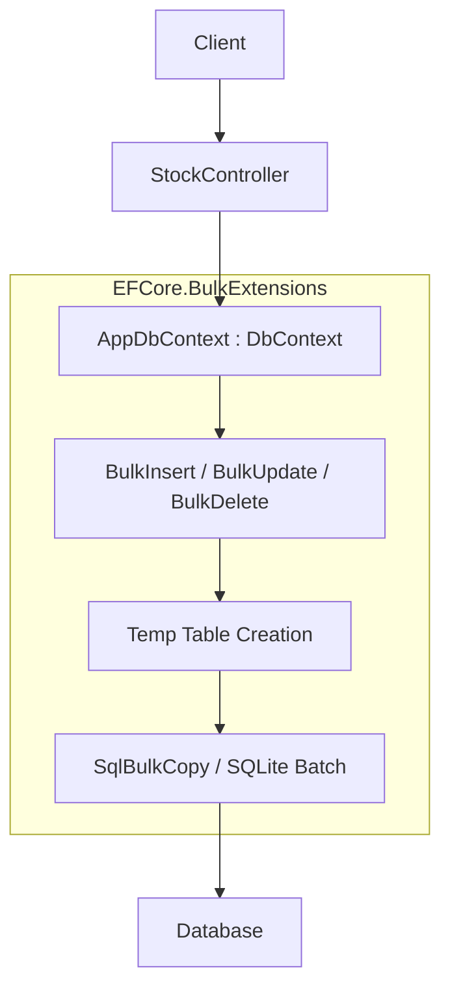
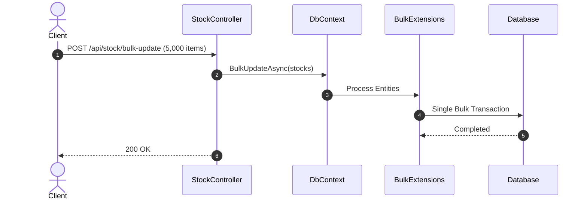

# 23-EFCoreBulkExtensions: Xử Lý Dữ Liệu Hàng Loạt Siêu Tốc Cho EF Core

Demo thư viện **EFCore.BulkExtensions** — mở rộng EF Core với các thao tác `BulkInsert`, `BulkUpdate`, `BulkDelete`, `BulkInsertOrUpdate` giúp xử lý hàng nghìn bản ghi trong vài millisecond.

---

## 1. Giới thiệu

EF Core `SaveChangesAsync` xử lý từng bản ghi một (row-by-row INSERT/UPDATE). Với 10,000 bản ghi, thời gian có thể lên tới vài chục giây. **EFCore.BulkExtensions** giải quyết bằng cách sử dụng cơ chế `SqlBulkCopy` / batch SQL statements, giảm thời gian xuống dưới 1 giây.

## 2. API Contract

| Phương thức | Endpoint | Mô tả |
|---|---|---|
| `GET` | `/api/stock` | Lấy danh sách (`?category=` filter) |
| `GET` | `/api/stock/{id}` | Chi tiết item |
| `GET` | `/api/stock/summary` | Thống kê aggregate theo category |
| `POST` | `/api/stock/bulk-insert` | BulkInsert hàng loạt |
| `POST` | `/api/stock/bulk-update` | BulkUpdate giá theo category |
| `POST` | `/api/stock/bulk-delete` | BulkDelete theo category |
| `POST` | `/api/stock/bulk-upsert` | BulkInsertOrUpdate theo SKU |


## Sơ đồ Kiến trúc & Luồng dữ liệu (Architecture & Data Flow)

### 1. Sơ đồ Kiến trúc Tổng quan (Architecture Overview)


### 2. Mô hình Luồng dữ liệu Chi tiết (Data Flow & Sequence)


### 3. Các Use Cases Cụ thể trong Thực tế (Concrete Use Cases)
- **Mở rộng Sức mạnh cho EF Core**: Khắc phục nhược điểm chạy từng câu lệnh đơn lẻ của `SaveChanges()` khi thao tác số lượng lớn.
- **Bulk Insert / Update / Delete / Merge**: Xử lý 10,000 - 100,000 bản ghi nhanh hơn từ 20 đến 50 lần so với EF Core mặc định.
- **Bảo toàn Cấu hình Model EF Core**: Sử dụng lại toàn bộ mapping, schema và tên bảng đã cấu hình trong `DbContext`.


## 3. Chạy ứng dụng

```powershell
cd d:\GitHub\dotnet-example\23-EFCoreBulkExtensions\InventoryBulk.Api
dotnet run
# http://localhost:5123/swagger
```

## 4. Kiểm thử

```powershell
dotnet test d:\GitHub\dotnet-example\23-EFCoreBulkExtensions\InventoryBulk.slnx
```

## 5. Tài liệu tham khảo

- [EFCore.BulkExtensions GitHub](https://github.com/borisdj/EFCore.BulkExtensions)
