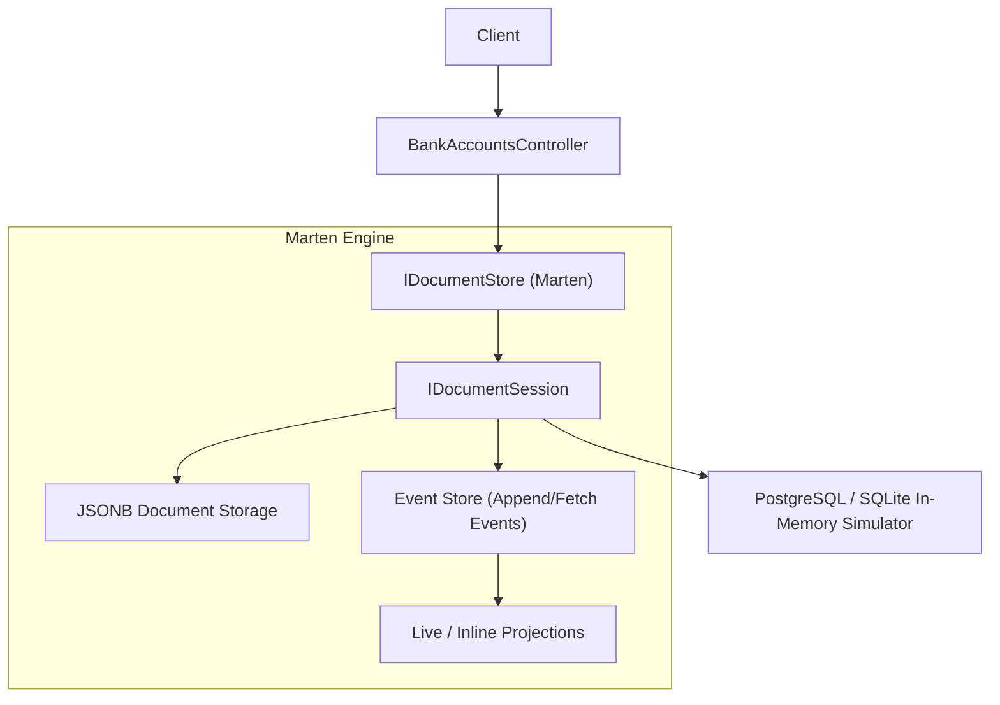
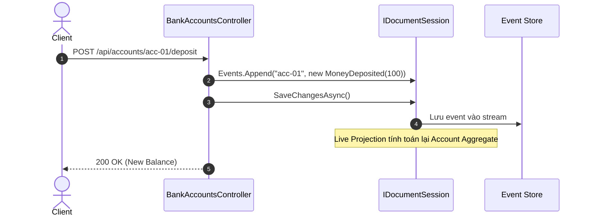

# 24-Marten: Document Database & Event Sourcing Cho .NET 10

Dự án mẫu minh họa cách sử dụng **Marten** — thư viện biến PostgreSQL thành Document Database và Event Store mạnh mẽ bậc nhất trong hệ sinh thái .NET.

---

## 1. Giới thiệu Marten trong hệ sinh thái .NET

PostgreSQL với kiểu dữ liệu `JSONB` có hiệu năng xử lý văn bản phi cấu trúc vượt trội. **Marten** tận dụng sức mạnh này để cung cấp:
- **Document Database**: Lưu trữ, truy vấn, chỉ mục các đối tượng POCO C# trực tiếp dưới dạng JSONB trong PostgreSQL mà không cần ORM mapping hay migrations schema truyền thống.
- **Event Sourcing Native**: Biến PostgreSQL thành Event Store chuyên nghiệp, hỗ trợ stream events, live aggregation, inline/async projections và CQRS.
- **ACID Transactional Guarantees**: Kết hợp tính linh hoạt của NoSQL với tính toàn vẹn dữ liệu mạnh mẽ của PostgreSQL RDBMS.

---

## 2. Kiến trúc & Cơ chế hoạt động

```
[ HTTP Request ]
       │
       ▼
[ BankAccountsController ] (ASP.NET Core Controller)
       │
       ▼
[ IBankAccountStore ]
   ├── [ MartenBankAccountStore ] (Khi có PostgreSQL)
   │        │
   │        ▼
   │   [ IDocumentSession (Marten) ]
   │      - Events.StartStream<BankAccount>(id, @event)
   │      - Events.Append(id, @event)
   │      - Events.AggregateStreamAsync<BankAccount>(id) (Live Projection)
   │      - Store(document) / LoadAsync<T>(id) (Document DB)
   │        │
   │        ▼
   │   [ PostgreSQL (JSONB & mt_events table) ]
   │
   └── [ InMemoryBankAccountStore ] (Fallback local / CI test không cần PostgreSQL)
```

---


## Sơ đồ Kiến trúc & Luồng dữ liệu (Architecture & Data Flow)

### 1. Sơ đồ Kiến trúc Tổng quan (Architecture Overview)


### 2. Mô hình Luồng dữ liệu Chi tiết (Data Flow & Sequence)


### 3. Các Use Cases Cụ thể trong Thực tế (Concrete Use Cases)
- **Event Sourcing Toàn diện**: Lưu trữ toàn bộ lịch sử biến đổi của đối tượng dưới dạng chuỗi sự kiện.
- **Document DB trên PostgreSQL**: Sử dụng PostgreSQL như một cơ sở dữ liệu Document noSQL mạnh mẽ thông qua kiểu dữ liệu `JSONB`.
- **Hệ thống Ngân hàng & Tài chính**: Yêu cầu kiểm toán dòng tiền, khôi phục trạng thái tại bất kỳ thời điểm nào trong quá khứ.


## 3. Cấu trúc thư mục & Project

```
24-Marten/
├── EventStoreMarten.slnx
├── README.md
├── EventStoreMarten.Api/
│   ├── EventStoreMarten.Api.csproj
│   ├── Program.cs
│   ├── appsettings.json
│   ├── appsettings.Development.json
│   ├── EventStoreMarten.Api.http
│   ├── Properties/
│   │   └── launchSettings.json
│   ├── Domain/
│   │   ├── Events.cs
│   │   ├── BankAccount.cs
│   │   └── CustomerProfile.cs
│   ├── Models/
│   │   └── BankAccountDtos.cs
│   ├── Services/
│   │   ├── IBankAccountStore.cs
│   │   ├── MartenBankAccountStore.cs
│   │   └── InMemoryBankAccountStore.cs
│   └── Controllers/
│       └── BankAccountsController.cs
└── EventStoreMarten.Tests/
    ├── EventStoreMarten.Tests.csproj
    └── BankAccountTests.cs
```

---

## 4. Cài đặt & Cấu hình

### Package NuGet:
- `Marten` (9.37.0)
- `Swashbuckle.AspNetCore` (10.2.3)

### Cấu hình trong `Program.cs`:
```csharp
builder.Services.AddMarten(options =>
{
    options.Connection(connectionString);
    options.Projections.LiveStreamAggregation<BankAccount>();
}).UseLightweightSessions();
```

> [!NOTE]
> Khi chạy ở môi trường không có PostgreSQL (như máy test hoặc CI), ứng dụng tự động kích hoạt `InMemoryBankAccountStore` để kiểm thử toàn bộ luồng nghiệp vụ mà không bị chặn.

---

## 5. Hướng dẫn chạy ứng dụng & API Contract

### Khởi chạy:
```powershell
cd d:\GitHub\dotnet-example\24-Marten\EventStoreMarten.Api
dotnet run
```
Ứng dụng lắng nghe tại: `http://localhost:5124`  
Swagger UI: `http://localhost:5124/swagger`

### API Contract:

| Phương thức | Endpoint | Mô tả |
|---|---|---|
| `POST` | `/api/bankaccounts` | Mở tài khoản ngân hàng (Event: `AccountCreated`) |
| `GET` | `/api/bankaccounts/{id}` | Lấy số dư tài khoản qua Live Event Stream Replay |
| `POST` | `/api/bankaccounts/{id}/deposit` | Nạp tiền vào tài khoản (Event: `MoneyDeposited`) |
| `POST` | `/api/bankaccounts/{id}/withdraw` | Rút tiền (Event: `MoneyWithdrawn` - kiểm tra số dư) |
| `GET` | `/api/bankaccounts/{id}/events` | Lấy toàn bộ lịch sử luồng sự kiện (Event Stream History) |
| `POST` | `/api/bankaccounts/customers` | Lưu hồ sơ khách hàng (Document DB JSONB) |
| `GET` | `/api/bankaccounts/customers/{id}` | Tải hồ sơ khách hàng theo ID (Document DB) |

---

## 6. Chi tiết triển khai code

### 6.1. Event Sourcing Aggregate Replay
```csharp
public class BankAccount
{
    public Guid Id { get; set; }
    public string OwnerName { get; set; } = string.Empty;
    public decimal Balance { get; set; }

    public void Apply(AccountCreated @event)
    {
        Id = @event.AccountId;
        OwnerName = @event.OwnerName;
        Balance = @event.InitialBalance;
    }

    public void Apply(MoneyDeposited @event) => Balance += @event.Amount;
    public void Apply(MoneyWithdrawn @event) => Balance -= @event.Amount;
}
```

### 6.2. Document Storage với JSONB
```csharp
// Lưu văn bản không cần schema migration
_session.Store(customerProfile);
await _session.SaveChangesAsync();

// Tải văn bản theo định danh
var customer = await _session.LoadAsync<CustomerProfile>(id);
```

---

## 7. Tối ưu hiệu năng & Best Practices

1. **Sử dụng `UseLightweightSessions`**: Tránh overhead theo dõi thay đổi (identity map) khi chỉ cần append events hoặc thao tác nhanh.
2. **Snapshot / Inline Projections**: Với các stream có hàng nghìn events, chuyển từ Live Aggregation sang Inline Projections (lưu trạng thái tính toán sẵn vào bảng PostgreSQL) để tăng tốc độ đọc `O(1)`.
3. **Index trên JSONB**: Đánh GIN Index hoặc B-Tree Index trên các thuộc tính JSONB thường xuyên tìm kiếm (`options.Schema.For<CustomerProfile>().Index(x => x.Email)`).

---

## 8. Phản biện kỹ thuật & Đánh giá rủi ro

- **Tính bất biến (Immutability)**: Event Sourcing đảm bảo không ai có thể sửa hoặc xóa lịch sử giao dịch (Audit Trail hoàn hảo cho tài chính/ngân hàng).
- **Rủi ro Overdraft**: Khi có giao dịch rút tiền đồng thời, cần áp dụng cơ chế Optimistic Concurrency Control (kiểm tra stream version) để tránh thấu chi.
- **Yêu cầu hạ tầng**: Marten phụ thuộc chặt chẽ vào các tính năng riêng của PostgreSQL (`JSONB`, `PL/pgSQL`); không thể chuyển đổi sang SQL Server hay MySQL mà không viết lại.

---

## 9. Kiểm thử tự động (TDD)

Dự án có bộ kiểm thử tự động kiểm tra cả logic Event Replay và tích hợp HTTP API:
```powershell
dotnet test d:\GitHub\dotnet-example\24-Marten\EventStoreMarten.slnx
```

### Kết quả kiểm thử:
- ✅ Unit test các hàm `Apply` của Aggregate (AccountCreated, MoneyDeposited, MoneyWithdrawn)
- ✅ Tạo tài khoản mở stream sự kiện
- ✅ Nạp tiền và cập nhật số dư
- ✅ Rút tiền và chặn thấu chi (400 Bad Request)
- ✅ Truy vấn lịch sử chuỗi sự kiện (Event Stream)
- ✅ Lưu và tải văn bản Document DB (CustomerProfile)
- ✅ Xử lý 404 Not Found khi ID không tồn tại

---

## 10. Bài tập mở rộng & Thử thách thực tế

1. **Inline Projection**: Cấu hình `options.Projections.Add<AccountProjection>(ProjectionLifecycle.Inline)` để lưu bảng chiếu `AccountView` song song với event stream.
2. **Optimistic Concurrency**: Thêm tham số `expectedVersion` khi `Append` sự kiện để bắt `ConcurrencyException`.
3. **Async Daemon Projections**: Cấu hình Marten Async Daemon để chạy background projections xử lý khối lượng event lớn.

---

## 11. Giới hạn & Lưu ý khi lên Production

- Yêu cầu PostgreSQL phiên bản 12 trở lên.
- Đảm bảo cấu hình `connection pool` đầy đủ và monitor kích thước bảng `mt_events`.
- Lập kế hoạch snapshot nếu một stream có thể vượt quá 500 events.

---

## 12. Tài liệu tham khảo

- [Marten Official Documentation](https://martendb.io/)
- [Marten GitHub Repository](https://github.com/JasperFx/marten)
- [Event Sourcing Pattern (Martin Fowler)](https://martinfowler.com/eaaDev/EventSourcing.html)
