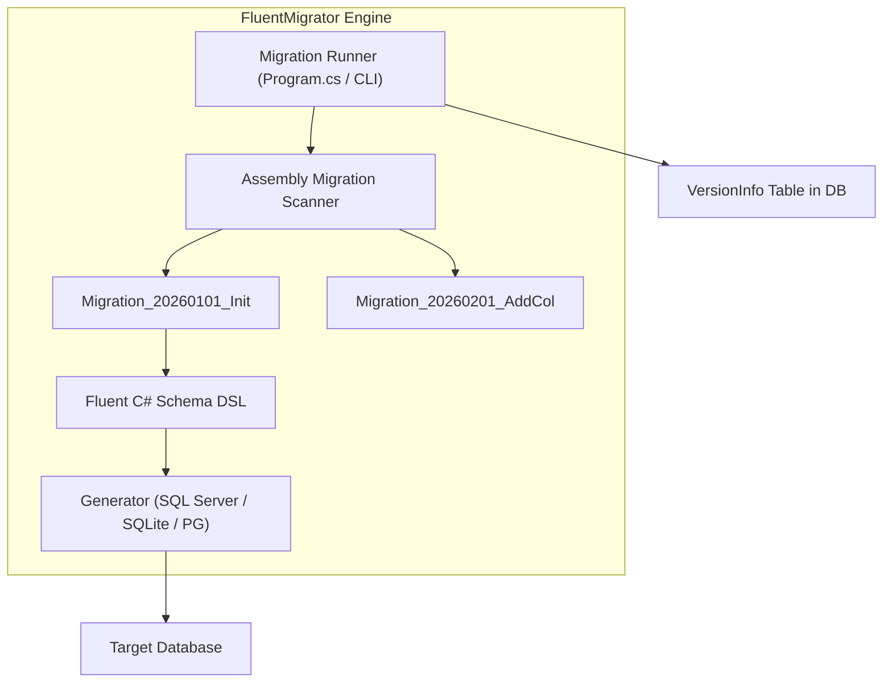
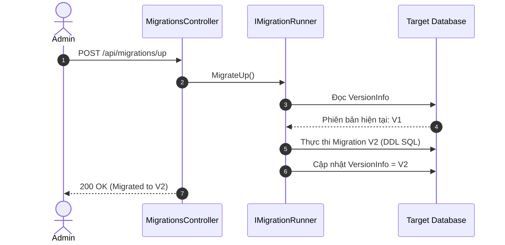

# 25-FluentMigrator: Quản Lý Di Trú Cơ Sở Dữ Liệu Bằng C# Fluent API

Dự án mẫu minh họa cách sử dụng **FluentMigrator** — framework quản lý di trú lược đồ CSDL (Database Schema Migrations) độc lập hàng đầu trong hệ sinh thái .NET.

---

## 1. Giới thiệu FluentMigrator trong hệ sinh thái .NET

Khi các hệ thống microservices hoặc monolithic lớn sử dụng Dapper, RepoDb hay LinqToDB, chúng không có sẵn công cụ migration tự động như EF Core Migrations. 

**FluentMigrator** là giải pháp chuẩn công nghiệp:
- **Độc lập với ORM**: Hoạt động hoàn hảo với bất kỳ công nghệ Data Access nào (Dapper, ADO.NET, RepoDb, EF Core).
- **Cú pháp Fluent dễ đọc**: Viết migration bằng C# thuần túy, an toàn kiểu dữ liệu, dễ review code trên Git pull request.
- **Hỗ trợ Reversible Migrations**: Luôn định nghĩa cả hai chiều `Up()` (nâng cấp) và `Down()` (hạ cấp / rollback) giúp khôi phục hệ thống khi deploy thất bại.
- **Hỗ trợ đa CSDL**: Cùng một mã migration C# có thể chạy trên SQLite, SQL Server, PostgreSQL, MySQL, Oracle.

---

## 2. Kiến trúc & Cơ chế hoạt động

```
[ HTTP Request ]
       │
       ▼
[ MigrationsController ] (ASP.NET Core Controller)
       │
       ▼
[ IMigrationManager ] (MigrationManager)
       │
       ▼
[ IMigrationRunner (FluentMigrator) ]
  - MigrateUp(): Áp dụng tất cả migration chưa chạy theo thứ tự version
  - MigrateDown(targetVersion): Rollback về version chỉ định
  - Ghi nhận lịch sử vào bảng [VersionInfo]
       │
       ▼
[ SQLite Database (migrations.db) ]
  ├── VersionInfo (Bảng metadata quản lý version của FluentMigrator)
  ├── Users (Sinh ra từ Migration 202601010001 & 202601010003)
  └── Profiles (Sinh ra từ Migration 202601010002 có khóa ngoại tới Users)
```

---


## Sơ đồ Kiến trúc & Luồng dữ liệu (Architecture & Data Flow)

### 1. Sơ đồ Kiến trúc Tổng quan (Architecture Overview)


### 2. Mô hình Luồng dữ liệu Chi tiết (Data Flow & Sequence)


### 3. Các Use Cases Cụ thể trong Thực tế (Concrete Use Cases)
- **Độc lập với ORM**: Quản lý phiên bản cơ sở dữ liệu cho các dự án dùng Dapper, ADO.NET hoặc nhiều ORM khác nhau.
- **Cú pháp C# Fluent rõ ràng**: Viết migration bằng code C# trực quan (`Create.Table("Users").WithColumn("Id").AsInt32().PrimaryKey()`).
- **CI/CD Database Deployment**: Tích hợp vào pipeline triển khai tự động trước khi deploy API.


## 3. Cấu trúc thư mục & Project

```
25-FluentMigrator/
├── DatabaseMigrations.slnx
├── README.md
├── DatabaseMigrations.Api/
│   ├── DatabaseMigrations.Api.csproj
│   ├── Program.cs
│   ├── appsettings.json
│   ├── appsettings.Development.json
│   ├── DatabaseMigrations.Api.http
│   ├── Properties/
│   │   └── launchSettings.json
│   ├── Migrations/
│   │   ├── Migration_202601010001_CreateUsersTable.cs
│   │   ├── Migration_202601010002_CreateProfilesTable.cs
│   │   └── Migration_202601010003_AddStatusToUsers.cs
│   ├── Models/
│   │   └── MigrationDtos.cs
│   ├── Services/
│   │   ├── IMigrationManager.cs
│   │   └── MigrationManager.cs
│   └── Controllers/
│       └── MigrationsController.cs
└── DatabaseMigrations.Tests/
    ├── DatabaseMigrations.Tests.csproj
    └── MigrationTests.cs
```

---

## 4. Cài đặt & Cấu hình

### Package NuGet:
- `FluentMigrator` (8.0.1)
- `FluentMigrator.Runner` (8.0.1)
- `FluentMigrator.Runner.SQLite` (8.0.1)
- `Microsoft.Data.Sqlite` (10.0.12)
- `Swashbuckle.AspNetCore` (10.2.3)

### Cấu hình trong `Program.cs`:
```csharp
builder.Services.AddFluentMigratorCore()
    .ConfigureRunner(rb => rb
        .AddSQLite()
        .WithGlobalConnectionString(connectionString)
        .ScanIn(typeof(Program).Assembly).For.Migrations());
```

---

## 5. Hướng dẫn chạy ứng dụng & API Contract

### Khởi chạy:
```powershell
cd d:\GitHub\dotnet-example\25-FluentMigrator\DatabaseMigrations.Api
dotnet run
```
Ứng dụng lắng nghe tại: `http://localhost:5125`  
Swagger UI: `http://localhost:5125/swagger`

### API Contract:

| Phương thức | Endpoint | Mô tả |
|---|---|---|
| `POST` | `/api/migrations/up` | Chạy toàn bộ các migration còn thiếu (`MigrateUp`) |
| `POST` | `/api/migrations/rollback/{version}` | Rollback CSDL về version chỉ định (`MigrateDown`) |
| `GET` | `/api/migrations/history` | Xem danh sách các migration đã được áp dụng (`VersionInfo`) |
| `GET` | `/api/migrations/tables` | Kiểm tra cấu trúc bảng và các cột hiện có trong CSDL |

---

## 6. Chi tiết triển khai code

### 6.1. Định nghĩa Migration với Fluent Syntax
```csharp
[Migration(202601010001, "Create Users table")]
public class Migration_202601010001_CreateUsersTable : Migration
{
    public override void Up()
    {
        Create.Table("Users")
            .WithColumn("Id").AsInt32().PrimaryKey().Identity()
            .WithColumn("Username").AsString(50).NotNullable().Unique()
            .WithColumn("Email").AsString(100).NotNullable()
            .WithColumn("CreatedAt").AsDateTime().NotNullable().WithDefault(SystemMethods.CurrentUTCDateTime);
    }

    public override void Down()
    {
        Delete.Table("Users");
    }
}
```

### 6.2. Thay đổi cấu trúc bảng (Alter Table & Foreign Key)
```csharp
[Migration(202601010003, "Add Status column to Users table")]
public class Migration_202601010003_AddStatusToUsers : Migration
{
    public override void Up()
    {
        Alter.Table("Users")
            .AddColumn("Status").AsString(20).NotNullable().WithDefaultValue("Active");
    }

    public override void Down()
    {
        Delete.Column("Status").FromTable("Users");
    }
}
```

---

## 7. Tối ưu hiệu năng & Best Practices

1. **Quy tắc đặt Version**: Luôn sử dụng timestamp định dạng `YYYYMMDDHHMM` (ví dụ: `202601010001`) làm Version để tránh xung đột khi nhiều lập trình viên cùng tạo migration.
2. **Luôn viết phương thức `Down()`**: Mọi migration đều phải có khả năng khôi phục để hỗ trợ tự động rollback trong pipeline CI/CD nếu phát sinh sự cố.
3. **Transaction Per Migration**: FluentMigrator mặc định bọc mỗi file migration trong một Transaction riêng biệt. Nếu 1 câu lệnh bị lỗi, toàn bộ migration đó được rollback sạch sẽ.

---

## 8. Phản biện kỹ thuật & Đánh giá rủi ro

- **Ưu điểm**: Không phụ thuộc vào snapshot hay file model như EF Core; có thể chạy độc lập qua console runner (`dotnet-fm`) hoặc tích hợp vào web app.
- **Rủi ro mất mát dữ liệu khi Rollback**: Lệnh `Delete.Table()` hoặc `Delete.Column()` trong hàm `Down()` sẽ xóa vĩnh viễn dữ liệu của cột/bảng đó. Cần có chiến lược backup DB trước khi rollback trên Production.
- **Khác biệt tính năng giữa các RDBMS**: Một số lệnh `Alter.Column()` hoặc `DropForeignKey()` có thể bị giới hạn trên SQLite do cơ chế kiến trúc của SQLite, cần kiểm tra tài liệu của từng provider.

---

## 9. Kiểm thử tự động (TDD)

Dự án có bộ kiểm thử tự động kiểm tra toàn bộ vòng đời di trú (Up -> History -> Tables -> Rollback -> Kiểm tra lại Schema):
```powershell
dotnet test d:\GitHub\dotnet-example\25-FluentMigrator\DatabaseMigrations.slnx
```

### Kết quả kiểm thử:
- ✅ Kiểm tra ban đầu chưa có bảng người dùng
- ✅ Thực thi `MigrateUp` tạo thành công bảng `Users`, `Profiles`, và `VersionInfo`
- ✅ Kiểm tra lịch sử version được ghi nhận đầy đủ theo thứ tự thời gian
- ✅ Kiểm tra các cột được thêm đúng kiểu dữ liệu
- ✅ Thực thi `Rollback` xóa bảng `Profiles` và gỡ bỏ cột `Status`
- ✅ Xác thực dữ liệu đầu vào (chặn rollback version âm)

---

## 10. Bài tập mở rộng & Thử thách thực tế

1. **Seed Data Migration**: Sử dụng `Insert.IntoTable("Users").Row(new { ... })` để chèn dữ liệu khởi tạo ban đầu cho các bảng danh mục.
2. **Conditional Migration / Tags**: Dùng `[Tags("Development", "Staging")]` để chỉ chạy một số migration nhất định theo môi trường.
3. **CLI Runner Integration**: Thiết lập công cụ dòng lệnh `dotnet-fm` để chạy migration trong quy trình deployment Docker/Kubernetes mà không cần khởi động Web API.

---

## 11. Giới hạn & Lưu ý khi lên Production

- Không nên chạy `MigrateUp()` tự động trong `Program.cs` khi triển khai dạng multi-instance (Scale-out) vì có thể gây race-condition khóa CSDL.
- Khuyến nghị chạy migration thông qua một Job/Init Container riêng biệt trong Kubernetes trước khi khởi động ứng dụng chính.

---

## 12. Tài liệu tham khảo

- [FluentMigrator Official Documentation](https://fluentmigrator.github.io/)
- [FluentMigrator GitHub Repository](https://github.com/fluentmigrator/fluentmigrator)
- [Database Migration Strategies in Microservices](https://microservices.io/patterns/data/database-per-service.html)
