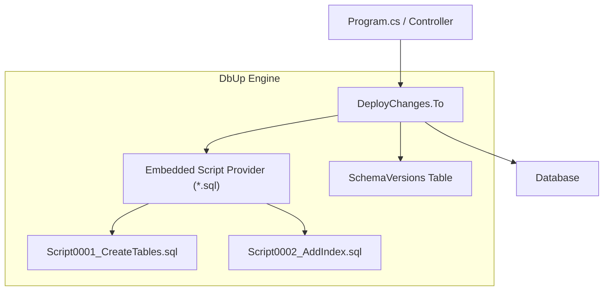
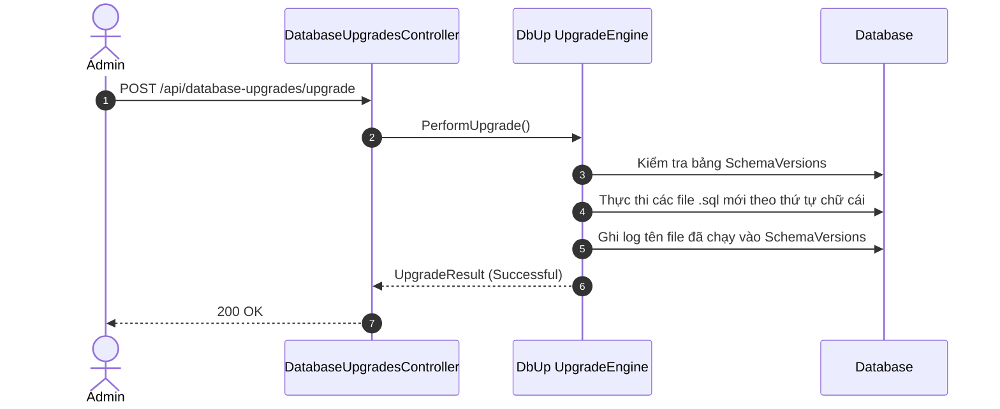

# 26-DbUp: Quản Lý Di Trú Cơ Sở Dữ Liệu Bằng Script SQL Thuần

Dự án mẫu minh họa cách sử dụng **DbUp** — thư viện .NET mã nguồn mở chuyên quản lý và tự động hóa việc triển khai các script SQL thuần (`.sql`) lên cơ sở dữ liệu.

---

## 1. Giới thiệu DbUp trong hệ sinh thái .NET

Khác với các công cụ migration sinh mã tự động (như EF Core Migrations) hay dùng DSL (như FluentMigrator), **DbUp** đi theo triết lý:
- **Tập trung vào Raw SQL**: Các DBA hoặc lập trình viên backend viết trực tiếp script SQL chuẩn (`.sql`), có toàn quyền tối ưu cú pháp, câu lệnh DDL, indexes, triggers, stored procedures cho từng loại CSDL.
- **Embedded Scripts**: Các file SQL được nhúng trực tiếp vào assembly (`.dll`) dưới dạng `EmbeddedResource`, tránh rủi ro thiếu file script khi đóng gói Docker container hoặc triển khai Production.
- **Idempotent & Ordered Execution**: DbUp sắp xếp các script theo thứ tự tên file (ví dụ: `0001_...`, `0002_...`), chỉ chạy các script chưa từng được thực thi và lưu dấu vết vào bảng `SchemaVersions`.

---

## 2. Kiến trúc & Cơ chế hoạt động

```
[ HTTP Request ]
       │
       ▼
[ DatabaseUpgradesController ] (ASP.NET Core Controller)
       │
       ▼
[ IDbUpService ] (DbUpService)
       │
       ▼
[ DbUp UpgradeEngine ]
  - Quét các script nhúng trong Assembly (Scripts/*.sql)
  - Đọc bảng [SchemaVersions] trong CSDL để phát hiện script mới
  - Thực thi từng script trong Transaction
  - Ghi nhận lịch sử thành công
       │
       ▼
[ SQLite Database (invoices.db) ]
  ├── SchemaVersions (Bảng nhật ký các script đã chạy)
  ├── Invoices (Sinh ra từ 0001_CreateInvoicesTable.sql)
  └── InvoiceItems (Sinh ra từ 0002_CreateInvoiceItemsTable.sql)
```

---


## Sơ đồ Kiến trúc & Luồng dữ liệu (Architecture & Data Flow)

### 1. Sơ đồ Kiến trúc Tổng quan (Architecture Overview)


### 2. Mô hình Luồng dữ liệu Chi tiết (Data Flow & Sequence)


### 3. Các Use Cases Cụ thể trong Thực tế (Concrete Use Cases)
- **SQL-First Migrations**: Phù hợp với các DBA thích viết câu lệnh SQL thuần túy thay vì C# code.
- **Đơn giản & Bền bỉ**: Nhúng trực tiếp các file `.sql` vào assembly của ứng dụng và tự chạy khi khởi động.
- **Không có Magic Code**: Mọi thay đổi schema đều là SQL minh bạch, dễ kiểm soát quyền và index.


## 3. Cấu trúc thư mục & Project

```
26-DbUp/
├── SqlMigrationsDbUp.slnx
├── README.md
├── SqlMigrationsDbUp.Api/
│   ├── SqlMigrationsDbUp.Api.csproj
│   ├── Program.cs
│   ├── appsettings.json
│   ├── appsettings.Development.json
│   ├── SqlMigrationsDbUp.Api.http
│   ├── Properties/
│   │   └── launchSettings.json
│   ├── Scripts/
│   │   ├── 0001_CreateInvoicesTable.sql
│   │   ├── 0002_CreateInvoiceItemsTable.sql
│   │   └── 0003_SeedSampleInvoices.sql
│   ├── Models/
│   │   └── UpgradeDtos.cs
│   ├── Services/
│   │   ├── IDbUpService.cs
│   │   └── DbUpService.cs
│   └── Controllers/
│       └── DatabaseUpgradesController.cs
└── SqlMigrationsDbUp.Tests/
    ├── SqlMigrationsDbUp.Tests.csproj
    └── DatabaseUpgradeTests.cs
```

---

## 4. Cài đặt & Cấu hình

### Package NuGet:
- `dbup-sqlite` (6.0.4)
- `Microsoft.Data.Sqlite` (10.0.12)
- `Swashbuckle.AspNetCore` (10.2.3)

### Cấu hình `SqlMigrationsDbUp.Api.csproj`:
```xml
<ItemGroup>
  <EmbeddedResource Include="Scripts\*.sql" />
</ItemGroup>
```

### Cấu hình `DbUpService.cs`:
```csharp
var upgradeEngine = DeployChanges.To
    .SQLiteDatabase(connectionString)
    .WithScriptsEmbeddedInAssembly(Assembly.GetExecutingAssembly())
    .LogToConsole()
    .Build();
```

---

## 5. Hướng dẫn chạy ứng dụng & API Contract

### Khởi chạy:
```powershell
cd d:\GitHub\dotnet-example\26-DbUp\SqlMigrationsDbUp.Api
dotnet run
```
Ứng dụng lắng nghe tại: `http://localhost:5126`  
Swagger UI: `http://localhost:5126/swagger`

### API Contract:

| Phương thức | Endpoint | Mô tả |
|---|---|---|
| `GET` | `/api/databaseupgrades/status` | Kiểm tra trạng thái nâng cấp (script đã chạy vs đang chờ) |
| `POST` | `/api/databaseupgrades/upgrade` | Thực thi toàn bộ các script SQL còn thiếu |
| `GET` | `/api/databaseupgrades/tables` | Kiểm tra danh sách bảng, cột và số lượng bản ghi trong CSDL |

---

## 6. Chi tiết triển khai code

### 6.1. Script SQL tự quản lý DDL & DML
`Scripts/0001_CreateInvoicesTable.sql`:
```sql
CREATE TABLE IF NOT EXISTS Invoices (
    Id INTEGER PRIMARY KEY AUTOINCREMENT,
    InvoiceNumber TEXT NOT NULL UNIQUE,
    CustomerName TEXT NOT NULL,
    TotalAmount DECIMAL(18,2) NOT NULL,
    Status TEXT NOT NULL DEFAULT 'Pending',
    CreatedAt TEXT NOT NULL
);
CREATE INDEX IF NOT EXISTS IX_Invoices_InvoiceNumber ON Invoices(InvoiceNumber);
```

### 6.2. Kiểm tra trạng thái nâng cấp trước khi chạy
```csharp
var engine = CreateUpgradeEngine();
bool isUpgradeRequired = engine.IsUpgradeRequired();
var executedScripts = engine.GetExecutedScripts();
var pendingScripts = engine.GetScriptsToExecute();
```

---

## 7. Tối ưu hiệu năng & Best Practices

1. **Quy tắc đặt tên file**: Sử dụng tiền tố số thứ tự 4 chữ số (ví dụ: `0001_...`, `0002_...`) để đảm bảo DbUp sắp xếp và thực thi chính xác theo thứ tự bảng chữ cái.
2. **Không sửa file script cũ đã chạy**: Không bao giờ sửa nội dung file `.sql` đã deploy lên Production. Nếu cần thay đổi, tạo file script mới (ví dụ: `0004_AddDiscountToInvoices.sql`).
3. **Transaction Per Script**: Đảm bảo mỗi script thực thi trong một transaction để nếu có lỗi, CSDL không bị rơi vào trạng thái dở dang (partial migration).

---

## 8. Phản biện kỹ thuật & Đánh giá rủi ro

- **So với FluentMigrator / EF Core**: DbUp không có cơ chế tự động Rollback (hạ cấp). Muốn rollback, nhà phát triển phải viết một script sửa đổi mới theo kiểu Forward-Fixing (`0005_RevertInvoiceChanges.sql`).
- **Ưu điểm lớn nhất**: Tương thích 100% với các tính năng đặc thù của từng hệ CSDL (Stored Procedures, Triggers, Views, Functions phức tạp).

---

## 9. Kiểm thử tự động (TDD)

Dự án áp dụng kiểm thử tích hợp đầy đủ kiểm tra toàn bộ chu trình nâng cấp:
```powershell
dotnet test d:\GitHub\dotnet-example\26-DbUp\SqlMigrationsDbUp.slnx
```

### Kết quả kiểm thử:
- ✅ Kiểm tra trạng thái ban đầu: `IsUpgradeRequired = true`, có 3 script chờ chạy
- ✅ Thực thi `PerformUpgrade` thành công 3 script
- ✅ Kiểm tra trạng thái sau nâng cấp: `IsUpgradeRequired = false`, không còn script pending
- ✅ Kiểm tra các bảng `Invoices`, `InvoiceItems`, `SchemaVersions` và dữ liệu mẫu đã được tạo

---

## 10. Bài tập mở rộng & Thử thách thực tế

1. **Script Variables**: Sử dụng tính năng `.WithVariable("SchemaName", "dbo")` của DbUp để tham số hóa tên schema hoặc cấu hình trong file SQL.
2. **Journaling tùy biến**: Triển khai `IJournal` tùy biến để lưu lịch sử migration vào một hệ thống log hoặc bảng khác ngoài mặc định.
3. **Null-database Testing**: Chạy test kiểm tra cú pháp của toàn bộ script SQL nhúng trước khi build artifact CI/CD.

---

## 11. Giới hạn & Lưu ý khi lên Production

- Không tự ý xóa bảng `SchemaVersions` trên CSDL Production vì DbUp sẽ hiểu nhầm là CSDL mới và chạy lại toàn bộ script từ đầu.
- Nên chạy DbUp trong một pipeline CD hoặc một container khởi tạo (Init Container) trước khi ứng dụng chính nhận traffic.

---

## 12. Tài liệu tham khảo

- [DbUp Official Documentation](https://dbup.readthedocs.io/)
- [DbUp GitHub Repository](https://github.com/DbUp/DbUp)
