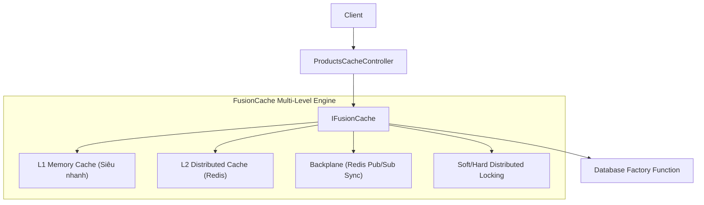
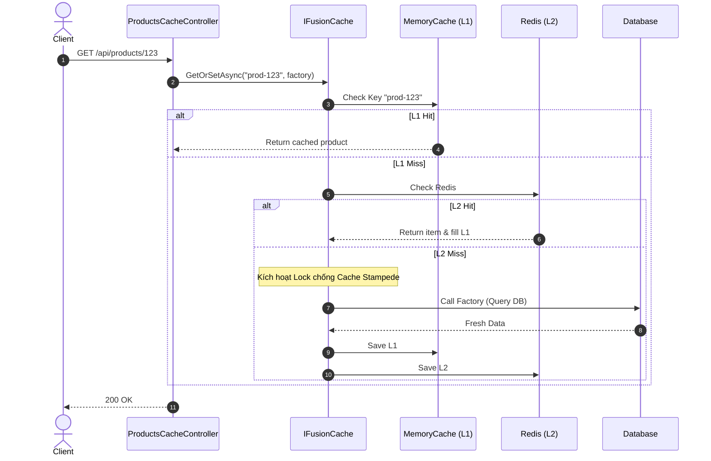

# 27-FusionCache: Bộ Đệm Hybrid Siêu Tốc & Chống Cache Stampede Cho .NET 10

Dự án mẫu minh họa cách sử dụng **FusionCache** — thư viện caching được đánh giá là mạnh mẽ, an toàn và nhanh bậc nhất thế giới .NET hiện nay, do Jody Donetti phát triển.

---

## 1. Giới thiệu FusionCache trong hệ sinh thái .NET

Caching trong các hệ thống phân tán lớn thường gặp các vấn đề nghiêm trọng:
- **Cache Stampede (Dogpiling)**: Khi một cache key hết hạn (expire), hàng trăm hoặc hàng nghìn luồng đồng thời gọi vào database để tạo lại dữ liệu, khiến CSDL bị sập (Denial of Service).
- **Transient Failures**: Khi CSDL bị chập chờn, nếu không có cơ chế Fallback, ứng dụng sẽ ném lỗi 500 cho người dùng dù trong cache vừa có dữ liệu cũ còn tốt.

**FusionCache** giải quyết triệt để các bài toán này:
- **Chống Cache Stampede tự động**: Sử dụng cơ chế khóa phân tán / factory locking tối ưu, đảm bảo **chỉ đúng 1 luồng** gọi vào database để tính toán dữ liệu, các luồng khác chờ kết quả từ luồng đó.
- **Cơ chế Fail-Safe**: Nếu database gặp sự cố (timeout, sập mạng), FusionCache tự động phát hiện và trả về dữ liệu cũ (stale data) kèm cờ cảnh báo thay vì để crash ứng dụng.
- **Kiến trúc Multi-Level (L1 + L2)**: Kết hợp L1 (MemoryCache trong RAM máy chủ) với L2 (Redis phân tán) và cơ chế Backplane đồng bộ hóa tức thì.
- **Soft / Hard Timeouts**: Cho phép đặt timeout mềm để trả dữ liệu nhanh và cập nhật cache ngầm ở background (Background Refresh / Eager Refresh).

---

## 2. Kiến trúc & Cơ chế hoạt động

```
[ HTTP Request 1, 2, ..., 10 ] (Đồng thời)
             │
             ▼
[ ProductsCacheController ]
             │
             ▼
      [ IFusionCache ]
             │
             ├──► [ L1: MemoryCache ] ──(Hit)──► Trả về ngay trong vài nanosecond
             │
      (Stampede Lock: Chỉ 1 request được chạy Factory)
             │
             ▼
[ IProductCatalogService ] (Database Call giả lập)
             │
             ├──(Nếu DB thành công)──► Lưu vào L1 & Trả về cho tất cả 10 request
             │
             └──(Nếu DB bị lỗi/sập)──► Kích hoạt FAIL-SAFE: Trả về stale cache an toàn!
```

---


## Sơ đồ Kiến trúc & Luồng dữ liệu (Architecture & Data Flow)

### 1. Sơ đồ Kiến trúc Tổng quan (Architecture Overview)


### 2. Mô hình Luồng dữ liệu Chi tiết (Data Flow & Sequence)


### 3. Các Use Cases Cụ thể trong Thực tế (Concrete Use Cases)
- **Chống hiện tượng Cache Stampede**: Ngăn chặn hàng ngàn request cùng chọc vào DB khi cache vừa hết hạn thông qua cơ chế khóa thông minh.
- **Multi-level Caching (L1 + L2)**: Kết hợp tốc độ microsecond của RAM máy chủ và tính chia sẻ của Redis.
- **Fail-Safe Mode**: Trả về dữ liệu cũ (stale data) tạm thời khi database gặp sự cố, đảm bảo dịch vụ không bị gián đoạn.


## 3. Cấu trúc thư mục & Project

```
27-FusionCache/
├── ProductCatalogCache.slnx
├── README.md
├── ProductCatalogCache.Api/
│   ├── ProductCatalogCache.Api.csproj
│   ├── Program.cs
│   ├── appsettings.json
│   ├── appsettings.Development.json
│   ├── ProductCatalogCache.Api.http
│   ├── Properties/
│   │   └── launchSettings.json
│   ├── Models/
│   │   └── ProductCacheDtos.cs
│   ├── Services/
│   │   ├── IProductCatalogService.cs
│   │   └── ProductCatalogService.cs
│   └── Controllers/
│       └── ProductsCacheController.cs
└── ProductCatalogCache.Tests/
    ├── ProductCatalogCache.Tests.csproj
    └── FusionCacheTests.cs
```

---

## 4. Cài đặt & Cấu hình

### Package NuGet:
- `ZiggyCreatures.FusionCache` (2.8.0)
- `ZiggyCreatures.FusionCache.Serialization.SystemTextJson` (2.8.0)
- `Swashbuckle.AspNetCore` (10.2.3)

### Cấu hình `Program.cs`:
```csharp
builder.Services.AddMemoryCache();
builder.Services.AddFusionCache()
    .WithSerializer(new FusionCacheSystemTextJsonSerializer())
    .WithDefaultEntryOptions(options =>
    {
        options.Duration = TimeSpan.FromMinutes(2);
        options.IsFailSafeEnabled = true;
        options.FailSafeMaxDuration = TimeSpan.FromHours(1);
        options.FailSafeThrottleDuration = TimeSpan.FromSeconds(5);
        options.FactorySoftTimeout = TimeSpan.FromMilliseconds(100);
    });
```

---

## 5. Hướng dẫn chạy ứng dụng & API Contract

### Khởi chạy:
```powershell
cd d:\GitHub\dotnet-example\27-FusionCache\ProductCatalogCache.Api
dotnet run
```
Ứng dụng lắng nghe tại: `http://localhost:5127`  
Swagger UI: `http://localhost:5127/swagger`

### API Contract:

| Phương thức | Endpoint | Mô tả |
|---|---|---|
| `GET` | `/api/productscache/{id}` | Lấy sản phẩm với FusionCache (Stampede protection + Fail-Safe) |
| `POST` | `/api/productscache/simulate-failure?enabled=true` | Giả lập sự cố CSDL để kiểm tra tính năng Fail-Safe |
| `DELETE` | `/api/productscache/{id}` | Xóa cache của sản phẩm (Evict) |
| `GET` | `/api/productscache/stats` | Xem thống kê số lượng truy vấn thực tế vào CSDL |
| `POST` | `/api/productscache/reset` | Đặt lại bộ đếm thống kê |

---

## 6. Chi tiết triển khai code

### 6.1. GetOrSetAsync với Stampede Protection & Fail-Safe
```csharp
var product = await _cache.GetOrSetAsync<ProductItem>(
    $"product:{id}",
    async ct => await _service.GetProductFromDatabaseAsync(id, ct),
    options => options
        .SetDuration(TimeSpan.FromMinutes(2))
        .SetFailSafe(true, maxDuration: TimeSpan.FromHours(1), throttleDuration: TimeSpan.FromSeconds(5)),
    cancellationToken
);
```

---

## 7. Tối ưu hiệu năng & Best Practices

1. **Luôn bật `IsFailSafeEnabled`**: Đảm bảo dịch vụ của bạn có tính kiên cường (resilience) cao nhất trước các sự cố mạng hoặc downtime của CSDL.
2. **Khai thác `FactorySoftTimeout`**: Thiết lập timeout mềm ngắn (ví dụ: 100ms) để nếu CSDL phản hồi chậm hơn 100ms, FusionCache lập tức trả về dữ liệu cũ cho user và đẩy việc tính toán/cập nhật cache chạy ngầm ở background.
3. **Key Naming Convention**: Đặt cache key có cấu trúc phân cấp rõ ràng (ví dụ: `tenant:1:catalog:product:123`).

---

## 8. Phản biện kỹ thuật & Đánh giá rủi ro

- **So với IMemoryCache mặc định**: `IMemoryCache` của .NET không có cơ chế khóa (locking) khi tính toán giá trị cache, rất dễ gây sập CSDL do Cache Stampede. FusionCache giải quyết hoàn toàn vấn đề này.
- **Tính nhất quán dữ liệu (Data Consistency)**: Khi dùng Fail-Safe, người dùng có thể nhận được dữ liệu cũ nếu CSDL gặp sự cố. Đây là sự đánh đổi có chủ đích theo định lý CAP (Ưu tiên Availability hơn Consistency).

---

## 9. Kiểm thử tự động (TDD)

Toàn bộ các tính năng cốt lõi được kiểm thử tự động:
```powershell
dotnet test d:\GitHub\dotnet-example\27-FusionCache\ProductCatalogCache.slnx
```

### Kết quả kiểm thử:
- ✅ **Cache MISS**: Lần gọi đầu tiên kích hoạt query CSDL (`TotalDbQueries = 1`)
- ✅ **Cache HIT**: Lần gọi thứ hai lấy từ RAM, không tăng bộ đếm CSDL (`TotalDbQueries = 1`)
- ✅ **Chống Cache Stampede**: 10 request đồng thời cùng lúc chỉ kích hoạt đúng **1** truy vấn CSDL duy nhất
- ✅ **Fail-Safe**: Khi CSDL bị ngắt kết nối giả lập, FusionCache tự động phục vụ dữ liệu cũ an toàn thay vì báo lỗi 500
- ✅ **Eviction**: Xóa cache thành công, request tiếp theo gọi lại vào CSDL

---

## 10. Bài tập mở rộng & Thử thách thực tế

1. **Tích hợp L2 Redis**: Bổ sung `ZiggyCreatures.FusionCache.Providers.Redis` để kết hợp L1 in-memory với L2 Redis cache phân tán.
2. **Backplane Synchronization**: Cấu hình FusionCache Backplane sử dụng Redis pub/sub để khi 1 instance xóa cache, toàn bộ các instance khác trong cụm microservices đều nhận được thông báo evict.
3. **Adaptive Caching**: Thay đổi thời gian cache dựa trên tần suất truy cập của người dùng.

---

## 11. Giới hạn & Lưu ý khi lên Production

- Chú ý kích thước bộ nhớ L1 RAM trên server để không làm đầy bộ nhớ máy chủ (dùng `SizeLimit` trên MemoryCache nếu cần).
- Cần đặt `FailSafeMaxDuration` hợp lý tùy thuộc vào yêu cầu nghiệp vụ (ví dụ: dữ liệu giá cả không nên để stale quá vài giờ).

---

## 12. Tài liệu tham khảo

- [FusionCache GitHub Repository](https://github.com/ZiggyCreatures/FusionCache)
- [FusionCache Official Documentation](https://github.com/ZiggyCreatures/FusionCache/blob/main/docs/README.md)
- [Cache Stampede Problem (Wikipedia)](https://en.wikipedia.org/wiki/Cache_stampede)
