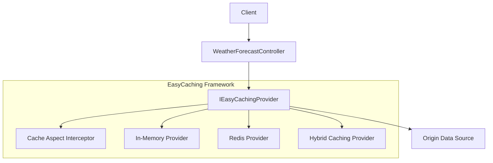
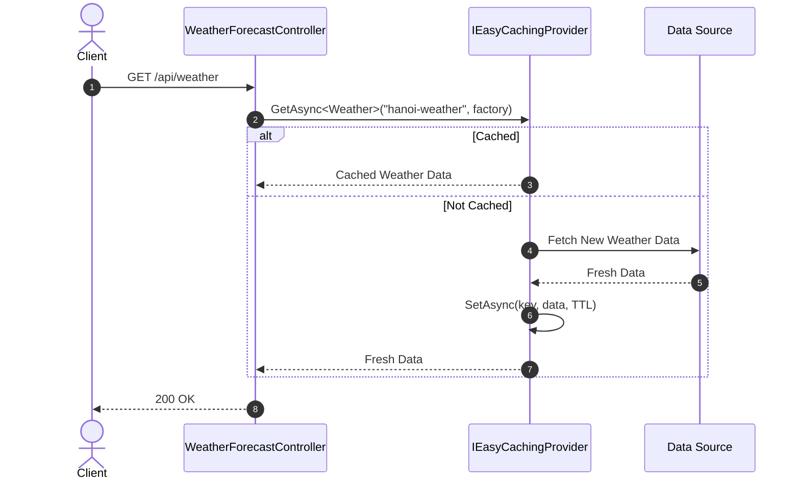

# 28-EasyCaching: Lớp Trừu Tượng Hóa Bộ Đệm Đa Nền Tảng Cho .NET 10

Dự án mẫu minh họa cách sử dụng **EasyCaching** — framework cung cấp tầng trừu tượng thống nhất cho toàn bộ các giải pháp caching trong hệ sinh thái .NET.

---

## 1. Giới thiệu EasyCaching trong hệ sinh thái .NET

Khi phát triển ứng dụng phân tán hoặc microservices, các nhóm phát triển thường gặp khó khăn khi chuyển đổi nhà cung cấp bộ đệm (chẳng hạn từ MemoryCache sang Redis, Memcached, hoặc SQLite Cache). Mã nguồn thường bị gắn chặt vào thư viện cụ thể.

**EasyCaching** giải quyết vấn đề này:
- **Giao diện chuẩn hóa**: Cung cấp interface `IEasyCachingProvider` với các hàm async trực quan (`GetAsync`, `SetAsync`, `RemoveAsync`, `GetByPrefixAsync`).
- **Hỗ trợ đa Provider**: Dễ dàng đổi từ `InMemory`, `Redis`, `Memcached`, `SQLite`, `Disk` sang `Hybrid` (kết hợp L1 + L2) chỉ qua cấu hình DI.
- **Named Providers**: Cho phép cấu hình nhiều provider đồng thời trong một ứng dụng (ví dụ: `local_mem` cho dữ liệu phiên làm việc, `cluster_redis` cho dữ liệu dùng chung toàn cụm).
- **Hỗ trợ tiền tố (Prefix Search)**: Truy vấn hàng loạt key theo tiền tố với `GetByPrefixAsync`.

---

## 2. Kiến trúc & Cơ chế hoạt động

```
[ HTTP Request ]
       │
       ▼
[ WeatherForecastController ] (ASP.NET Core Controller)
       │
       ▼
[ IEasyCachingProviderFactory ]
       │  (Get provider: "default_mem")
       ▼
[ IEasyCachingProvider ]
  ├── GetAsync<T>(key)
  ├── SetAsync<T>(key, value, expiration)
  ├── RemoveAsync(key)
  └── GetByPrefixAsync<T>(prefix)
       │
       ▼
[ EasyCaching.InMemory Storage ] (L1 In-Memory với SizeLimit & ExpirationScan)
```

---


## Sơ đồ Kiến trúc & Luồng dữ liệu (Architecture & Data Flow)

### 1. Sơ đồ Kiến trúc Tổng quan (Architecture Overview)


### 2. Mô hình Luồng dữ liệu Chi tiết (Data Flow & Sequence)


### 3. Các Use Cases Cụ thể trong Thực tế (Concrete Use Cases)
- **Trừu tượng hóa Caching đồng nhất**: Dễ dàng đổi từ Memory sang Redis, Memcached hoặc SQLite chỉ bằng cấu hình.
- **Caching qua Attribute**: Gắn `[EasyCachingAble(Expiration = 60)]` lên method để tự động cache kết quả.
- **Đồng bộ Cache Đa nút**: Tự động vô hiệu hóa cache giữa các server trong cụm.


## 3. Cấu trúc thư mục & Project

```
28-EasyCaching/
├── WeatherCache.slnx
├── README.md
├── WeatherCache.Api/
│   ├── WeatherCache.Api.csproj
│   ├── Program.cs
│   ├── appsettings.json
│   ├── appsettings.Development.json
│   ├── WeatherCache.Api.http
│   ├── Properties/
│   │   └── launchSettings.json
│   ├── Models/
│   │   └── WeatherDtos.cs
│   └── Controllers/
│       └── WeatherForecastController.cs
└── WeatherCache.Tests/
    ├── WeatherCache.Tests.csproj
    └── WeatherCacheTests.cs
```

---

## 4. Cài đặt & Cấu hình

### Package NuGet:
- `EasyCaching.Core` (1.9.2)
- `EasyCaching.InMemory` (1.9.2)
- `EasyCaching.Serialization.SystemTextJson` (1.9.2)
- `Swashbuckle.AspNetCore` (10.2.3)

### Cấu hình trong `Program.cs`:
```csharp
builder.Services.AddEasyCaching(options =>
{
    options.UseInMemory(config =>
    {
        config.DBConfig = new InMemoryDataConfiguration
        {
            SizeLimit = 1000,
            ExpirationScanFrequency = 60
        };
    }, "default_mem");
});
```

---

## 5. Hướng dẫn chạy ứng dụng & API Contract

### Khởi chạy:
```powershell
cd d:\GitHub\dotnet-example\28-EasyCaching\WeatherCache.Api
dotnet run
```
Ứng dụng lắng nghe tại: `http://localhost:5128`  
Swagger UI: `http://localhost:5128/swagger`

### API Contract:

| Phương thức | Endpoint | Mô tả |
|---|---|---|
| `GET` | `/api/weatherforecast/{city}` | Lấy dự báo thời tiết (Cache MISS thì tạo mới & lưu, Cache HIT thì trả ngay) |
| `POST` | `/api/weatherforecast/{city}` | Lưu thủ công dự báo thời tiết với TTL tùy chỉnh |
| `DELETE` | `/api/weatherforecast/{city}` | Xóa cache dự báo của thành phố (Evict) |
| `GET` | `/api/weatherforecast/prefix/{prefix}` | Tìm kiếm tất cả các giá trị cache khớp với tiền tố key |

---

## 6. Chi tiết triển khai code

### 6.1. GetAsync & SetAsync
```csharp
var key = $"weather:{city.Trim().ToLowerInvariant()}";
var cacheValue = await _cache.GetAsync<WeatherForecast>(key);

if (cacheValue.HasValue)
{
    return Ok(new CachedForecastResponse(cacheValue.Value, true, _cache.Name));
}

var forecast = GenerateForecast(city);
await _cache.SetAsync(key, forecast, TimeSpan.FromMinutes(2));
return Ok(new CachedForecastResponse(forecast, false, _cache.Name));
```

### 6.2. Truy vấn theo tiền tố (Prefix Query)
```csharp
var result = await _cache.GetByPrefixAsync<WeatherForecast>(prefix);
```

---

## 7. Tối ưu hiệu năng & Best Practices

1. **SizeLimit & ExpirationScanFrequency**: Luôn đặt giới hạn dung lượng (`SizeLimit`) trên `InMemoryDataConfiguration` để bảo vệ server khỏi tràn bộ nhớ khi lưu số lượng lớn keys.
2. **Key Naming Convention**: Sử dụng dấu `:` làm phân cách phân cấp (ví dụ: `weather:vn:hanoi`) để tận dụng tính năng `GetByPrefixAsync`.
3. **Serializer Chuẩn**: Sử dụng `System.Text.Json` hoặc `MessagePack` thông qua các gói serializer của EasyCaching để tối ưu kích thước payload và tốc độ tuần tự hóa.

---

## 8. Phản biện kỹ thuật & Đánh giá rủi ro

- **So với FusionCache**: EasyCaching mạnh về việc hỗ trợ nhiều loại backend lưu trữ khác nhau (Memcached, SQLite, Disk, Redis), trong khi FusionCache tập trung tối đa vào hiệu năng L1/L2 và khả năng chống stampede / fail-safe.
- **Tính nhất quán khi dùng Hybrid**: Cần cấu hình Bus (như Redis Pub/Sub hoặc RabbitMQ) để đồng bộ hóa việc xóa cache giữa các node khi sử dụng chế độ `Hybrid`.

---

## 9. Kiểm thử tự động (TDD)

Dự án có bộ kiểm thử tự động kiểm tra đầy đủ các kịch bản:
```powershell
dotnet test d:\GitHub\dotnet-example\28-EasyCaching\WeatherCache.slnx
```

### Kết quả kiểm thử:
- ✅ **Cache MISS & HIT**: Kiểm tra lần đầu trả về dữ liệu mới (`IsFromCache = false`), lần 2 lấy chính xác dữ liệu từ RAM (`IsFromCache = true`)
- ✅ **Custom Cache Setting**: Lưu dữ liệu với thời gian TTL tùy chọn và kiểm tra tính toàn vẹn
- ✅ **Eviction**: Xóa cache thành công, request tiếp theo sinh lại dữ liệu
- ✅ **GetByPrefix**: Truy vấn chính xác danh sách các key có cùng tiền tố
- ✅ **Input Validation**: Chặn tên thành phố rỗng (400 Bad Request)

---

## 10. Bài tập mở rộng & Thử thách thực tế

1. **Chuyển đổi sang Redis Provider**: Thêm gói `EasyCaching.Redis` và đổi cấu hình trong `Program.cs` sang `options.UseRedis(...)` mà không cần sửa bất kỳ dòng code nào trong Controller.
2. **Cấu hình Hybrid Caching**: Cấu hình 2 tầng (L1 In-Memory + L2 Redis) thông qua gói `EasyCaching.HybridCache`.
3. **Aspect-Oriented Caching**: Thử nghiệm gắn attribute `[EasyCachingAble(Expiration = 120)]` lên các phương thức service.

---

## 11. Giới hạn & Lưu ý khi lên Production

- Với provider In-Memory, dữ liệu cache sẽ mất khi ứng dụng khởi động lại hoặc recycle App Pool.
- Trong môi trường phân tán (Load Balancing), nên chuyển sang provider phân tán như Redis hoặc Memcached để đảm bảo tính nhất quán dữ liệu giữa các node.

---

## 12. Tài liệu tham khảo

- [EasyCaching Official Documentation](https://easycaching.readthedocs.io/)
- [EasyCaching GitHub Repository](https://github.com/dotnetcore/EasyCaching)
