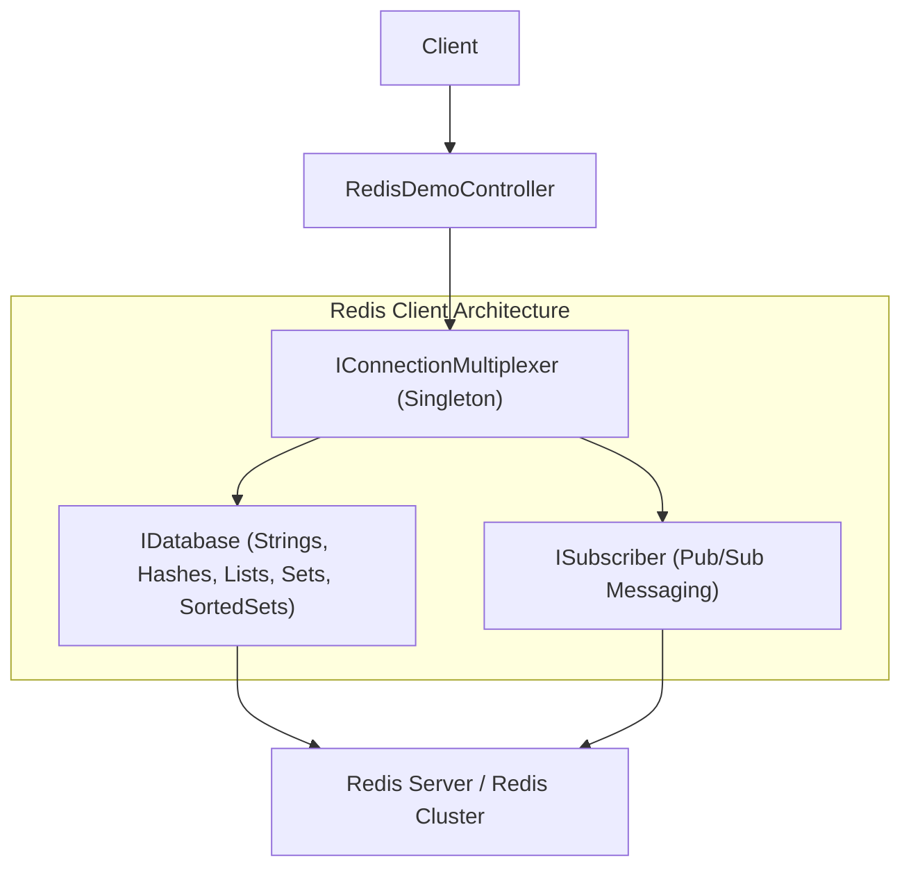
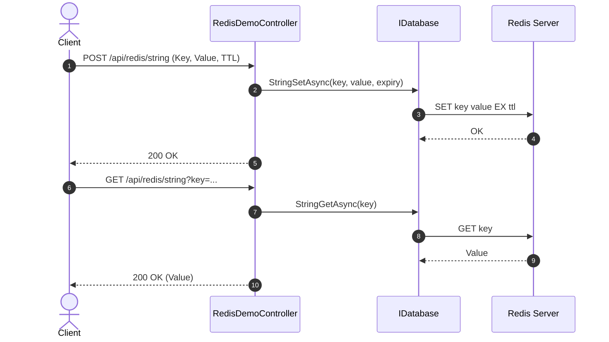

# 29-StackExchangeRedis: Client Redis Hiệu Năng Cao Hàng Đầu Cho .NET 10

Dự án mẫu minh họa cách sử dụng **StackExchange.Redis** — thư viện kết nối và thao tác với Redis hiệu năng cao, do đội ngũ kỹ sư Stack Overflow phát triển và bảo trì.

---

## 1. Giới thiệu StackExchange.Redis trong hệ sinh thái .NET

Redis là hệ thống cơ sở dữ liệu in-memory cấu trúc dữ liệu (data structure store) được sử dụng rộng rãi nhất thế giới cho caching, session store, real-time message broker và rate limiter.

**StackExchange.Redis** là thư viện client chuẩn mực cho .NET:
- **Kiến trúc Multiplexer (`IConnectionMultiplexer`)**: Sử dụng một kết nối TCP duy nhất cho hàng nghìn request đồng thời (pipelining / multiplexing), giảm thiểu chi phí socket và CPU overhead.
- **Hỗ trợ đầy đủ các cấu trúc dữ liệu của Redis**:
  - **String / Counter**: Các lệnh `StringSetAsync`, `StringGetAsync`, `StringIncrementAsync` (tăng giảm nguyên tử - atomic operations).
  - **Hash**: Lưu trữ cấu trúc đối tượng nhiều trường (`HashSetAsync`, `HashGetAllAsync`).
  - **Set**: Tập hợp các phần tử duy nhất (`SetAddAsync`, `SetMembersAsync`).
  - **Sorted Set**: Tập hợp có điểm số, tự động sắp xếp theo thứ hạng (`SortedSetAddAsync`, `SortedSetRangeByRankWithScoresAsync`).
  - **Pub/Sub**: Hệ thống phát/nhận tin nhắn thời gian thực đa luồng qua kênh (`ISubscriber`).

---

## 2. Kiến trúc & Cơ chế hoạt động

```
[ HTTP Request ]
       │
       ▼
[ RedisDemoController ] (ASP.NET Core Controller)
       │
       ▼
[ IRedisService ]
   ├── [ StackExchangeRedisService ] (Khi có Redis Server)
   │        │
   │        ▼
   │   [ IConnectionMultiplexer (StackExchange.Redis) ]
   │      - String: Tăng/giảm biến đếm nguyên tử (Atomic Counter)
   │      - Hash: Lưu giỏ hàng, thông tin session
   │      - Set: Quản lý nhãn (tags), tập người dùng duy nhất
   │      - Sorted Set: Bảng xếp hạng (Leaderboard) theo score
   │      - Pub/Sub: Phát tin nhắn tới các subscriber qua channel
   │        │
   │        ▼
   │   [ Redis Server (localhost:6379) ]
   │
   └── [ InMemoryRedisService ] (Fallback local / CI test không cần Redis server)
```

---


## Sơ đồ Kiến trúc & Luồng dữ liệu (Architecture & Data Flow)

### 1. Sơ đồ Kiến trúc Tổng quan (Architecture Overview)


### 2. Mô hình Luồng dữ liệu Chi tiết (Data Flow & Sequence)


### 3. Các Use Cases Cụ thể trong Thực tế (Concrete Use Cases)
- **Client Redis Tiêu Chuẩn Công Nghiệp**: Nền tảng cho hầu hết các thư viện cache và phân tán khác trong .NET.
- **Cấu trúc Dữ liệu Đa dạng**: Làm việc trực tiếp với Hashes, Sorted Sets (Leaderboards), Bitmaps, Streams.
- **Phân tán Khóa (Distributed Locks)**: Đảm bảo chỉ 1 tiến trình được thao tác với tài nguyên chung tại 1 thời điểm.


## 3. Cấu trúc thư mục & Project

```
29-StackExchangeRedis/
├── RedisPlatform.slnx
├── README.md
├── RedisPlatform.Api/
│   ├── RedisPlatform.Api.csproj
│   ├── Program.cs
│   ├── appsettings.json
│   ├── appsettings.Development.json
│   ├── RedisPlatform.Api.http
│   ├── Properties/
│   │   └── launchSettings.json
│   ├── Models/
│   │   └── RedisDtos.cs
│   ├── Services/
│   │   ├── IRedisService.cs
│   │   ├── StackExchangeRedisService.cs
│   │   └── InMemoryRedisService.cs
│   └── Controllers/
│       └── RedisDemoController.cs
└── RedisPlatform.Tests/
    ├── RedisPlatform.Tests.csproj
    └── RedisDemoTests.cs
```

---

## 4. Cài đặt & Cấu hình

### Package NuGet:
- `StackExchange.Redis` (3.3.0)
- `Swashbuckle.AspNetCore` (10.2.3)

### Cấu hình trong `Program.cs`:
```csharp
var redisConnStr = builder.Configuration.GetConnectionString("Redis");

if (!string.IsNullOrWhiteSpace(redisConnStr) && !redisConnStr.Contains("YOUR_REDIS"))
{
    // Real Redis with StackExchange.Redis
    builder.Services.AddSingleton<IConnectionMultiplexer>(_ =>
        ConnectionMultiplexer.Connect(redisConnStr));
    builder.Services.AddSingleton<IRedisService, StackExchangeRedisService>();
}
else
{
    // In-memory fallback for local testing / CI without Redis
    builder.Services.AddSingleton<IRedisService, InMemoryRedisService>();
}
```

---

## 5. Hướng dẫn chạy ứng dụng & API Contract

### Khởi chạy:
```powershell
cd d:\GitHub\dotnet-example\29-StackExchangeRedis\RedisPlatform.Api
dotnet run
```
Ứng dụng lắng nghe tại: `http://localhost:5129`  
Swagger UI: `http://localhost:5129/swagger`

### API Contract:

| Phương thức | Endpoint | Cấu trúc Redis | Mô tả |
|---|---|---|---|
| `POST` | `/api/redisdemo/counter/{key}` | String | Tăng biến đếm nguyên tử (`INCRBY`) |
| `POST` | `/api/redisdemo/hash/{key}` | Hash | Lưu cặp field-value vào Hash (`HSET`) |
| `GET` | `/api/redisdemo/hash/{key}` | Hash | Lấy toàn bộ fields của Hash (`HGETALL`) |
| `POST` | `/api/redisdemo/set/{key}` | Set | Thêm phần tử duy nhất vào Set (`SADD`) |
| `GET` | `/api/redisdemo/set/{key}` | Set | Lấy toàn bộ phần tử của Set (`SMEMBERS`) |
| `POST` | `/api/redisdemo/leaderboard/{key}` | Sorted Set | Thêm điểm số vào Leaderboard (`ZADD`) |
| `GET` | `/api/redisdemo/leaderboard/{key}/top` | Sorted Set | Lấy top bảng xếp hạng theo điểm số (`ZREVRANGE`) |
| `POST` | `/api/redisdemo/publish` | Pub/Sub | Gửi tin nhắn qua kênh (`PUBLISH`) |

---

## 6. Chi tiết triển khai code

### 6.1. Atomic Counter
```csharp
public async Task<long> IncrementCounterAsync(string key, long value = 1)
{
    return await _db.StringIncrementAsync(key, value);
}
```

### 6.2. Sorted Set Leaderboard
```csharp
public async Task<List<LeaderboardEntryDto>> GetTopLeaderboardAsync(string leaderboardKey, int take = 10)
{
    var entries = await _db.SortedSetRangeByRankWithScoresAsync(
        leaderboardKey,
        start: 0,
        stop: take - 1,
        order: Order.Descending
    );
    // Project sang DTO với Rank 1-indexed
}
```

---

## 7. Tối ưu hiệu năng & Best Practices

1. **Singleton `ConnectionMultiplexer`**: Tuyệt đối không tạo mới `ConnectionMultiplexer` trong mỗi request. Luôn đăng ký dạng **Singleton** trong DI container.
2. **Pipelining**: Khi cần thực thi nhiều lệnh Redis cùng lúc, sử dụng Batching (`db.CreateBatch()`) để gửi một mảng lệnh trong một lượt TCP round-trip.
3. **Key Naming Convention**: Sử dụng dấu `:` phân tách namespace (ví dụ: `app:users:123:session`).

---

## 8. Phản biện kỹ thuật & Đánh giá rủi ro

- **Connection Heartbeat & Timeout**: Cần cấu hình `syncTimeout` và `connectTimeout` hợp lý để tránh nghẽn thread pool khi Redis phản hồi chậm.
- **Rủi ro Memory Leak trên Pub/Sub**: Khi sử dụng `SubscribeAsync`, phải đảm bảo gọi `Unsubscribe` khi không còn sử dụng để tránh rò rỉ bộ nhớ handler.

---

## 9. Kiểm thử tự động (TDD)

Toàn bộ các cấu trúc dữ liệu của Redis được kiểm thử tự động:
```powershell
dotnet test d:\GitHub\dotnet-example\29-StackExchangeRedis\RedisPlatform.slnx
```

### Kết quả kiểm thử:
- ✅ **Counter**: Tăng nguyên tử chính xác theo bước nhảy (5 + 3 = 8)
- ✅ **Hash**: Lưu và truy xuất đúng các trường thông tin đối tượng
- ✅ **Set**: Đảm bảo loại bỏ trùng lặp khi thêm phần tử trùng
- ✅ **Leaderboard (Sorted Set)**: Sắp xếp chính xác top người chơi theo điểm số từ cao xuống thấp
- ✅ **Pub/Sub**: Phát tin nhắn thành công qua kênh
- ✅ **Validation**: Chặn key/field rỗng (400 Bad Request)

---

## 10. Bài tập mở rộng & Thử thách thực tế

1. **Distributed Lock với Redis**: Sử dụng `LockTakeAsync` và `LockReleaseAsync` để triển khai khóa phân tán chống tranh chấp tài nguyên (Concurrency Lock).
2. **Rate Limiter Middleware**: Viết ASP.NET Core Middleware giới hạn số lượng request theo IP dùng `StringIncrementAsync` kèm TTL (Sliding/Fixed Window).
3. **Redis Streams**: Thử nghiệm tính năng Redis Streams (`StreamAddAsync`, `StreamReadGroupAsync`) cho luồng sự kiện phân tán.

---

## 11. Giới hạn & Lưu ý khi lên Production

- Không dùng lệnh `KEYS *` trên Production vì lệnh này chặn (block) toàn bộ server Redis đơn luồng. Dùng `SCAN` thay thế.
- Cấu hình Redis Cluster hoặc Redis Sentinel để đảm bảo tính sẵn sàng cao (High Availability).

---

## 12. Tài liệu tham khảo

- [StackExchange.Redis Official Documentation](https://stackexchange.github.io/StackExchange.Redis/)
- [StackExchange.Redis GitHub](https://github.com/StackExchange/StackExchange.Redis)
- [Redis Data Structures Reference](https://redis.io/docs/data-types/)
