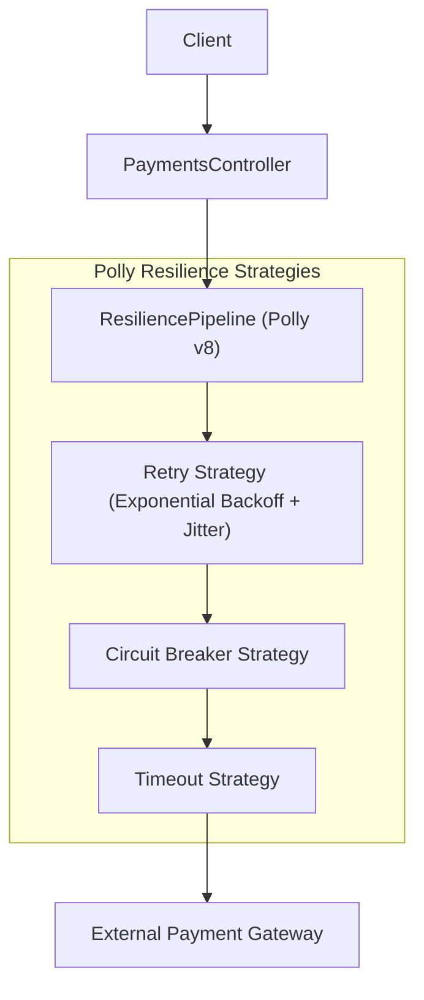
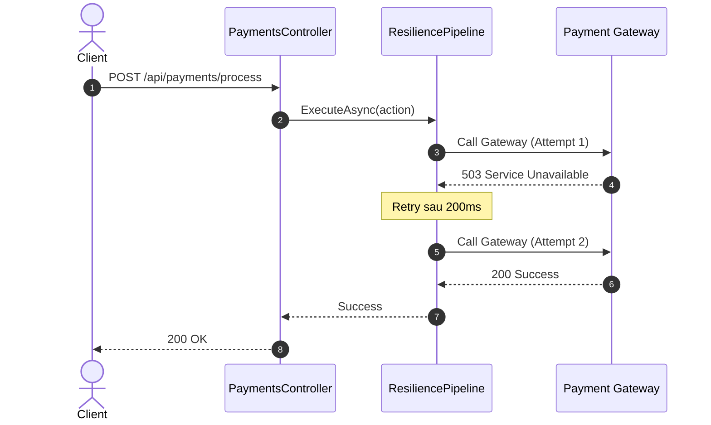

# 30-Polly: Xây Dựng Hệ Thống Kiên Cường Trước Sự Cố Bằng Resilience Pipeline

Dự án mẫu minh họa cách sử dụng **Polly v8** (`Polly.Core`) — thư viện xây dựng tính kiên cường (Resilience & Fault Tolerance) chuẩn mực cho các hệ thống phân tán và microservices trong .NET.

---

## 1. Giới thiệu Polly trong hệ sinh thái .NET

Trong kiến trúc phân tán, lỗi mạng, nghẽn tải tạm thời (transient faults), hoặc đối tác bên thứ 3 bị sập là điều không thể tránh khỏi. Nếu không có cơ chế xử lý kiên cường, một lỗi nhỏ từ một dịch vụ phụ có thể gây ra hiện tượng **Cascading Failure** đánh sập toàn bộ hệ thống.

**Polly v8** mang đến kiến trúc **Resilience Pipeline** hiện đại, hiệu năng cao, zero-allocation:
- **Retry**: Tự động thử lại khi gặp lỗi tạm thời với các chiến lược backoff (hằng số, tuyến tính, số mũ có jitter).
- **Circuit Breaker**: Cắt mạch tạm thời khi tỷ lệ lỗi vượt ngưỡng cho phép, ngăn không cho hệ thống tiếp tục gửi request vào dịch vụ đang chết, giúp dịch vụ đó có thời gian tự phục hồi.
- **Timeout**: Đặt giới hạn thời gian tối đa cho mỗi tác vụ, tránh treo thread worker vĩnh viễn.
- **Fallback**: Cung cấp phản hồi dự phòng an toàn (ví dụ: chuyển sang hàng đợi offline) khi toàn bộ các nỗ lực chính đều thất bại.
- **Rate Limiter / Bulkhead**: Giới hạn số lượng request đồng thời để bảo vệ tài nguyên hệ thống.

---

## 2. Kiến trúc & Cơ chế hoạt động

```
[ HTTP Request: Process Payment ]
               │
               ▼
[ PaymentsController ]
               │
               ▼
[ Polly v8 ResiliencePipeline<PaymentResponse> ]
  │
  ├── 1. Fallback Strategy (Bao bọc ngoài cùng: bắt lỗi và trả degraded response)
  │      │
  │      ▼
  ├── 2. Retry Strategy (Thử lại tối đa 3 lần nếu gặp lỗi mạng tạm thời)
  │      │
  │      ▼
  ├── 3. Circuit Breaker Strategy (Ngắt mạch nếu lỗi > 50% trong 5 giây)
  │      │
  │      ▼
  └── 4. Timeout Strategy (Hủy bỏ nếu gateway xử lý quá 300ms)
         │
         ▼
[ IPaymentGatewayService ] (Cổng thanh toán giả lập)
```

---


## Sơ đồ Kiến trúc & Luồng dữ liệu (Architecture & Data Flow)

### 1. Sơ đồ Kiến trúc Tổng quan (Architecture Overview)


### 2. Mô hình Luồng dữ liệu Chi tiết (Data Flow & Sequence)


### 3. Các Use Cases Cụ thể trong Thực tế (Concrete Use Cases)
- **Chống Lỗi Tạm Thời (Transient Fault Handling)**: Tự động thử lại khi gặp lỗi mạng, timeout hoặc 503 tạm thời.
- **Circuit Breaker (Ngắt mạch)**: Ngừng gọi đến dịch vụ đang bị tê liệt để tránh làm nghẽn toàn bộ hệ thống của bạn.
- **Rate Limiter & Fallback**: Giới hạn số lượng gọi ra API bên ngoài và cung cấp giá trị mặc định khi có sự cố.


## 3. Cấu trúc thư mục & Project

```
30-Polly/
├── ResilientPaymentGateway.slnx
├── README.md
├── ResilientPaymentGateway.Api/
│   ├── ResilientPaymentGateway.Api.csproj
│   ├── Program.cs
│   ├── appsettings.json
│   ├── appsettings.Development.json
│   ├── ResilientPaymentGateway.Api.http
│   ├── Properties/
│   │   └── launchSettings.json
│   ├── Models/
│   │   └── PaymentDtos.cs
│   ├── Services/
│   │   ├── IPaymentGatewayService.cs
│   │   └── PaymentGatewayService.cs
│   └── Controllers/
│       └── PaymentsController.cs
└── ResilientPaymentGateway.Tests/
    ├── ResilientPaymentGateway.Tests.csproj
    └── PaymentResilienceTests.cs
```

---

## 4. Cài đặt & Cấu hình

### Package NuGet:
- `Polly.Core` (8.8.0)
- `Swashbuckle.AspNetCore` (10.2.3)

### Cấu hình `Program.cs`:
```csharp
builder.Services.AddSingleton(sp =>
{
    return new ResiliencePipelineBuilder<PaymentResponse>()
        .AddFallback(new FallbackStrategyOptions<PaymentResponse> { ... })
        .AddRetry(new RetryStrategyOptions<PaymentResponse> { ... })
        .AddCircuitBreaker(new CircuitBreakerStrategyOptions<PaymentResponse> { ... })
        .AddTimeout(TimeSpan.FromMilliseconds(300))
        .Build();
});
```

---

## 5. Hướng dẫn chạy ứng dụng & API Contract

### Khởi chạy:
```powershell
cd d:\GitHub\dotnet-example\30-Polly\ResilientPaymentGateway.Api
dotnet run
```
Ứng dụng lắng nghe tại: `http://localhost:5130`  
Swagger UI: `http://localhost:5130/swagger`

### API Contract:

| Phương thức | Endpoint | Mô tả |
|---|---|---|
| `POST` | `/api/payments/process` | Xử lý thanh toán qua Resilience Pipeline |
| `POST` | `/api/payments/gateway-behavior?behavior=...` | Giả lập lỗi cổng thanh toán (`Success`, `TransientFailure`, `PermanentFailure`, `Timeout`) |
| `GET` | `/api/payments/status` | Xem số lượt gọi thực tế vào gateway và trạng thái giả lập |
| `POST` | `/api/payments/reset` | Đặt lại bộ đếm và trạng thái ban đầu |

---

## 6. Chi tiết triển khai code

### 6.1. Thực thi tác vụ qua Resilience Pipeline
```csharp
var response = await _pipeline.ExecuteAsync(
    async token => await _gatewayService.ProcessPaymentAsync(request, token),
    cancellationToken
);
```

### 6.2. Kết hợp Retry và Circuit Breaker
```csharp
.AddRetry(new RetryStrategyOptions<PaymentResponse>
{
    MaxRetryAttempts = 3,
    Delay = TimeSpan.FromMilliseconds(20),
    BackoffType = DelayBackoffType.Constant,
    ShouldHandle = new PredicateBuilder<PaymentResponse>()
        .Handle<HttpRequestException>()
        .Handle<TimeoutRejectedException>()
})
```

---

## 7. Tối ưu hiệu năng & Best Practices

1. **Thứ tự của các chiến lược trong Pipeline**: Luôn tuân thủ thứ tự chuẩn:
   - Ngoài cùng: **Fallback** (để bắt mọi lỗi từ các tầng bên trong và trả phản hồi dự phòng).
   - Tiếp theo: **Retry** (để thử lại trước khi tính lỗi vào Circuit Breaker).
   - Tiếp theo: **Circuit Breaker** (để phát hiện cụm lỗi và ngắt mạch).
   - Trong cùng: **Timeout** (để mỗi lượt gọi không vượt quá thời gian tối đa).
2. **Sử dụng Jitter khi Retry**: Thêm độ trễ ngẫu nhiên (`UseJitter = true`) khi retry để tránh hiện tượng hàng nghìn client cùng retry tại một thời điểm chính xác (Thundering Herd).
3. **Đăng ký Pipeline dạng Singleton**: Tái sử dụng đối tượng `ResiliencePipeline` trong toàn bộ vòng đời ứng dụng để tối ưu bộ nhớ.

---

## 8. Phản biện kỹ thuật & Đánh giá rủi ro

- **Idempotency (Tính bất biến khi gọi lại)**: Khi kích hoạt cơ chế `Retry`, các tác vụ POST/thanh toán phải đảm bảo có `Idempotency-Key` phía server để tránh việc trừ tiền nhiều lần nếu request đầu tiên đã đến nơi nhưng kết quả trả về bị timeout mạng.
- **Circuit Breaker BreakDuration**: Không nên đặt thời gian ngắt mạch quá ngắn (dưới 1s) hoặc quá dài (nhiều phút) để cân bằng giữa bảo vệ hạ tầng và thời gian phục hồi dịch vụ.

---

## 9. Kiểm thử tự động (TDD)

Dự án có bộ kiểm thử tự động kiểm tra đầy đủ các chiến lược resilience:
```powershell
dotnet test d:\GitHub\dotnet-example\30-Polly\ResilientPaymentGateway.slnx
```

### Kết quả kiểm thử:
- ✅ **Happy Path**: Thanh toán thành công ngay lần đầu tiên (`Attempts = 1`)
- ✅ **Transient Error Recovery**: Cổng bị lỗi 2 lần, Polly tự động retry và thành công ở lần thứ 3 (`Attempts = 3, Status = CompletedAfterRetry`)
- ✅ **Permanent Failure Fallback**: Cổng sập hoàn toàn, Polly Fallback kích hoạt an toàn, đưa thanh toán vào hàng đợi xử lý offline thay vì báo lỗi 500
- ✅ **Timeout Fallback**: Cổng phản hồi chậm quá 300ms, Polly Timeout ngắt và chuyển sang Fallback an toàn
- ✅ **Validation**: Chặn số tiền không hợp lệ (400 Bad Request)

---

## 10. Bài tập mở rộng & Thử thách thực tế

1. **Tích hợp với HttpClientFactory**: Sử dụng `Microsoft.Extensions.Http.Resilience` với phương thức mở rộng `builder.Services.AddHttpClient(...).AddStandardResilienceHandler()`.
2. **Hedging Strategy**: Gửi song song 2 request đến 2 cổng thanh toán khác nhau và lấy kết quả của cổng phản hồi nhanh hơn.
3. **Telemetry & Metrics**: Lắng nghe `OnRetry`, `OnCircuitOpened` để ghi nhận OpenTelemetry metrics gửi về Prometheus / Grafana.

---

## 11. Giới hạn & Lưu ý khi lên Production

- Đặt timeout phù hợp với SLAs (Service Level Agreements) của hệ thống.
- Luôn kiểm tra log khi Circuit Breaker mở (`Open`) để kích hoạt cảnh báo trực tuyến (PagerDuty/Slack).

---

## 12. Tài liệu tham khảo

- [Polly Official Documentation](https://www.pollydocs.org/)
- [Polly GitHub Repository](https://github.com/App-vNext/Polly)
- [Microsoft Resilience in .NET](https://learn.microsoft.com/en-us/dotnet/core/resilience/)
