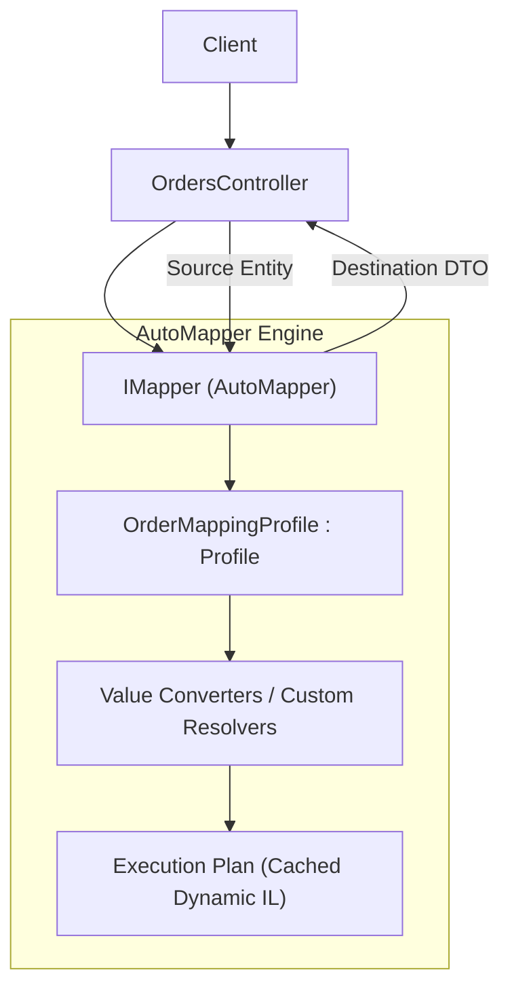
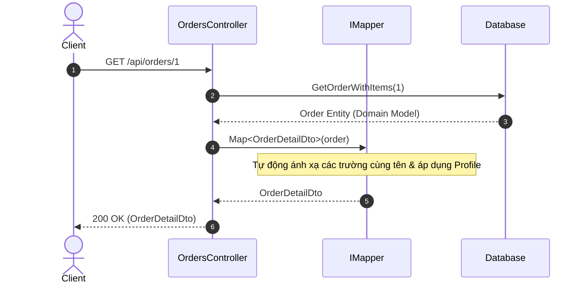

# 31-AutoMapper: Ánh Xạ Đối Tượng Tự Động (Object-to-Object Mapping) Cho .NET 10

Dự án mẫu minh họa cách sử dụng **AutoMapper** — thư viện ánh xạ đối tượng (Object-to-Object Mapping) phổ biến và lâu đời nhất trong hệ sinh thái .NET, do Jimmy Bogard phát triển.

---

## 1. Giới thiệu AutoMapper trong hệ sinh thái .NET

Trong các ứng dụng phân tầng (Layered / Clean Architecture), việc chuyển đổi dữ liệu qua lại giữa Domain Entities, Database Models và Data Transfer Objects (DTOs) là công việc lặp đi lặp lại rất tốn thời gian (boilerplate code).

**AutoMapper** giải quyết bài toán này:
- **Tự động ánh xạ theo quy ước (Convention-based Mapping)**: Tự động ghép các thuộc tính có cùng tên và kiểu dữ liệu tương thích mà không cần viết tay từng dòng `dest.Prop = src.Prop`.
- **Làm phẳng đối tượng (Flattening)**: Tự động gom các đối tượng lồng nhau thành các thuộc tính phẳng (ví dụ: `Customer.FirstName` + `Customer.LastName` -> `CustomerFullName`).
- **Tùy biến linh hoạt**: Hỗ trợ Custom Value Resolvers, Type Converters, Pre/Post Condition, Reverse Mapping (`ReverseMap()`).
- **Xác thực cấu hình chặt chẽ (`AssertConfigurationIsValid`)**: Phát hiện ngay lập tức các thuộc tính chưa được ánh xạ hoặc sai kiểu dữ liệu ngay tại thời điểm khởi động / chạy unit test.

---

## 2. Kiến trúc & Cơ chế hoạt động

```
[ HTTP Request: CreateOrderRequest / UpdateAddressRequest ]
                         │
                         ▼
             [ OrdersController ]
                         │
                         ▼
        [ IMapper (OrderMappingProfile) ]
     ┌───────────────────┴───────────────────┐
     ▼                                       ▼
[ CreateOrderRequest -> Order ]     [ Order -> OrderSummaryDto / OrderDetailDto ]
 (Bỏ qua Id, CreatedAt...)          (Tính TotalAmount, ItemsCount, FullName)
                         │
                         ▼
                   [ OrderStore ] (Lưu trữ đơn hàng)
```

---


## Sơ đồ Kiến trúc & Luồng dữ liệu (Architecture & Data Flow)

### 1. Sơ đồ Kiến trúc Tổng quan (Architecture Overview)


### 2. Mô hình Luồng dữ liệu Chi tiết (Data Flow & Sequence)


### 3. Các Use Cases Cụ thể trong Thực tế (Concrete Use Cases)
- **Tách Biệt Domain Entity và DTO**: Giữ cho các mô hình CSDL không bị lộ trực tiếp ra ngoài giao diện API.
- **Flattening & Complex Projection**: Tự động làm phẳng cấu trúc đối tượng lồng nhau thành DTO đơn giản.
- **Kiểm thử Cấu hình Ánh xạ**: Dùng `configuration.AssertConfigurationIsValid()` để phát hiện sớm các trường chưa được ánh xạ lúc chạy Unit Test.


## 3. Cấu trúc thư mục & Project

```
31-AutoMapper/
├── OrderMapping.slnx
├── README.md
├── OrderMapping.Api/
│   ├── OrderMapping.Api.csproj
│   ├── Program.cs
│   ├── appsettings.json
│   ├── appsettings.Development.json
│   ├── OrderMapping.Api.http
│   ├── Properties/
│   │   └── launchSettings.json
│   ├── Entities/
│   │   ├── Customer.cs
│   │   ├── Address.cs
│   │   ├── OrderItem.cs
│   │   └── Order.cs
│   ├── Models/
│   │   └── OrderDtos.cs
│   ├── Mappings/
│   │   └── OrderMappingProfile.cs
│   ├── Data/
│   │   └── OrderStore.cs
│   └── Controllers/
│       └── OrdersController.cs
└── OrderMapping.Tests/
    ├── OrderMapping.Tests.csproj
    └── OrderMappingTests.cs
```

---

## 4. Cài đặt & Cấu hình

### Package NuGet:
- `AutoMapper` (16.2.0)
- `Swashbuckle.AspNetCore` (10.2.3)

### Cấu hình `Program.cs`:
```csharp
var mapperConfig = new MapperConfiguration(cfg =>
{
    cfg.AddProfile<OrderMappingProfile>();
});
// Xác thực 100% cấu hình ánh xạ hợp lệ trước khi chạy
mapperConfig.AssertConfigurationIsValid();
builder.Services.AddSingleton(mapperConfig.CreateMapper());
```

---

## 5. Hướng dẫn chạy ứng dụng & API Contract

### Khởi chạy:
```powershell
cd d:\GitHub\dotnet-example\31-AutoMapper\OrderMapping.Api
dotnet run
```
Ứng dụng lắng nghe tại: `http://localhost:5131`  
Swagger UI: `http://localhost:5131/swagger`

### API Contract:

| Phương thức | Endpoint | Mô tả |
|---|---|---|
| `GET` | `/api/orders` | Lấy danh sách đơn hàng đã làm phẳng (`OrderSummaryDto`) |
| `GET` | `/api/orders/{id}` | Lấy chi tiết đơn hàng kèm đối tượng lồng nhau (`OrderDetailDto`) |
| `POST` | `/api/orders` | Tạo đơn hàng mới từ `CreateOrderRequest` |
| `PUT` | `/api/orders/{id}/address` | Cập nhật địa chỉ giao hàng áp trực tiếp lên entity hiện có |

---

## 6. Chi tiết triển khai code

### 6.1. Định nghĩa Profile ánh xạ
```csharp
public class OrderMappingProfile : Profile
{
    public OrderMappingProfile()
    {
        CreateMap<Customer, CustomerDto>()
            .ForMember(d => d.FullName, opt => opt.MapFrom(s => $"{s.FirstName} {s.LastName}".Trim()));

        CreateMap<Address, AddressDto>().ReverseMap();

        CreateMap<OrderItem, OrderItemDto>()
            .ForMember(d => d.LineTotal, opt => opt.MapFrom(s => s.UnitPrice * s.Quantity));

        CreateMap<Order, OrderSummaryDto>()
            .ForMember(d => d.CustomerFullName, opt => opt.MapFrom(s => $"{s.Customer.FirstName} {s.Customer.LastName}".Trim()))
            .ForMember(d => d.TotalAmount, opt => opt.MapFrom(s => s.Items.Sum(i => i.UnitPrice * i.Quantity)))
            .ForMember(d => d.ItemsCount, opt => opt.MapFrom(s => s.Items.Sum(i => i.Quantity)));
    }
}
```

### 6.2. Áp dụng ánh xạ lên đối tượng đã có (Instance-to-Instance)
```csharp
// Cập nhật thuộc tính trực tiếp vào entity đã tồn tại trong DB
_mapper.Map(updateAddressRequest, order.ShippingAddress);
```

---

## 7. Tối ưu hiệu năng & Best Practices

1. **Luôn gọi `AssertConfigurationIsValid()` trong Unit Test**: Đảm bảo phát hiện lỗi đổi tên property hoặc thiếu mapping ngay trong CI build.
2. **Sử dụng `ProjectTo<T>` với IQueryable (EF Core)**: Tránh lấy toàn bộ cột của bảng lên RAM rồi mới Map; `ProjectTo` sinh câu lệnh SQL `SELECT col1, col2` chỉ lấy đúng các cột cần thiết.
3. **Tránh logic nghiệp vụ phức tạp trong Profile**: Các tính toán nặng hoặc truy vấn CSDL phụ không nên đặt trong `MapFrom`, nên chuẩn bị dữ liệu từ trước.

---

## 8. Phản biện kỹ thuật & Đánh giá rủi ro

- **So với Mapster**: AutoMapper sử dụng Expression Trees và Reflection sâu hơn nên tốc độ chậm hơn một chút so với Mapster hoặc code tay; tuy nhiên tính năng và hệ sinh thái cực kỳ phong phú, tài liệu đầy đủ.
- **Rủi ro Silent Failure**: Nếu không gọi `AssertConfigurationIsValid()`, khi đổi tên một property ở Entity, AutoMapper có thể ngầm bỏ qua và để thuộc tính ở DTO nhận giá trị `null` hoặc `default` mà không báo lỗi runtime.

---

## 9. Kiểm thử tự động (TDD)

Dự án kiểm thử cả tính hợp lệ của cấu hình AutoMapper lẫn các API endpoints:
```powershell
dotnet test d:\GitHub\dotnet-example\31-AutoMapper\OrderMapping.slnx
```

### Kết quả kiểm thử:
- ✅ **Configuration Validity**: `AssertConfigurationIsValid()` vượt qua hoàn hảo không có cảnh báo
- ✅ **List Projection**: Ánh xạ danh sách đơn hàng sang DTO tóm tắt với tổng tiền và số lượng chính xác
- ✅ **Deep Nested Mapping**: Ánh xạ đầy đủ khách hàng, địa chỉ và từng dòng sản phẩm
- ✅ **Request to Entity**: Chuyển đổi payload `CreateOrderRequest` sang `Order` entity để lưu trữ
- ✅ **Existing Instance Update**: Cập nhật trực tiếp địa chỉ vào entity mà không tạo đối tượng mới
- ✅ **Validation & 404**: Kiểm tra đầy đủ các kịch bản lỗi đầu vào

---

## 10. Bài tập mở rộng & Thử thách thực tế

1. **EF Core `ProjectTo`**: Tích hợp AutoMapper với EF Core DbContext và kiểm tra câu truy vấn SQL sinh ra qua `_db.Orders.ProjectTo<OrderSummaryDto>(_mapper.ConfigurationProvider)`.
2. **Custom Type Converter**: Viết `ITypeConverter<string, DateTime>` để parse định dạng ngày tháng tùy chỉnh.
3. **Value Resolver có DI**: Viết `IValueResolver<Order, OrderDetailDto, decimal>` có inject dịch vụ tính thuế hoặc tỷ giá tiền tệ.

---

## 11. Giới hạn & Lưu ý khi lên Production

- Đăng ký `IMapper` dạng **Singleton** trong DI container vì khởi tạo `MapperConfiguration` là tác vụ tốn chi phí CPU.
- Tránh map vòng lặp đệ quy (Circular Reference) giữa các entity quan hệ hai chiều mà không cấu hình `MaxDepth` hoặc `Ignore`.

---

## 12. Tài liệu tham khảo

- [AutoMapper Official Documentation](https://docs.automapper.org/)
- [AutoMapper GitHub Repository](https://github.com/AutoMapper/AutoMapper)
- [Jimmy Bogard Blog on AutoMapper](https://jimmybogard.com/)
