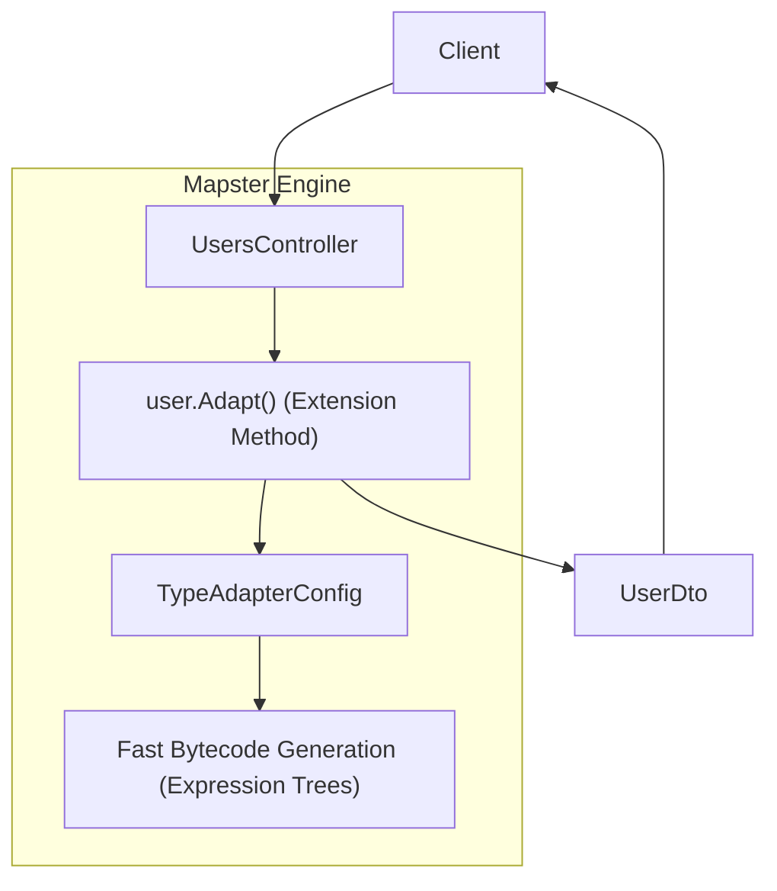
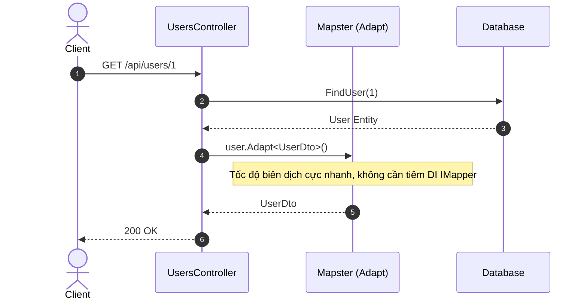

# 32-Mapster: Thư Viện Ánh Xạ Đối Tượng Hiệu Năng Cao (Fast Object Mapping) Cho .NET 10

Dự án mẫu minh họa cách sử dụng **Mapster** — thư viện ánh xạ đối tượng (Object-to-Object Mapping) thế hệ mới, nổi tiếng với tốc độ vượt trội và mức tiêu hao bộ nhớ cực thấp trong hệ sinh thái .NET.

---

## 1. Giới thiệu Mapster trong hệ sinh thái .NET

Khi so sánh với AutoMapper truyền thống, **Mapster** được thiết kế để giải quyết bài toán hiệu năng:
- **Tốc độ thực thi hàng đầu**: Nhanh hơn AutoMapper từ 2 đến 4 lần trong hầu hết các kịch bản benchmark nhờ cơ chế biên dịch trước các biểu thức ánh xạ (Expression Tree Compilation) và hỗ trợ Source Generator.
- **Cú pháp ngắn gọn & Tự nhiên**: Ánh xạ đối tượng trực tiếp qua extension method: `source.Adapt<Destination>()` hoặc `source.Adapt(existingDestination)`.
- **Hỗ trợ C# Records & Immutability**: Tự động nhận diện và ánh xạ hoàn hảo vào các kiểu Positional Records, Init-only properties mà không cần cấu hình constructor rườm rà.
- **Tích hợp IQueryable (`ProjectToType`)**: Chiếu trực tiếp câu truy vấn từ EF Core sang DTO ở cấp độ SQL Database.

---

## 2. Kiến trúc & Cơ chế hoạt động

```
[ HTTP Request: CreateUserRequest / UpdateUserBioRequest ]
                         │
                         ▼
             [ UsersController ]
                         │
                         ▼
             [ Mapster .Adapt<T>() ]
     ┌───────────────────┴───────────────────┐
     ▼                                       ▼
[ CreateUserRequest -> User ]       [ User -> UserSummaryDto / UserDetailDto ]
(Map Preferences & Roles)           (Làm phẳng FullName, đếm Roles, lấy Theme)
                         │
                         ▼
                    [ UserStore ] (Lưu trữ người dùng)
```

---


## Sơ đồ Kiến trúc & Luồng dữ liệu (Architecture & Data Flow)

### 1. Sơ đồ Kiến trúc Tổng quan (Architecture Overview)


### 2. Mô hình Luồng dữ liệu Chi tiết (Data Flow & Sequence)


### 3. Các Use Cases Cụ thể trong Thực tế (Concrete Use Cases)
- **Thay thế AutoMapper với Hiệu Năng Vượt Trội**: Tốc độ ánh xạ nhanh hơn từ 3 đến 8 lần và ít cấp phát bộ nhớ hơn.
- **Cú pháp Adapt Gọn Gàng**: Sử dụng trực tiếp extension method `obj.Adapt<T>()` mà không cần inject `IMapper`.
- **Hỗ trợ Code Generation**: Sinh mã nguồn ánh xạ lúc biên dịch (compile-time) để đạt hiệu năng tương đương code tay.


## 3. Cấu trúc thư mục & Project

```
32-Mapster/
├── UserProfilesMapster.slnx
├── README.md
├── UserProfilesMapster.Api/
│   ├── UserProfilesMapster.Api.csproj
│   ├── Program.cs
│   ├── appsettings.json
│   ├── appsettings.Development.json
│   ├── UserProfilesMapster.Api.http
│   ├── Properties/
│   │   └── launchSettings.json
│   ├── Entities/
│   │   └── User.cs
│   ├── Models/
│   │   └── UserDtos.cs
│   ├── Mappings/
│   │   └── MapsterConfig.cs
│   ├── Data/
│   │   └── UserStore.cs
│   └── Controllers/
│       └── UsersController.cs
└── UserProfilesMapster.Tests/
    ├── UserProfilesMapster.Tests.csproj
    └── UserMappingTests.cs
```

---

## 4. Cài đặt & Cấu hình

### Package NuGet:
- `Mapster` (10.0.12)
- `Mapster.DependencyInjection` (10.0.12)
- `Swashbuckle.AspNetCore` (10.2.3)

### Cấu hình `Program.cs`:
```csharp
// Đăng ký quy tắc ánh xạ vào TypeAdapterConfig toàn cục
MapsterConfig.RegisterMappings(TypeAdapterConfig.GlobalSettings);
```

---

## 5. Hướng dẫn chạy ứng dụng & API Contract

### Khởi chạy:
```powershell
cd d:\GitHub\dotnet-example\32-Mapster\UserProfilesMapster.Api
dotnet run
```
Ứng dụng lắng nghe tại: `http://localhost:5132`  
Swagger UI: `http://localhost:5132/swagger`

### API Contract:

| Phương thức | Endpoint | Mô tả |
|---|---|---|
| `GET` | `/api/users` | Lấy danh sách người dùng tóm tắt (`UserSummaryDto`) |
| `GET` | `/api/users/{id}` | Lấy chi tiết hồ sơ người dùng kèm cấu hình (`UserDetailDto`) |
| `POST` | `/api/users` | Tạo mới người dùng (Request -> Entity -> DTO) |
| `PUT` | `/api/users/{id}/bio` | Cập nhật tiểu sử và giao diện áp trực tiếp lên entity hiện có |

---

## 6. Chi tiết triển khai code

### 6.1. Cấu hình quy tắc ánh xạ với TypeAdapterConfig
```csharp
config.NewConfig<User, UserSummaryDto>()
    .Map(dest => dest.FullName, src => $"{src.FirstName} {src.LastName}".Trim())
    .Map(dest => dest.RolesCount, src => src.Roles.Count)
    .Map(dest => dest.Theme, src => src.Preferences.Theme);
```

### 6.2. Sử dụng tiện ích mở rộng `.Adapt<T>()`
```csharp
// 1. Ánh xạ danh sách
var dtos = users.Adapt<List<UserSummaryDto>>();

// 2. Ánh xạ một đối tượng
var dto = user.Adapt<UserDetailDto>();

// 3. Ánh xạ cập nhật đối tượng đã có
request.Adapt(existingUser);
```

---

## 7. Tối ưu hiệu năng & Best Practices

1. **Sử dụng `TypeAdapterConfig.GlobalSettings`**: Khởi tạo quy tắc một lần duy nhất lúc khởi động ứng dụng để Mapster compile và cache sẵn các delegate ánh xạ.
2. **Khai thác `ProjectToType<T>`**: Khi kết hợp với Entity Framework Core, sử dụng `db.Users.ProjectToType<UserSummaryDto>()` để SQL chỉ lấy đúng các cột được định nghĩa.
3. **Mapster CodeGen (Tùy chọn)**: Dùng gói `Mapster.Tool` sinh code ánh xạ tường minh tại thời điểm build (Compile-time) cho các ứng dụng yêu cầu Zero-Reflection (AOT).

---

## 8. Phản biện kỹ thuật & Đánh giá rủi ro

- **So với AutoMapper**: Mapster có cú pháp gọn gàng hơn, không cần tạo Profile class bắt buộc, tốc độ nhanh hơn đáng kể và hỗ trợ C# records tự nhiên.
- **Rủi ro**: Tính năng quy ước mặc định của Mapster rất linh hoạt, có thể tự động map các thuộc tính trùng tên mà lập trình viên không để ý. Cần dùng `.Ignore()` rõ ràng với các trường nhạy cảm (như mật khẩu, hash).

---

## 9. Kiểm thử tự động (TDD)

Toàn bộ các endpoint và logic ánh xạ được kiểm thử tự động:
```powershell
dotnet test d:\GitHub\dotnet-example\32-Mapster\UserProfilesMapster.slnx
```

### Kết quả kiểm thử:
- ✅ **List Mapping**: Ánh xạ danh sách người dùng, làm phẳng FullName và đếm số lượng vai trò chính xác
- ✅ **Detail Mapping**: Ánh xạ cấu trúc đối tượng lồng nhau (PreferencesDto, Roles)
- ✅ **Request to Entity**: Chuyển đổi payload tạo mới sang entity
- ✅ **Update Existing**: Áp dụng thay đổi trực tiếp lên đối tượng hiện có
- ✅ **Validation & 404**: Kiểm tra đầy đủ các kịch bản ngoại lệ

---

## 10. Bài tập mở rộng & Thử thách thực tế

1. **Ánh xạ hai chiều**: Cấu hình `.TwoWays()` trên `TypeAdapterConfig` để tự động sinh chiều ngược lại.
2. **Conditional Mapping**: Cấu hình thuộc tính chỉ được ánh xạ khi thỏa mãn điều kiện (`.Map(dest => dest.Secret, src => src.Secret, srcCond => srcCond.IsAdmin)`).
3. **Mapster.Tool Code Generation**: Thiết lập Source Generator để tạo phương thức ánh xạ tĩnh thuần túy không dùng reflection.

---

## 11. Giới hạn & Lưu ý khi lên Production

- Đảm bảo gọi `MapsterConfig.RegisterMappings` trước khi nhận bất kỳ request nào.
- Tránh tạo các instance `TypeAdapterConfig` mới bên trong request pipeline để không làm mất bộ nhớ cache compiled delegates.

---

## 12. Tài liệu tham khảo

- [Mapster Official Documentation](https://mapstermapper.overviewer.com/)
- [Mapster GitHub Repository](https://github.com/MapsterMapper/Mapster)
- [Object Mapper Benchmark Comparisons](https://github.com/danielwertheim/open-dotnet-mapper-benchmarks)
