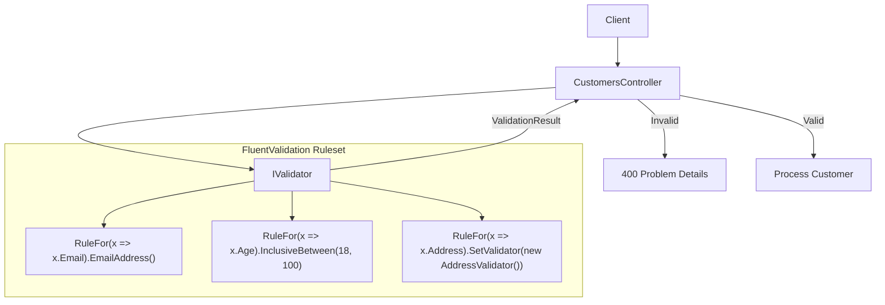
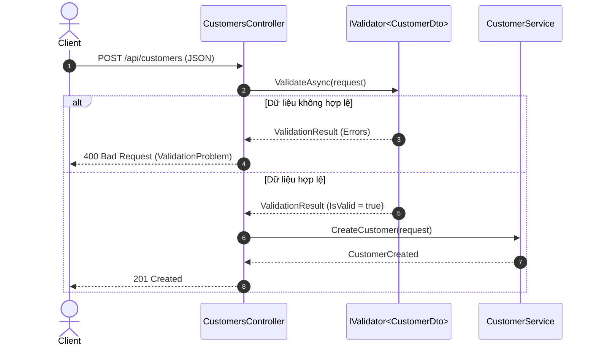

# 33-FluentValidation: Strongly-Typed Validation Rules trong .NET 10

Dự án mẫu minh họa việc sử dụng **FluentValidation** trong ứng dụng **ASP.NET Core Controllers** (.NET 10), tuân thủ tiêu chuẩn thiết kế RESTful API, validation phức tạp với Nested DTOs, Collection Rules, Conditional Validation, và định dạng lỗi chuẩn RFC 7807 (`ValidationProblemDetails`).

---

## 1. Giới thiệu tổng quan về FluentValidation

**FluentValidation** là thư viện validation phổ biến và mạnh mẽ nhất cho hệ sinh thái .NET, cho phép định nghĩa các quy tắc kiểm tra tính hợp lệ của dữ liệu (business validation rules) một cách tường minh, tách biệt hoàn toàn khỏi Model/DTO.

Thay vì nhồi nhét thuộc tính (Attributes) vào class DTO như DataAnnotations, FluentValidation sử dụng Fluent Interface và Lambda Expression để tạo ra các rule dễ đọc, dễ kiểm thử và có khả năng mở rộng cao.

---

## 2. So sánh DataAnnotations vs FluentValidation

| Tiêu chí | DataAnnotations | FluentValidation |
| :--- | :--- | :--- |
| **Vị trí định nghĩa** | Trực tiếp trên DTO/Entity bằng `[Attribute]` | Tách biệt hoàn toàn trong class `AbstractValidator<T>` |
| **Quy tắc phức tạp** | Rất khó, phải viết custom attribute phức tạp | Cực kỳ dễ dàng với `.When()`, `.Must()`, `.MustAsync()` |
| **Kiểm tra lồng nhau (Child/Collection)** | Hạn chế, khó kiểm soát collection | Hỗ trợ tự nhiên với `.SetValidator()` và `.RuleForEach()` |
| **Khả năng kiểm thử (Testability)** | Khó unit test độc lập | Rất dễ unit test với `TestValidate()` từ FluentValidation.TestHelper |
| **Dependency Injection** | Khó inject service vào Attribute | Hỗ trợ full DI trong constructor validator |
| **Single Responsibility Principle** | Vi phạm (DTO vừa chứa dữ liệu vừa chứa logic kiểm tra) | Tuân thủ tuyệt đối SRP |

---


## Sơ đồ Kiến trúc & Luồng dữ liệu (Architecture & Data Flow)

### 1. Sơ đồ Kiến trúc Tổng quan (Architecture Overview)


### 2. Mô hình Luồng dữ liệu Chi tiết (Data Flow & Sequence)


### 3. Các Use Cases Cụ thể trong Thực tế (Concrete Use Cases)
- **Tách biệt Logic Kiểm tra Dữ liệu**: Giữ cho các Model DTO hoàn toàn trong sạch, không bị bám bẩn bởi các Attribute `[Required]`, `[StringLength]`.
- **Kiểm tra Điều kiện Phức tạp**: Hỗ trợ quy tắc phụ thuộc (`When`, `Unless`), kiểm tra bất đồng bộ với Database (`MustAsync`).
- **Tái sử dụng Validator**: Dễ dàng lồng ghép các validator con (`SetValidator`).


## 3. Cài đặt và Cấu hình

### Package NuGet
- `FluentValidation` (11.11.0+)
- `FluentValidation.DependencyInjectionExtensions` (11.11.0+)
- `Swashbuckle.AspNetCore` (10.2.3)

### Đăng ký DI trong `Program.cs`
```csharp
using FluentValidation;
using CustomerValidationFluent.Api.Validators;

var builder = WebApplication.CreateBuilder(args);

builder.Services.AddControllers();

// Tự động quét và đăng ký tất cả các Validator trong Assembly
builder.Services.AddValidatorsFromAssemblyContaining<CustomerRegistrationValidator>();
```

---

## 4. Cấu trúc Project

```
33-FluentValidation/
├── CustomerValidationFluent.slnx
├── README.md
├── CustomerValidationFluent.Api/
│   ├── CustomerValidationFluent.Api.csproj
│   ├── Program.cs
│   ├── Properties/launchSettings.json (Port: 5133)
│   ├── appsettings.json
│   ├── appsettings.Development.json
│   ├── CustomerValidationFluent.Api.http
│   ├── Models/
│   │   └── CustomerDtos.cs
│   ├── Validators/
│   │   ├── AddressValidator.cs
│   │   ├── OrderItemValidator.cs
│   │   ├── CustomerRegistrationValidator.cs
│   │   └── CreateOrderValidator.cs
│   └── Controllers/
│       └── CustomersController.cs
└── CustomerValidationFluent.Tests/
    ├── CustomerValidationFluent.Tests.csproj
    └── CustomerValidationTests.cs
```

---

## 5. Các tính năng cốt lõi được triển khai

### 5.1. Quy tắc cơ bản và chuỗi (Chaining Rules)
```csharp
RuleFor(x => x.FullName)
    .NotEmpty().WithMessage("Full name is required.")
    .Length(3, 100).WithMessage("Full name must be between 3 and 100 characters.");

RuleFor(x => x.Email)
    .NotEmpty().WithMessage("Email is required.")
    .EmailAddress().WithMessage("A valid email address is required.");
```

### 5.2. Child Validator (Validate đối tượng lồng nhau)
```csharp
RuleFor(x => x.Address)
    .NotNull().WithMessage("Address is required.")
    .SetValidator(new AddressValidator()!);
```

### 5.3. Collection Validator (`RuleForEach`)
```csharp
RuleFor(x => x.Items)
    .NotEmpty().WithMessage("Order must contain at least one item.");

RuleForEach(x => x.Items)
    .SetValidator(new OrderItemValidator());
```

### 5.4. Conditional Validation (`When` / `Unless`)
```csharp
When(x => x.IsVip, () =>
{
    RuleFor(x => x.MembershipNumber)
        .NotEmpty().WithMessage("Membership number is required for VIP customers.")
        .Matches(@"^VIP-\d{4}$").WithMessage("VIP membership number must follow the format 'VIP-XXXX' (4 digits).");
});
```

### 5.5. Custom Validation với `.Must()`
```csharp
RuleFor(x => x.ShippingMethod)
    .NotEmpty()
    .Must(m => AllowedShippingMethods.Contains(m))
    .WithMessage($"Shipping method must be one of: {string.Join(", ", AllowedShippingMethods)}.");
```

---

## 6. Controller Implementation & Chuẩn RFC 7807

Dự án sử dụng **ASP.NET Core Controllers** với phương thức kiểm tra tường minh (explicit validation) và chuyển đổi kết quả thành định dạng lỗi chuẩn RFC 7807 `ValidationProblemDetails`:

```csharp
[HttpPost("register")]
public async Task<IActionResult> Register([FromBody] CustomerRegistrationRequest request)
{
    var validationResult = await _registrationValidator.ValidateAsync(request);
    if (!validationResult.IsValid)
    {
        var modelState = new ModelStateDictionary();
        foreach (var error in validationResult.Errors)
        {
            modelState.AddModelError(error.PropertyName, error.ErrorMessage);
        }
        return ValidationProblem(modelState);
    }

    // Tiến hành xử lý nghiệp vụ...
}
```

---

## 7. Xử lý lỗi tập trung & Best Practices

- **Explicit Validation**: Việc inject trực tiếp `IValidator<T>` vào Controller hoặc MediatR Pipeline Behavior giúp kiểm soát hoàn toàn luồng thực thi, hỗ trợ async rules và tránh các hành vi ngầm khó đoán của automatic filter.
- **Tránh logic nghiệp vụ nặng trong Validator**: Validator chỉ nên kiểm tra tính hợp lệ của dữ liệu đầu vào. Tránh gọi Database hoặc API bên thứ ba phức tạp trong validator để không làm nghẽn pipeline.

---

## 8. Hướng dẫn kiểm thử (TDD)

Dự án bao gồm bộ kiểm thử tích hợp toàn diện trong `CustomerValidationTests.cs` sử dụng `WebApplicationFactory<Program>`:
1. `Register_ValidCustomer_ReturnsCreated` (201 Created)
2. `Register_InvalidEmail_ReturnsBadRequestWithEmailError` (400)
3. `Register_UnderageCustomer_ReturnsBadRequestWithAgeError` (400)
4. `Register_ShortFullName_ReturnsBadRequestWithFullNameError` (400)
5. `Register_VipCustomerWithoutMembershipNumber_ReturnsBadRequest` (400)
6. `Register_VipCustomerWithValidMembership_ReturnsCreated` (201)
7. `Register_InvalidAddress_ReturnsBadRequestWithNestedPropertyErrors` (400 với key `Address.City`, v.v.)
8. `CreateOrder_ValidRequest_ReturnsOkWithCalculatedTotal` (200)
9. `CreateOrder_InvalidItems_ReturnsBadRequestWithCollectionIndexErrors` (400 với key `Items[0].Sku`, v.v.)
10. `CreateOrder_InvalidShippingMethod_ReturnsBadRequest` (400)
11. `GetById_ExistingCustomer_ReturnsOk` (200)
12. `GetById_NonExistentCustomer_ReturnsNotFound` (404)

---

## 9. Hiệu năng & Tối ưu hóa

- **Validator Lifetime**: Mặc định `AddValidatorsFromAssemblyContaining` đăng ký các validator dưới dạng `Scoped` (hoặc `Transient`). Tránh dùng `Singleton` nếu validator có phụ thuộc vào scoped services (như DbContext).
- **CascadeMode**: Cấu hình `CascadeMode.Stop` khi muốn dừng ngay sau lỗi đầu tiên của một thuộc tính, tránh thực thi các regex hay hàm kiểm tra tốn tài nguyên tiếp theo.

---

## 10. Các bẫy thường gặp (Common Pitfalls)

1. **Khấu hao Automatic Validation**: Thư viện `FluentValidation.AspNetCore` tự động validate qua MVC ActionFilter hiện bị FluentValidation team khuyến cáo không nên dùng vì không hỗ trợ tốt async validation và dễ gây side-effects ngầm. Nên dùng explicit validation hoặc MediatR pipeline.
2. **Quên gọi SetValidator cho Child DTO**: Khai báo child DTO nhưng không gắn `.SetValidator(new ChildValidator())` sẽ khiến child DTO hoàn toàn bị bỏ qua không được kiểm tra.
3. **Đường dẫn lỗi lồng nhau**: Khi validate collection, tên thuộc tính lỗi trả về sẽ có dạng `Items[0].Quantity` hoặc `Address.PostalCode`. Cần đảm bảo frontend map đúng các path này.

---

## 11. Hướng dẫn chạy dự án

### Chạy API
```bash
dotnet run --project CustomerValidationFluent.Api/CustomerValidationFluent.Api.csproj
```
- Swagger UI: `http://localhost:5133/swagger`

### Chạy Unit / Integration Tests
```bash
dotnet test CustomerValidationFluent.slnx
```

---

## 12. Kết luận & Tài liệu tham khảo

- **FluentValidation Documentation**: [https://docs.fluentvalidation.net/](https://docs.fluentvalidation.net/)
- **GitHub Repository**: [https://github.com/FluentValidation/FluentValidation](https://github.com/FluentValidation/FluentValidation)
- **RFC 7807 (Problem Details for HTTP APIs)**: [https://tools.ietf.org/html/rfc7807](https://tools.ietf.org/html/rfc7807)
